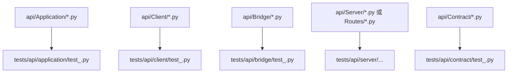
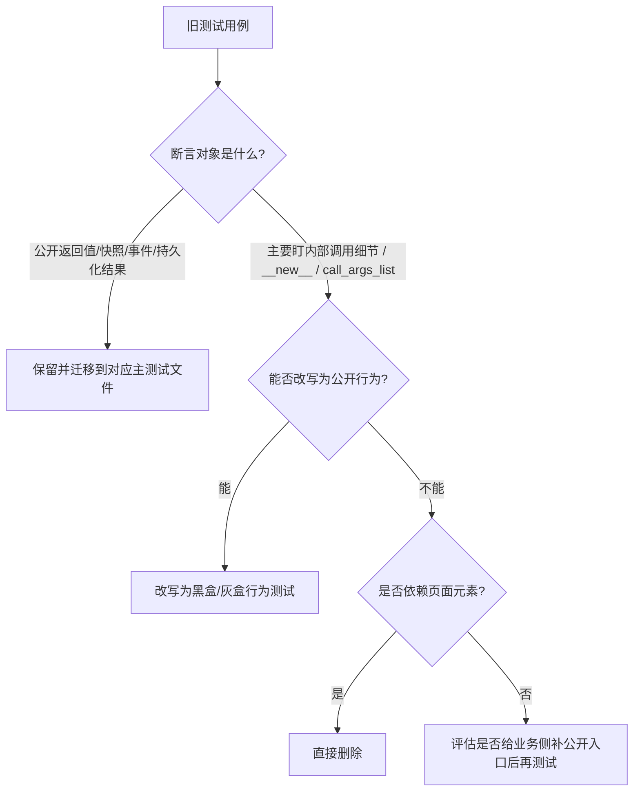

# API 测试重构设计：`tests/api` 镜像业务目录并清理白盒用例

## 1. 背景

`tests/api` 当前已经积累出一批与 `api/` 目录边界不一致的测试文件，主要问题如下：

- 测试文件没有与被测业务文件形成稳定的一一对应关系，文件名和相对路径都不够直观。
- 同一业务对象的测试散落在多个测试文件中，导致新增或排查用例时很难快速定位。
- 存在明显白盒测试反模式，例如 `Class.__new__(Class)` 拼接半成品对象、以 `call_args_list` 作为主要断言、依赖页面元素和控件状态来间接验证 API 行为。
- 一部分测试本质上验证的是页面细节或阶段性守卫，却被放在 `tests/api` 中，导致测试语义与目录语义不匹配。

本次重构的目标不是简单重命名文件，而是同时完成目录整理、用例归位、白盒清理和少量可测试性修复，让 `tests/api` 真正回答“API 边界有没有按对外契约工作”。

## 2. 已确认的设计决策

本设计基于以下已确认前提：

- 本轮采用“迁移 + 黑盒化”的方案，允许为了测试质量做少量业务侧调整。
- `tests/api` 默认按照 `api/` 的相对路径进行镜像组织。
- 每个业务文件默认只对应一个主测试文件，除非测试层次明显不同到必须拆分。
- 必须依赖页面元素才能成立的测试用例可以直接删除，不迁回其他目录兜底。
- 对仍有业务价值的旧测试，应优先改写为公开行为断言，而不是保留白盒断言。
- 不为了测试保留兼容层，也不允许暴露测试后门或新增额外状态源。

## 3. 目标与非目标

### 3.1 目标

- 让 `tests/api` 的目录结构与 `api/` 目录边界保持一致。
- 让同一被测对象的主测试集中在一个明确位置，降低维护成本。
- 移除或改写明显白盒测试，使主要断言回到返回值、快照、事件和持久化结果。
- 在必要时对业务代码做最小范围的可测试性整理，让对象可以通过真实构造和公开接口被验证。
- 为后续继续补充 API 测试建立稳定骨架和统一规则。

### 3.2 非目标

- 本轮不重构整个 `frontend` 测试体系。
- 本轮不为了保留旧测试而创建新的兼容接口或过渡层。
- 本轮不追求所有历史测试文件都原样保留，删除无业务价值或强依赖页面元素的用例属于预期结果。
- 本轮不扩展到 `tests/api` 之外的无关目录整理。

## 4. 核心问题分析

### 4.1 目录与职责不一致

当前 `tests/api` 内存在多个职责混杂的文件，例如单个测试文件同时覆盖多个 `api/Client`、`api/Application` 与 `frontend` 对象。这样的组织方式会直接导致以下问题：

- 看到测试文件名时无法快速判断它对应哪个业务文件。
- 修改某个业务对象时，容易漏掉散落在其他文件中的相关测试。
- 测试文件越写越大，阅读成本和局部夹具复用成本都持续上升。

### 4.2 白盒测试反模式较多

现有测试中已经出现以下反模式：

- 使用 `Class.__new__(Class)` 绕过真实构造流程。
- 通过手工塞属性拼接半成品对象。
- 把 `call_args` 或 `call_args_list` 作为主要断言。
- 通过页面控件状态、页面方法调用顺序来间接证明 API 或服务层行为。

这些用例即使短期能提供回归保护，也会在后续重构时频繁误报，并迫使实现细节被冻结。

### 4.3 目录语义被页面测试污染

部分测试虽然位于 `tests/api`，但其核心断言依赖页面元素、页面生命周期或者 UI 组件状态。这类测试并不适合作为 API 目录中的长期资产：

- 它们很难稳定表达 API 的外部契约。
- 它们往往需要 `__new__`、手工桩对象或杂糅页面状态才能成立。
- 它们会让 `tests/api` 失去“只关心 API 边界”的语义清晰度。

## 5. 推荐方案

采用“目录镜像 + 用例归位 + 白盒清理 + 最小可测试性调整”的方案。


该方案的关键点是同时解决“文件放哪儿”和“测试测什么”两个问题，而不是只做其中一半。

## 6. 目录映射设计

### 6.1 基本规则

- `tests/api` 按 `api/` 的相对路径镜像组织。
- 每个业务文件默认对应一个主测试文件，命名使用 `test_<业务文件名>.py`。
- 同一被测对象的主测试必须集中，不再分散到名称含糊的文件中。
- 只有当单元测试与集成测试层次明确不同，或单个文件已经明显影响可读性时，才允许拆分成多个测试文件。

### 6.2 目标目录骨架

```text
tests/api/
  application/
  bridge/
  client/
  contract/
  server/
```

### 6.3 映射示例



例如：

- `api/Client/ProjectApiClient.py` 对应 `tests/api/client/test_project_api_client.py`
- `api/Application/ProofreadingAppService.py` 对应 `tests/api/application/test_proofreading_app_service.py`
- `api/Bridge/EventBridge.py` 对应 `tests/api/bridge/test_event_bridge.py`
- `api/Server/Routes/QualityRoutes.py` 对应 `tests/api/server/test_quality_routes.py`

## 7. 用例迁移与清理规则

### 7.1 总体判定流程



### 7.2 保留并迁移的测试类型

- API Client 对服务端契约的请求与响应模型验证。
- AppService 的输入输出、错误分支、快照组装与持久化结果验证。
- Bridge 的事件映射、主题和公开载荷验证。
- Contract 的序列化、字段映射和依赖边界验证。
- Server 路由的 HTTP 对外行为与注册契约验证。

### 7.3 必须删除的测试类型

- 主要依赖页面元素、控件状态、按钮启停等 UI 细节的用例。
- 使用 `__new__` 构造半成品页面对象且无法转成公开行为测试的用例。
- 没有稳定业务语义、只是守着当前实现细节不变的用例。
- 文件路径与被测对象完全不匹配、且内容本身也不值得保留的杂项测试。

### 7.4 优先整改的历史文件

#### `test_api_client.py`

此文件会拆分到与被测对象一一对应的多个主测试文件中，例如：

- `tests/api/client/test_project_api_client.py`
- `tests/api/client/test_quality_rule_api_client.py`
- `tests/api/client/test_proofreading_api_client.py`
- `tests/api/client/test_task_api_client.py`
- `tests/api/client/test_settings_api_client.py`
- `tests/api/client/test_workbench_api_client.py`

若其中夹杂了页面依赖测试，则按本设计的删除规则处理。

#### `test_api_layering_boundary.py`

此文件中混杂了上下文对象、源码导入边界、路由契约和客户端契约断言。后续将按真实被测对象拆分到更精确的位置，例如：

- `tests/api/client/test_app_client_context.py`
- `tests/api/server/test_route_contracts.py`
- `tests/api/bridge/test_event_topic.py`
- `tests/api/test_api_spec_contract.py`

若其中某些断言只服务于过时阶段性文档或实现细节，也允许直接删除。

#### 页面相关测试文件

对于 `test_proofreading_page_api_consumer.py`、`test_quality_frontend_prompt_guards.py`、`test_proofreading_rule_impact.py` 等文件：

- 依赖页面元素或 UI 控件状态的用例直接删除。
- 若存在与 `api/Bridge`、`api/Application`、`api/Contract` 明确对应的纯逻辑，可迁回对应主测试文件。
- 不把页面测试伪装成 API 测试继续保留在 `tests/api` 中。

## 8. 业务侧可测试性调整边界

### 8.1 允许的调整

- 为 `api/Application` 或 `api/Bridge` 补充稳定的公开返回值、事件载荷或纯函数入口。
- 把原本混在页面方法中的纯逻辑整理到更合适的业务对象中。
- 收拢重复散落的测试契约常量，确保存在单一来源。
- 对现有构造流程做轻量整理，使对象能够通过真实构造和公开接口被验证。

### 8.2 明确禁止的调整

- 不新增仅供测试使用的隐藏入口、测试开关或私有状态暴露。
- 不保留“旧接口 + 新接口”双轨兼容层，除非后续单独审批。
- 不引入新的全局单例、额外状态源或跨模块可变对象引用。
- 不为了覆盖率保留没有业务语义的测试用例。

### 8.3 边界原则

所有业务侧调整仍需遵守仓库现有原则：

- 单一来源与单一写入入口不被破坏。
- 跨模块只通过显式接口或事件交换数据。
- 不因测试需求而绕开 `api/` 现有分层边界。

## 9. 夹具与辅助文件规则

- 真正全局复用的夹具才保留在 `tests/api/conftest.py`。
- 只服务于某个镜像子目录的夹具，应下沉到对应子目录的 `conftest.py`。
- `boundary_contracts.py` 这类测试辅助模块，只有在服务多个测试文件时才保留为独立文件。
- 若某个辅助常量只服务单个测试文件，应直接并回该测试文件，减少跳转成本。

## 10. 实施顺序

1. 先建立镜像目录和目标测试文件骨架。
2. 拆分 `test_api_client.py` 这类大文件，将用例归位到对应主测试文件。
3. 清理 `test_api_layering_boundary.py` 等混合边界文件，按被测对象重新归档。
4. 删除页面元素依赖测试，并改写仍有业务价值的旧测试为公开行为断言。
5. 如确有必要，再进行少量业务侧可测试性调整。
6. 运行目标测试、格式化和静态检查，确认重构后的结构与行为均正确。

## 11. 验证标准

| 维度 | 通过标准 |
| --- | --- |
| 目录结构 | `tests/api` 基本按 `api/` 镜像组织 |
| 文件映射 | 主测试文件与业务文件形成稳定的一一对应关系 |
| 用例归属 | 同一被测对象的主用例不再散落在多个含糊文件中 |
| 白盒整改 | 不再保留以 `__new__`、`call_args_list` 等为主要断言的历史反模式 |
| 页面依赖 | 依赖页面元素才能成立的测试已删除 |
| 业务调整 | 若有业务侧改动，也符合单一来源、显式接口和无兼容层约束 |
| 验证命令 | 至少运行相关 `pytest`、`ruff format`、`ruff check --fix` |

## 12. 风险与控制

### 12.1 主要风险

- 删除页面依赖测试后，短期内相关行为的自动化保护范围会收缩。
- 将测试从白盒改为黑盒时，可能暴露出原本缺少稳定公开输出的问题。
- 测试文件重组会让历史定位路径变化，短期内需要适应新的查找方式。

### 12.2 控制措施

- 优先保留能表达真实业务行为的测试，而不是机械追求“文件一个都不删”。
- 对无法稳定黑盒验证的点，优先通过最小业务整理补公开入口，而不是回退到白盒断言。
- 重构过程中持续运行目标测试，避免大规模迁移后才一次性发现问题。

## 13. 预期产出

本设计落地后，`tests/api` 应具备以下特征：

- 目录结构和 `api/` 业务结构能够一眼对应。
- 同一对象的测试集中、命名清楚、入口稳定。
- 主要断言围绕公开行为，而不是内部实现细节。
- 依赖页面元素的伪 API 测试被清理掉。
- 后续新增测试时，团队可以直接沿用本设计，不必再次讨论目录和归属规则。
