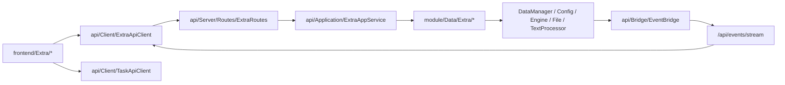

# Extra UI/Core 分离设计

## 1. 背景

当前 `Quality` / `Proofreading` 主链路已经基本完成 `api/` 边界迁移，但 `frontend/Extra/*` 仍保留多处对 Core 单例与实现细节的直接依赖，主要包括：

- `TSConversionPage` 直接依赖 `DataManager`、`Config`、`FileManager`、`TextProcessor`
- `NameFieldExtractionPage` 直接依赖 `DataManager`、`Config`、`Engine`
- `LaboratoryPage` 直接依赖 `Config`、`Engine`
- `ToolBoxPage` 直接依赖 `Config`

这些页面的问题并不只是“导入路径不好看”，而是 UI 仍然承担了大量业务职责：

- 页面直接读取工程权威状态
- 页面自行启动后台线程并编排长任务
- 页面直接操作配置读写与术语规则写入
- 页面直接依赖翻译引擎状态来决定交互禁用

这会导致 `frontend/Extra/*` 继续成为 UI/Core 分离中的架构缺口，也会让未来继续替换 UI 技术栈时保留一条“偷偷直连 Core”的回退路径。

本设计的目标，是把 `frontend/Extra/*` 收口为纯 UI 消费层，通过新的 `api/Client`、`api/Application` 与 `module/Data/Extra/*` 完成彻底分离，并通过 boundary 测试锁死整目录，避免后续回退。

## 2. 本轮确认的设计决策

本设计基于以下已确认决策：

- 本轮范围覆盖整个 `frontend/Extra/*`，不仅是当前直连 Core 的三个页面
- `frontend/Extra/*` 必须全部纳入 boundary 守卫清单
- 采用“UI 纯消费 + Application 用例层 + Data 业务服务层”的分层方式
- 不为 `Extra` 抽象“大一统工具框架”，只按当前业务线做最小必要拆分
- `TSConversion` 采用长任务协议，由 Core 侧负责实际执行与导出
- `NameFieldExtraction` 采用“Core 负责生成与处理结果，UI 本地维护编辑草稿”的模式
- `Laboratory` 的设置读取与修改不再由页面直接读写 `Config`
- SSE 只用于进度与完成通知，不承载整页权威状态流同步

## 3. 目标与非目标

### 3.1 目标

- 建立 `frontend/Extra/*` 与 Core 之间唯一正式边界
- 移除 `frontend/Extra/*` 对 `Config`、`DataManager`、`Engine`、`FileManager`、`TextProcessor` 的直接依赖
- 把 `TSConversion`、`NameFieldExtraction`、`Laboratory` 的业务编排从 UI 下沉到 Application / Data 层
- 让 `ToolBoxPage` 一并纳入治理与 boundary 守卫，避免成为新的偷渡入口
- 在 `api/SPEC.md` 中补齐 `Extra` 契约，作为后续页面接入的正式约束

### 3.2 非目标

- 本轮不抽象通用的“Extra 工具平台”或工具会话中心
- 本轮不重写 `DataManager`、`Engine`、`FileManager`、`TextProcessor` 的底层实现
- 本轮不改变现有 `Extra` 页面核心用户交互语义
- 本轮不把 `NameFieldExtraction` 的整个编辑中间态提升为服务端会话

## 4. 方案比较与选择结论

本轮评估过以下方案：

| 方案 | 描述 | 结论 |
| --- | --- | --- |
| 页面直改 API | 页面改为调用新客户端，但业务逻辑仍保留在页面中 | 不采用，边界不够硬 |
| Extra 双层下沉 | 页面只保留展示与交互；新增 `ExtraAppService` 与 `module/Data/Extra/*` 承担用例与业务逻辑 | 采用 |
| 通用工具执行框架 | 为所有工具建立统一任务框架、统一会话协议 | 暂不采用，超出当前范围 |

最终采用“Extra 双层下沉 + 全目录 boundary 守卫”的方案。

## 5. 整体架构



核心分层约束如下：

- `frontend/Extra/*` 只允许依赖 `api/Client/*`、对象化 API 模型与现有 UI 组件
- `api/Server/Routes/ExtraRoutes.py` 只做协议解析与响应封装，不承载业务规则
- `api/Application/ExtraAppService.py` 负责用例编排、错误映射、payload 转换与长任务生命周期管理
- `module/Data/Extra/*` 负责实际业务逻辑，是 `Extra` 在 Core 侧的唯一入口

## 6. 模块拆分设计

### 6.1 UI 页面职责

| 页面 | UI 侧保留职责 | UI 侧移除职责 |
| --- | --- | --- |
| `TSConversionPage` | 读取 options、提交开始命令、显示进度与结果提示 | 直接读取项目条目、直接导出文件、直接创建后台线程 |
| `NameFieldExtractionPage` | 渲染表格草稿、处理用户编辑、触发提取/翻译/导入命令 | 直接扫描工程、直接调用 `Engine`、直接写 glossary |
| `LaboratoryPage` | 渲染开关、显示忙碌态禁用、触发设置更新命令 | 直接读写 `Config`、直接读取 `Engine` 状态 |
| `ToolBoxPage` | 纯导航、展示工具入口 | 读取配置、承担业务态 |

### 6.2 Application 层

建议新增：

```text
api/Application/
  ExtraAppService.py
```

`ExtraAppService` 职责如下：

- 提供 `TSConversion`、`NameFieldExtraction`、`Laboratory` 的稳定用例接口
- 把内部业务对象转换为 `api/Contract/ExtraPayloads.py` 中的响应载荷
- 将领域异常映射为稳定错误码
- 编排长任务的进度回调与完成通知
- 作为 `ExtraRoutes` 唯一调用入口

### 6.3 Data 业务层

建议新增：

```text
module/Data/Extra/
  TsConversionService.py
  NameFieldExtractionService.py
  LaboratoryService.py
```

职责划分如下：

- `TsConversionService`
  - 构建繁简转换 options 快照
  - 校验工程加载态
  - 读取项目条目
  - 处理文本保护与繁简转换
  - 调用导出逻辑并回传进度
- `NameFieldExtractionService`
  - 从项目条目中提取姓名与上下文
  - 基于激活模型执行批量翻译
  - 构建结果草稿列表
  - 将草稿列表合并写入 glossary
- `LaboratoryService`
  - 读取实验设置快照
  - 更新实验开关设置
  - 隔离 `Config` 的直接读写细节

## 7. 页面与服务映射

| UI 页面 | Application 接口 | Data 服务 |
| --- | --- | --- |
| `TSConversionPage` | `get_ts_conversion_options()` `start_ts_conversion()` | `TsConversionService` |
| `NameFieldExtractionPage` | `get_name_field_snapshot()` `extract_name_fields()` `translate_name_fields()` `save_name_fields_to_glossary()` | `NameFieldExtractionService` |
| `LaboratoryPage` | `get_laboratory_snapshot()` `update_laboratory_settings()` | `LaboratoryService` |
| `ToolBoxPage` | `get_extra_tool_snapshot()` 或保持静态 | 无专门业务服务 |

这里故意不引入 `ExtraBaseService` 或其他通用基类，原因如下：

- 三条业务链路的状态模型完全不同
- `TSConversion` 是长任务
- `NameFieldExtraction` 是快照 + 批处理 + UI 草稿
- `Laboratory` 是薄设置入口
- 强行抽象只会制造新的伪共享层

## 8. 协议设计

## 8.1 接口概览

建议新增如下接口：

```text
POST /api/extra/tools/snapshot

POST /api/extra/ts-conversion/options
POST /api/extra/ts-conversion/start

POST /api/extra/name-fields/snapshot
POST /api/extra/name-fields/extract
POST /api/extra/name-fields/translate
POST /api/extra/name-fields/save-to-glossary

POST /api/extra/laboratory/snapshot
POST /api/extra/laboratory/update
```

统一原则：

- 读取与写入均使用 `POST + JSON body`
- 长任务只通过 SSE 推送进度与完成，不流式推整页状态
- 页面启动先拉快照，后续只通过命令更新

## 8.2 TSConversion 协议

### 8.2.1 options 快照

`POST /api/extra/ts-conversion/options`

响应示例：

```json
{
  "ok": true,
  "data": {
    "options": {
      "default_direction": "TO_TRADITIONAL",
      "preserve_text_enabled": true,
      "convert_name_enabled": true
    }
  }
}
```

### 8.2.2 开始命令

`POST /api/extra/ts-conversion/start`

请求示例：

```json
{
  "direction": "TO_TRADITIONAL",
  "preserve_text": true,
  "convert_name": true
}
```

响应示例：

```json
{
  "ok": true,
  "data": {
    "task": {
      "task_id": "extra_ts_conversion",
      "accepted": true
    }
  }
}
```

`TSConversion` 的权威数据与执行责任如下：

- 项目条目由 Core 读取
- 文本保护与转换由 Core 执行
- 导出路径由 Core 决定并返回
- UI 只负责提交命令与消费进度/完成事件

## 8.3 NameFieldExtraction 协议

### 8.3.1 快照接口

`POST /api/extra/name-fields/snapshot`

当前可返回空草稿，也可返回最近一次服务端生成结果；本轮不引入持久会话要求。

### 8.3.2 提取接口

`POST /api/extra/name-fields/extract`

响应示例：

```json
{
  "ok": true,
  "data": {
    "snapshot": {
      "items": [
        {
          "src": "勇者",
          "dst": "",
          "context": "勇者が来た",
          "status": "NONE"
        }
      ]
    }
  }
}
```

### 8.3.3 翻译接口

`POST /api/extra/name-fields/translate`

请求示例：

```json
{
  "items": [
    {
      "src": "勇者",
      "dst": "",
      "context": "勇者が来た",
      "status": "NONE"
    }
  ]
}
```

响应示例：

```json
{
  "ok": true,
  "data": {
    "result": {
      "success_count": 1,
      "failed_count": 0,
      "items": [
        {
          "src": "勇者",
          "dst": "Hero",
          "context": "勇者が来た",
          "status": "PROCESSED"
        }
      ]
    }
  }
}
```

这里刻意采用“返回完整更新后草稿列表”的模式，而不是让 UI 保存一堆 patch，原因如下：

- 当前页面允许用户在表格内直接编辑草稿
- 整表回写比逐行 patch 更简单、更稳定
- 不需要引入服务端编辑会话即可完成闭环

### 8.3.4 导入 glossary 接口

`POST /api/extra/name-fields/save-to-glossary`

请求体携带当前草稿条目列表，Core 负责合并现有 glossary 并写入。

## 8.4 Laboratory 协议

### 8.4.1 快照接口

`POST /api/extra/laboratory/snapshot`

响应示例：

```json
{
  "ok": true,
  "data": {
    "snapshot": {
      "mtool_optimizer_enabled": false,
      "force_thinking_enabled": true
    }
  }
}
```

### 8.4.2 更新接口

`POST /api/extra/laboratory/update`

请求示例：

```json
{
  "mtool_optimizer_enabled": true,
  "force_thinking_enabled": false
}
```

`LaboratoryPage` 的禁用态不再由页面直接读取 `Engine` 状态，而是通过任务快照判定：

- 页面从 `TaskApiClient` 读取 `task snapshot`
- 当引擎忙碌时，开关控件禁用
- 当引擎空闲时，开关控件恢复可编辑

## 8.5 ToolBox 协议

`ToolBoxPage` 可以保持纯导航页，不强制增加复杂业务协议。若后续需要统一工具入口元数据，可新增：

`POST /api/extra/tools/snapshot`

用于返回工具入口描述、可见性与未来扩展字段。

## 9. SSE 事件设计

建议新增 topic：

| topic | 说明 |
| --- | --- |
| `extra.ts_conversion_progress` | 繁简转换进度更新 |
| `extra.ts_conversion_finished` | 繁简转换结束 |
| `extra.name_fields_progress` | 姓名批量翻译进度更新 |
| `extra.name_fields_finished` | 姓名批量翻译结束 |

约束如下：

- SSE 不传整页权威状态
- 进度事件只用于更新进度提示
- 完成事件可携带最小结果摘要，如输出路径、成功/失败数量
- 若页面需要完整结果对象，可在完成后主动重新调用对应接口

## 10. 对象模型设计

建议新增：

```text
model/Api/ExtraModels.py
api/Contract/ExtraPayloads.py
api/Client/ExtraApiClient.py
api/Server/Routes/ExtraRoutes.py
```

### 10.1 `model/Api/ExtraModels.py`

建议至少定义以下对象：

- `TsConversionOptionsSnapshot`
- `TsConversionCommand`
- `TsConversionTaskAccepted`
- `NameFieldEntryDraft`
- `NameFieldSnapshot`
- `NameFieldTranslateResult`
- `LaboratorySnapshot`
- `ExtraToolEntry`
- `ExtraToolSnapshot`

客户端约束：

- `api/Client` 在收到 JSON 后立即反序列化为冻结对象
- 页面禁止再通过 `dict.get()` 消费 `Extra` 响应

### 10.2 `api/Contract/ExtraPayloads.py`

服务端响应载荷统一使用 `*Payload` 命名，避免语义继续漂移，例如：

- `TsConversionOptionsPayload`
- `TsConversionTaskPayload`
- `NameFieldEntryPayload`
- `NameFieldSnapshotPayload`
- `NameFieldTranslateResultPayload`
- `LaboratorySnapshotPayload`
- `ExtraToolEntryPayload`

## 11. 错误处理

建议新增或固定以下错误码：

| 错误码 | 语义 |
| --- | --- |
| `NO_PROJECT` | 当前未加载工程 |
| `TASK_RUNNING` | 同类 `Extra` 长任务正在执行 |
| `NO_ACTIVE_MODEL` | 当前没有激活模型配置 |
| `INVALID_REQUEST` | 请求参数非法或为空 |
| `EXPORT_FAILED` | 导出失败 |
| `TRANSLATE_FAILED` | 批量翻译整体失败或部分失败 |
| `ITEM_STALE` | 保存 glossary 时条目结构非法或状态已失效 |
| `READONLY_STATE` | 当前状态只读，禁止修改 |

统一错误响应格式：

```json
{
  "ok": false,
  "error": {
    "code": "NO_PROJECT",
    "message": "project is not loaded"
  }
}
```

分层要求：

- `module/Data/Extra/*` 抛语义化异常
- `api/Application/ExtraAppService.py` 负责错误码映射
- `api/Client/ExtraApiClient.py` 负责客户端异常对象化
- `frontend/Extra/*` 只负责展示

## 12. Boundary 规则

本轮必须新增并锁死以下硬边界：

- `frontend/Extra/*` 禁止直接导入：
  - `module.Config`
  - `module.Data.DataManager`
  - `module.Engine.Engine`
  - `module.File.FileManager`
  - `module.TextProcessor`
- `frontend/Extra/*` 中关键页面必须通过 `api.Client.ExtraApiClient` 访问 Core 能力
- `LaboratoryPage` 允许额外通过 `TaskApiClient` 读取任务快照，但不得直接读取 `Engine`
- `ToolBoxPage` 不得保留任何读取 Core 权威状态的入口

建议 boundary 测试至少显式列出以下文件：

- `frontend/Extra/ToolBoxPage.py`
- `frontend/Extra/TSConversionPage.py`
- `frontend/Extra/NameFieldExtractionPage.py`
- `frontend/Extra/LaboratoryPage.py`

## 13. 测试策略

测试分层如下：

| 层级 | 目标 |
| --- | --- |
| `module` 单测 | 校验 `TsConversionService`、`NameFieldExtractionService`、`LaboratoryService` 的纯业务逻辑 |
| `api/Application` 单测 | 校验 `ExtraAppService` 的 payload、错误码与长任务接受语义 |
| `api/client` / 路由测试 | 校验 `ExtraApiClient` 对象反序列化、`ExtraRoutes` 响应壳、SSE topic |
| `frontend boundary` 测试 | 校验整个 `frontend/Extra/*` 不再直连 Core |

### 13.1 自动化测试重点

- `TSConversion`
  - 文本保护开关是否生效
  - 转换方向是否正确
  - 导出失败是否正确映射为 `EXPORT_FAILED`
- `NameFieldExtraction`
  - 提取结果是否稳定
  - 批量翻译是否返回完整更新列表与成功/失败计数
  - glossary 合并写入是否正确
- `Laboratory`
  - 快照读取是否正确
  - 设置更新是否正确落库
- `frontend/Extra/*`
  - 是否仍存在直连 Core 的导入或调用

## 14. 最小手动验证路径

1. 打开工具箱，进入姓名提取页，执行提取，确认结果来自 API 而非页面直扫工程。
2. 在姓名提取页执行批量翻译，确认进度或结果刷新正常，且页面不直接调用 `Engine`。
3. 将姓名提取结果导入 glossary，确认写入成功，且页面不直接调用 `DataManager`。
4. 打开繁简转换页，启动转换并完成导出，确认进度通知、成功与失败提示正常。
5. 打开实验室页，在任务忙碌与空闲两种状态下确认开关禁用逻辑正确，且页面不直接读取 `Config` / `Engine`。

## 15. 实施顺序

建议按以下顺序推进：

1. 先补 `Extra` boundary 失败测试，钉住目录级红线。
2. 下沉 `Laboratory`，作为最薄的打样路径。
3. 下沉 `TSConversion`，建立长任务、进度与完成协议。
4. 下沉 `NameFieldExtraction`，补齐快照、翻译与 glossary 写入。
5. 接入 `ExtraApiClient`、`ExtraRoutes`、`Extra` 对象模型与 `api/SPEC.md`。
6. 运行格式化、检查、自动化测试，并执行最小手动验证路径。

## 16. 结论

本设计将 `frontend/Extra/*` 从“页面自己读写 Core、自己调度任务”的结构，重构为“UI 只消费对象化 API，Core 负责权威状态、业务执行与长任务管理”的结构。

这样既能继续延续现有 `api/` 分层模式，也能真正把 `Extra` 从 UI/Core 分离工程中的遗留缺口里收回来，并通过 boundary 守卫防止后续再次退化。
