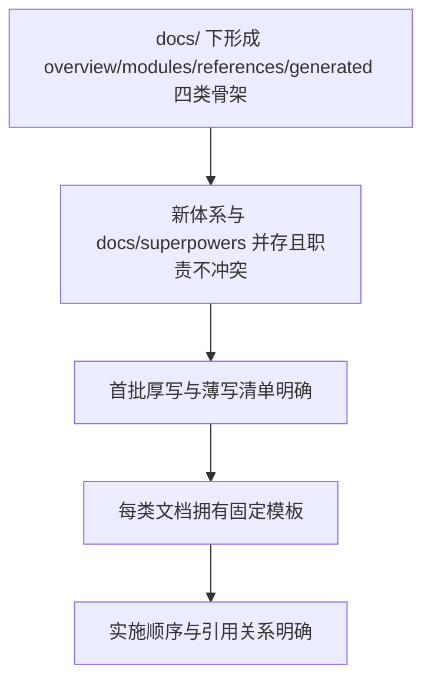

# 面向维护型 Agent 的前置信息文档系统设计

## 1. 背景

当前仓库已经存在 `AGENTS.md`、`docs/superpowers/specs`、`docs/superpowers/plans`，以及少量靠近代码目录维护的 `SPEC.md` / `spec.md` 文档：

- `AGENTS.md` 负责给进入仓库的 Agent 提供高层约束、项目背景和基础导航。
- `docs/superpowers/specs` 负责沉淀具体任务的设计方案。
- `docs/superpowers/plans` 负责拆解具体任务的实施步骤。
- `api/SPEC.md` 当前承担本地 Core API 契约、错误码、SSE topic 与客户端对象边界的权威说明。
- `module/Data/spec.md` 当前承担 `module/Data` 模块画像、阅读顺序、边界和常见入口说明。

这套结构已经能够支撑“围绕单个任务生成设计与计划”的工作流，但仍缺少一层稳定、可复用、跨任务共享的前置信息库。实际问题主要体现在：

- Agent 在接到维护任务后，往往仍需要重新摸索系统结构、模块边界、概念语义和代码入口。
- 同一类背景事实容易反复出现在不同 spec 或 plan 中，导致信息分散、重复和漂移。
- 某些跨任务长期成立的约束，例如单一数据来源、事件总线边界、线程与 UI 隔离规则，尚未形成独立、稳定的权威文档。
- 现有文档更偏“本次任务该怎么做”，而不是“这个仓库本身是什么样子”。
- 现有 `SPEC.md` / `spec.md` 的职责并不统一，有的是局部契约，有的是前置上下文，如果不先分类处理，后续文档体系会继续混杂。

本设计的目标，是在不替代现有 `superpowers` 文档体系的前提下，为维护与开发 `LinguaGacha` 的 Agent 建立一套稳定的前置信息文档系统。

## 2. 设计目标与非目标

### 2.1 目标

- 在 `docs/` 下建立一套与 `docs/superpowers/*` 并存的静态文档体系。
- 为 Agent 提供跨任务复用的前置信息，降低接任务后的建模成本。
- 让稳定事实拥有更清晰的权威归属，减少它们在任务型文档中的重复出现。
- 让 Agent 更快定位代码入口、理解模块边界、掌握关键概念和长期不变量。
- 为后续逐步引入自动生成的索引文档预留正式位置。

### 2.2 非目标

- 本轮不把新文档体系做成任务手册或实施清单。
- 本轮不让新文档替代 `docs/superpowers/specs` 与 `docs/superpowers/plans`。
- 本轮不要求一次性把所有模块文档写到同等深度。
- 本轮不把临时任务限制、一次性兼容方案、特定 PR 决策沉淀到静态文档中。

## 3. 设计原则

### 3.1 前置信息优先

新体系负责回答“仓库是什么样子”，而不是回答“这次任务怎么做”。静态文档必须优先沉淀以下信息：

- 系统结构
- 核心概念
- 模块职责与边界
- 长期不变量
- 代码定位线索
- 稳定专题规则

### 3.2 与任务型文档并存

新体系与 `docs/superpowers/specs`、`docs/superpowers/plans` 的关系如下：

| 文档类型 | 核心职责 |
| --- | --- |
| `AGENTS.md` | 仓库级入口、基础约束、总导航 |
| `docs/overview/*` `docs/modules/*` `docs/references/*` `docs/generated/*` | 稳定前置信息 |
| `docs/superpowers/specs/*` | 单个任务的设计方案 |
| `docs/superpowers/plans/*` | 单个任务的实施计划 |

### 3.3 信息类型导向

新体系不采用纯业务导向目录，也不采用纯技术层目录，而是采用“按信息类型分区”的组织方式。这样做的原因是：

- 更贴近记录系统思路，便于区分系统总览、模块画像、专题规则和生成索引。
- 更适合 Agent 以“我现在缺什么信息”为入口进行检索。
- 能避免文档仅仅成为代码目录镜像，或者退化为产品说明书。

### 3.4 按职责类型处理现有 `SPEC.md`

仓库里已有的 `SPEC.md` / `spec.md` 不能按文件名统一处理，而要按职责类型分流：

| 类型 | 特征 | 建议去向 |
| --- | --- | --- |
| 局部契约型 | 与某个子系统实现强绑定，描述接口、错误码、协议、边界 | 保留在代码目录附近，继续作为该子系统权威文档 |
| 前置上下文型 | 描述模块职责、阅读顺序、边界、入口、常见陷阱 | 吸收进 `docs/` 新体系，成为对应 overview 或 modules 文档 |

这条原则的目的是：

- 避免把所有 `SPEC.md` 一股脑迁入 `docs/`，导致代码附近失去局部契约锚点。
- 避免把本应成为全局前置信息的模块画像继续散落在代码目录中。
- 让今后新增规范文档时，能够先根据职责归类，再决定存放位置和命名。

## 4. 方案比较与结论

本轮评估过三种组织方案：

| 方案 | 描述 | 结论 |
| --- | --- | --- |
| 极简起步 | 只先建立少量 overview 文档，其余以后再补 | 不采用，首批对 Agent 的定位帮助不足 |
| 均衡骨架 | 一次铺出完整骨架，重点文档先写厚，其余文档薄写占位 | 采用 |
| 全量首发 | 首批就把所有目录写到较深深度 | 不采用，容易铺得过快并引入空泛内容 |

最终采用“完整骨架先建立，关键文档先写厚，其余文档薄写占位；新体系与 `docs/superpowers/*` 并存”的方案。

## 5. 目录骨架设计

建议在 `docs/` 下建立如下结构：

```text
docs/
  overview/
    system-overview.md
    runtime-topology.md
    core-concepts.md
    invariants.md
    code-map.md
  modules/
    base.md
    frontend.md
    data.md
    engine.md
    file.md
    localizer.md
  references/
    ui-framework.md
    localization-rules.md
    resource-layout.md
  generated/
    entrypoints.md
    event-index.md
    test-map.md

  superpowers/
    specs/
    plans/
```

各目录职责如下：

| 目录 | 职责 |
| --- | --- |
| `docs/overview` | 提供系统级前置信息，建立整体世界模型 |
| `docs/modules` | 为核心模块提供职责、边界、入口和状态说明 |
| `docs/references` | 存放跨模块长期有效的专题规则 |
| `docs/generated` | 存放适合由脚本生成的事实索引 |
| `docs/superpowers` | 继续承载任务级 spec 与 plan |

这里刻意不保留额外的 `agent-context` 层级，是因为：

- `AGENTS.md` 已经承担“面向 Agent 的入口”语义。
- 再套一层 `agent-context` 不会增加新的信息类型，只会增加目录深度。
- 直接落在 `docs/overview`、`docs/modules` 等位置，更利于检索和后续扩展。

### 5.1 现有 `SPEC.md` 的兼容策略

结合仓库当前现状，建议对现有 `SPEC.md` / `spec.md` 做如下处理：

| 文件 | 当前职责判断 | 处理策略 |
| --- | --- | --- |
| `api/SPEC.md` | 局部契约型文档，权威描述本地 API、SSE、错误码与客户端对象边界 | 保留原位，继续作为 `api/` 子系统契约文档 |
| `module/Data/spec.md` | 前置上下文型文档，描述 `module/Data` 的阅读顺序、模块边界、职责和常见入口 | 吸收进 `docs/modules/data.md`，逐步退出代码目录内的权威地位 |

对应的兼容原则如下：

1. 新体系不复制 `api/SPEC.md` 的大段契约内容，只在总览或代码地图中给出跳转线索。
2. `docs/modules/data.md` 建成后，应以它作为 `module/Data` 的长期权威画像。
3. `module/Data/spec.md` 在过渡期可以保留为短跳转说明，待没有保留价值后再删除。
4. 以后若出现新的 `SPEC.md`，应先判断它属于“局部契约型”还是“前置上下文型”，再决定是否进入 `docs/` 新体系。

## 6. 首批编纂清单

### 6.1 首批厚写文档

建议首批重点投入以下 6 篇文档：

| 文档 | 首批深度要求 | 作用 |
| --- | --- | --- |
| `docs/overview/system-overview.md` | 厚写 | 建立仓库总体结构、主分层与关键入口 |
| `docs/overview/core-concepts.md` | 厚写 | 固定核心术语，避免概念漂移 |
| `docs/overview/invariants.md` | 厚写 | 收口长期不变量与禁止破坏的事实 |
| `docs/overview/code-map.md` | 厚写 | 给 Agent 提供常见问题的代码定位地图 |
| `docs/modules/base.md` | 厚写 | 解释基础设施入口、事件、日志、路径与 CLI |
| `docs/modules/data.md` | 厚写 | 吸收 `module/Data/spec.md` 中有效内容，形成数据层权威画像 |

### 6.2 首批薄写占位文档

以下文档建议首批建立文件并写入最小有效内容，但不追求一次性展开到很深：

| 文档 | 首批状态 | 原因 |
| --- | --- | --- |
| `docs/overview/runtime-topology.md` | 薄写 | 运行时链路需要进一步细读源码后再加厚 |
| `docs/modules/frontend.md` | 薄写 | 页面众多，先建立总导航与边界 |
| `docs/modules/engine.md` | 薄写 | 先给任务引擎总图与主入口 |
| `docs/modules/file.md` | 薄写 | 先说明 `FileManager` 的统一入口地位 |
| `docs/modules/localizer.md` | 薄写 | 先固定本地化单一入口与同步要求 |
| `docs/references/ui-framework.md` | 薄写 | 先总结 UI 组件、主题与线程规则 |
| `docs/references/localization-rules.md` | 薄写 | 先提炼本地化规则摘要 |
| `docs/references/resource-layout.md` | 薄写 | 先明确资源放置与引用原则 |
| `docs/generated/entrypoints.md` | 薄写 | 先建立静态入口索引占位 |
| `docs/generated/event-index.md` | 薄写 | 先明确事件索引的正式位置 |
| `docs/generated/test-map.md` | 薄写 | 先建立模块到测试的映射位置 |

### 6.3 厚写与薄写的判定标准

为避免“写薄”退化成空话，建议采用如下标准：

| 类型 | 最低标准 |
| --- | --- |
| 厚写 | 能让 Agent 不翻太多源码，也能先建立正确模型 |
| 薄写 | 至少包含职责、关键入口、边界、跳转线索，不允许只有一句概述 |

## 7. 固定模板设计

### 7.1 `overview/*` 模板

`overview` 文档负责建立整体世界模型，建议固定回答以下问题：

1. 该文档覆盖的系统范围是什么。
2. 该范围内最关键的结构、分层或关系是什么。
3. 哪些概念是 Agent 必须先理解的。
4. 哪些事实是跨任务稳定成立的。
5. 若要继续深挖，应跳转到哪些模块文档。

### 7.2 `modules/*` 模板

`modules` 文档负责描述模块画像，建议固定回答以下问题：

| 固定问题 | 作用 |
| --- | --- |
| 这个模块负责什么 | 明确职责边界 |
| 它不负责什么 | 防止越界推断 |
| 它的权威入口是什么 | 帮助 Agent 快速读码 |
| 它依赖哪些上游与下游 | 建立改动波及面 |
| 它维护哪些关键状态 | 标记单一来源与持有者 |
| 哪些约束长期有效 | 防止破坏不变量 |
| 继续深挖时先看哪些文件 | 降低定位成本 |

### 7.3 `references/*` 模板

`references` 文档负责沉淀跨模块长期有效的专题规则，建议固定回答：

1. 这组规则解决什么问题。
2. 它适用于哪些目录或模块。
3. 哪些规则必须遵守。
4. 哪些文件是权威源。
5. 与哪些模块文档存在交叉引用。

### 7.4 `generated/*` 模板

`generated` 文档以索引和表格为主，不承担长篇解释。建议规则如下：

- `entrypoints.md` 聚焦“某类问题应该先看哪些文件”。
- `event-index.md` 聚焦“事件名、发送者、消费者、载荷语义”。
- `test-map.md` 聚焦“模块、目录与测试文件之间的映射”。
- 这类文档优先使用表格，减少长篇描述。

## 8. 首批编纂顺序

建议按以下顺序开展首批编纂：

1. `docs/overview/system-overview.md`
2. `docs/overview/core-concepts.md`
3. `docs/overview/invariants.md`
4. `docs/overview/code-map.md`
5. `docs/modules/base.md`
6. `docs/modules/data.md`
7. `docs/modules/frontend.md`
8. `docs/modules/engine.md`
9. 其余薄写占位文档

该顺序的设计逻辑如下：

- 先定义整体结构，再统一概念，再钉死不变量。
- 在有了系统模型之后，再补代码定位索引。
- 在此基础上优先扩写 `base` 与 `data` 两个横跨全局的核心模块。
- `frontend` 与 `engine` 范围更广，适合在世界模型稳定后再逐步展开。
- `references` 与 `generated` 作为配套层，先占位，再按需要加厚。

## 9. 文档之间的依赖与引用关系

为了防止信息重复和定义漂移，建议采用如下引用关系：

| 文档 | 权威职责 | 不应重复的内容 |
| --- | --- | --- |
| `system-overview.md` | 总体结构、主分层、总导航 | 术语定义与模块细节 |
| `core-concepts.md` | 核心概念与术语解释 | 重复讲全局结构 |
| `invariants.md` | 长期不变量与禁止破坏的事实 | 任务级限制与临时方案 |
| `code-map.md` | 代码阅读与定位索引 | 概念定义与全局约束解释 |
| `modules/*.md` | 模块画像、职责、边界、入口 | 重复定义系统级概念 |
| `api/SPEC.md` | `api/` 子系统的局部协议与契约 | 仓库级总览或模块画像职责 |
| `references/*.md` | 专题规则摘要 | 代替模块文档解释模块职责 |
| `generated/*.md` | 稳定索引和映射 | 长篇设计理由 |

推荐遵循以下规则：

- 同一概念只保留一个权威解释位置。
- 模块文档引用 `core-concepts.md` 与 `invariants.md`，不重复抄写公共定义。
- `code-map.md` 只回答“去哪看”，不回答“为什么这样设计”。
- 涉及本地 HTTP / SSE / 错误码 / 客户端对象边界时，应直接跳转到 `api/SPEC.md`。
- `generated/*` 只保留可检索事实，不承载推导过程。

## 10. 验收标准

满足以下条件时，可认为本轮文档系统设计达成目标：



更具体的验收条件如下：

1. 新文档体系的职责边界清晰，不与 `docs/superpowers/*` 发生功能重叠。
2. 目录结构能够覆盖系统总览、模块画像、专题规则和索引信息四类前置知识。
3. 首批需要厚写与薄写的文档范围已经明确，不依赖临时拍脑袋决定。
4. 文档模板能够约束后续编纂风格，避免每篇文档自由发散。
5. 现有 `SPEC.md` / `spec.md` 已按“局部契约型”与“前置上下文型”完成分类处理策略。
6. 文档间权威归属明确，能够减少重复描述和概念漂移。

## 11. 结论

本设计最终采用以下方案：

- 在 `docs/` 下建立一套与 `docs/superpowers/specs`、`docs/superpowers/plans` 并存的前置信息文档系统。
- 新体系按信息类型划分为 `overview`、`modules`、`references`、`generated` 四类。
- 现有 `SPEC.md` / `spec.md` 按职责分流处理：局部契约继续靠近代码维护，前置上下文吸收进新体系。
- 首批先铺设完整骨架，并重点厚写 `system-overview`、`core-concepts`、`invariants`、`code-map`、`base`、`data` 六篇文档。
- 其他文档先进行最小有效占位，后续再随着真实维护任务逐步扩写。
- 全体系坚持“静态文档负责让 Agent 看懂仓库，任务型文档负责让 Agent 做对当前任务”的边界。
