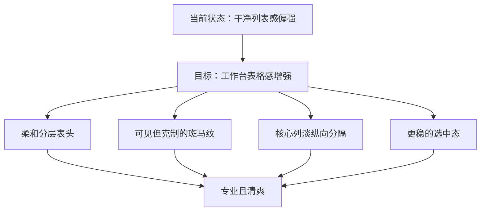
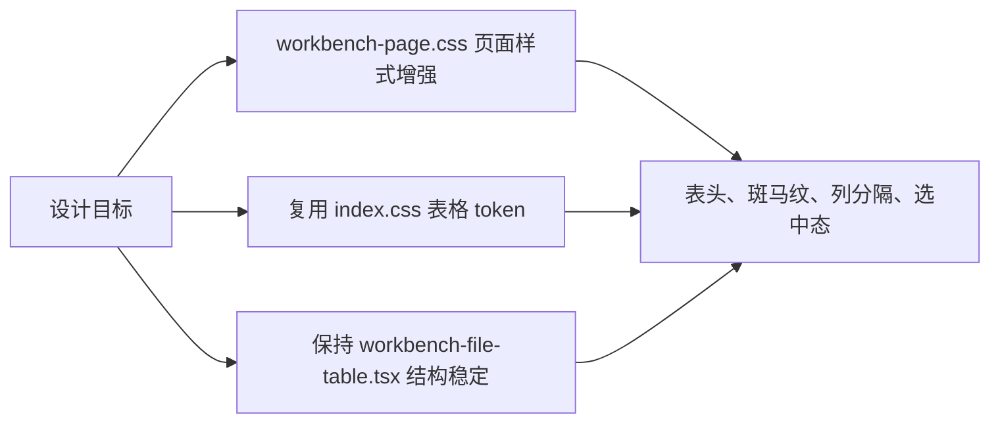

# Workbench 中间表格样式增强设计

## 1. 背景
`frontend-vite/src/renderer/pages/workbench-page` 的中间文件表格当前已经具备基础表头、行 hover、选中态和表格卡片容器，但整体观感更接近“干净的列表卡片”，表格识别度偏弱。

当前问题主要集中在以下几点：

- 表头存在感偏轻，和主体区分不够强。
- 行与行之间的节奏主要依赖横向分隔线，扫读时仍然偏列表感。
- 列结构较弱，文件名、格式、条数之间的工作台结构感不够明确。
- 选中态虽然存在，但在进一步增强表格感之后需要继续保持最高视觉层级。

## 2. 目标与非目标

### 2.1 目标
- 把当前区域从“干净列表感”提升为“有秩序感的工作台表格”。
- 在不破坏当前页面整体气质的前提下，增强表头、行节奏、列结构和选中反馈。
- 保持亮色与暗色主题都成立，不出现一套过淡、一套过脏的问题。
- 优先通过页面级样式完成本次设计，不改动数据流和组件职责。

### 2.2 非目标
- 不把当前区域改造成传统后台系统那种重边框、重网格、强对比的硬表格。
- 不新增与本次视觉目标无关的状态徽标、装饰图标或复杂信息块。
- 不调整 `workbench-file-table.tsx` 的数据结构、交互流程与组件边界。
- 不把单页临时视觉需求直接沉到 `ui/table.tsx` 中。

## 3. 设计方向
本次方案采用 `A 柔和分层` 作为主方向，并吸收 `C 轻工具台结构感` 的优点，最终形成一套“更像表格，但仍然克制”的混合方案。

设计原则只有一句：

> 增强结构，不增加噪音。

也就是说，表格感的提升依赖于浅底带表头、可见斑马纹、关键列淡分隔和更稳的选中态，而不是通过厚描边、满屏网格和高对比底纹来硬堆视觉强度。

## 4. 视觉规则

### 4.1 表头
- 表头从当前的轻底线形式升级为“浅底带 + 更清晰底部分隔”的结构。
- 表头高度维持现有设计系统节奏，不通过明显增高来制造存在感。
- 表头文案继续保持小号、稳重、克制，不引入过强字重和夸张对比。

### 4.2 行节奏
- 在 `tbody` 中加入相邻行轻微相间的斑马纹。
- 斑马纹需达到“肉眼能看出来”的程度，但仍低于 hover 与 selected。
- 斑马纹只用于增强横向扫读效率，不承担状态表达职责。

### 4.3 列结构
- 只在核心信息列上增加淡纵向分隔。
- 推荐强化的列为：`文件名`、`格式`、`条数`。
- `拖拽列` 与 `操作列` 保持克制，避免整张表被切得过碎。

### 4.4 状态层级
- 层级顺序固定为：`selected > hover > zebra`。
- selected 在保留底色高亮的基础上，增加一条细左侧强调线。
- hover 使用柔和提亮或压暗，不额外增加重描边。

### 4.5 主题策略
- 亮色主题优先通过浅层明度变化体现表头与斑马纹。
- 暗色主题优先避免灰脏覆盖，使用更干净的亮度差完成分层。
- 两套主题的视觉目标一致，但允许在强度上做小幅差异化调整。

## 5. 建议的视觉强度
以下强度为实现阶段的建议范围，而不是像素级硬编码值：

| 模块 | 亮色主题 | 暗色主题 |
| --- | --- | --- |
| `表头底带` | 比卡片主体略深一点 | 比主体略亮一点 |
| `斑马纹` | 偶数行约 `4% 到 5%` 的轻差异 | 偶数行约 `5% 到 6%` 的轻差异 |
| `hover` | 约 `7% 到 9%` | 约 `9% 到 11%` |
| `selected` | 约 `12% 到 15%` + 左侧细强调线 | 约 `14% 到 18%` + 左侧细强调线 |

## 6. 落地边界

### 6.1 主要落点
- 主要样式改动放在 `frontend-vite/src/renderer/pages/workbench-page/workbench-page.css`。
- 继续复用 `frontend-vite/src/renderer/index.css` 中已经存在的表格 token 与状态语义。
- 保持 `frontend-vite/src/renderer/pages/workbench-page/components/workbench-file-table.tsx` 的现有结构不变。

### 6.2 不改动的部分
- 不修改工作台表格的数据来源、排序逻辑、菜单行为和事件流。
- 不修改 `ui/table.tsx` 的基础契约。
- 不新增新的业务状态字段或页面局部组件层。

## 7. 风险与取舍

| 风险 | 原因 | 处理方式 |
| --- | --- | --- |
| `斑马纹太重` | 容易把页面拉向传统后台表格 | 控制为明显可见但不抢主视觉 |
| `纵向分隔太多` | 画面容易碎，尤其是拖拽列和操作列 | 只给核心信息列加淡分隔 |
| `selected 被削弱` | 行底色增强后，当前焦点可能不够稳 | selected 保持最高层级并增加左侧强调线 |
| `表头过厚` | 中间区域会显得头重脚轻 | 只增强底带和底边，不额外堆高度 |
| `暗色主题变脏` | 灰度覆盖过多会显得闷 | 优先用亮度差，不做浑浊覆盖 |

本次设计明确选择以下取舍：

- 选择 `中等可见的斑马纹`，不选择“几乎看不出来”的超轻方案。
- 选择 `核心列淡分隔`，不选择传统硬网格。
- 选择 `表头浅底带`，不选择通过厚边框堆出表格感。
- 选择 `页面级样式增强`，不选择扩散到基础组件层。

## 8. 验证标准
- 不看文字内容时，也能一眼识别该区域为表格，而不是普通列表。
- 用户在横向扫读文件名、格式、条数时，视觉对位更稳定。
- selected 在斑马纹存在的情况下仍然是最清晰的焦点。
- hover 与 selected 不互相抢戏，状态层级清晰。
- 亮色与暗色主题都维持统一气质，不出现一套过淡、一套过脏。

## 9. 最终定稿
本次 Workbench 中间表格样式增强的最终定稿如下：

1. 使用 `A 柔和分层` 作为主方向，混入 `C 轻工具台结构感`。
2. 表头增强为浅底带与更清晰的底部分隔，但保持轻薄。
3. `tbody` 引入中等可见的轻斑马纹，用于增强扫读效率和表格识别度。
4. 仅对 `文件名 / 格式 / 条数` 等核心阅读列增加淡纵向分隔。
5. 维持 `selected > hover > zebra` 的状态优先级，并通过左侧细强调线稳定选中行。
6. 实现阶段优先修改 `workbench-page.css`，不调整数据流与组件职责。

## 10. 关联文件
- `frontend-vite/src/renderer/pages/workbench-page/workbench-page.css`
- `frontend-vite/src/renderer/pages/workbench-page/components/workbench-file-table.tsx`
- `frontend-vite/src/renderer/index.css`
