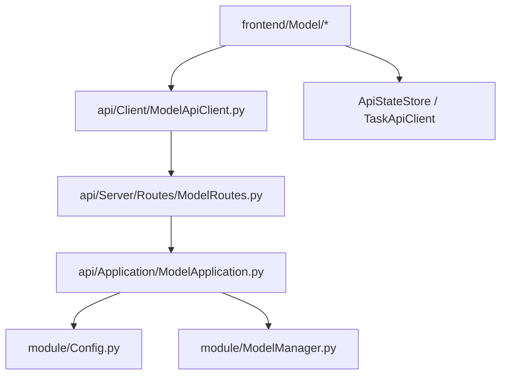

# Model 子树 UI/Core 分离设计

## 1. 背景

当前 `frontend/Model/` 子树仍然直接依赖 `module.Config`、`module.Engine.Engine` 与 `module.ModelManager`，与仓库已经完成分离的 `Project`、`Setting`、`Quality`、`Proofreading`、`Extra` 页面风格不一致。

现状主要表现为：

- `ModelPage` 直接读取和保存配置，并直接调用 `ModelManager` 执行激活、新增、删除、重置、排序动作。
- `ModelBasicSettingPage`、`ModelTaskSettingPage`、`ModelAdvancedSettingPage` 直接修改模型配置字典并落盘。
- `ModelBasicSettingPage` 直接通过 `Engine.get().get_status()` 控制测试按钮状态。
- `ModelSelectorPage` 同时承担在线模型列表拉取与模型配置写回。

这导致页面层同时掌握了：

- 配置文件结构
- 模型资源动作语义
- 引擎忙碌态读取方式

上述职责与仓库当前的 UI/Core 边界目标不一致，也让前端边界测试无法覆盖 `frontend/Model/*`。

## 2. 目标与非目标

### 2.1 目标

本次设计目标如下：

1. 让 `frontend/Model/*` 不再直接导入或调用 `Config`、`Engine`、`ModelManager`。
2. 为模型管理建立与现有仓库一致的本地 API 契约。
3. 将模型列表读取、模型局部字段更新和模型资源动作统一收口到 `ModelApiClient`。
4. 保持现有 UI 行为不变，包括激活、增删、重置、排序、局部设置编辑与测试按钮禁用逻辑。
5. 在迁移完成后，把 `frontend/Model/*` 纳入前端边界测试守卫。

### 2.2 非目标

本次设计明确不包含以下内容：

1. 不把 `ModelSelectorPage` 的在线模型列表拉取迁移到 Core。
2. 不重写 `Config` 或 `ModelManager` 的底层存储实现。
3. 不引入新的远程服务或跨进程通信方式。
4. 不在本轮引入模型配置 revision 并发保护。
5. 不改动模型测试事件 `Base.Event.APITEST` 的总体工作方式。

## 3. 设计原则

本设计遵循以下原则：

| 原则 | 说明 |
| --- | --- |
| 页面只做展示与交互 | 页面不再了解配置文件结构和 Core 单例 |
| 读写分离 | 读取统一走 `snapshot`，写入按资源动作或局部 patch 区分 |
| 动作显式化 | 激活、新增、删除、重置、排序单独建接口，不混入通用保存 |
| 局部更新白名单 | `update_model()` 只允许更新被声明的字段块，避免页面随意写任意键 |
| 兼容现有 Core | `Config` 与 `ModelManager` 继续保留在 Core 内部复用 |

## 4. 方案选择

### 4.1 候选方案

| 方案 | 描述 | 优点 | 缺点 |
| --- | --- | --- | --- |
| A1 | `snapshot + save_all_models` | 实现快 | 页面仍然容易依赖整块 dict，动作语义模糊 |
| A2 | `snapshot + update_model + 明确动作接口` | 与现有仓库风格一致，边界清楚 | 接口数略多 |
| A3 | 每个字段一个接口 | 边界最细 | 过碎，不符合仓库当前 API 风格 |

### 4.2 选型结论

采用 **A2：`snapshot + update_model + 明确动作接口`**。

原因如下：

1. `Model` 既包含配置字段，也包含资源动作，不适合退化为单一大保存接口。
2. 当前仓库成熟页面普遍采用“快照 + 局部更新 + 明确动作”的接口组织方式。
3. 该方案能让页面摆脱 Core 单例，又不会把接口拆得过细。

## 5. 分层与职责

### 5.1 总体结构



### 5.2 分层职责

| 层 | 职责 |
| --- | --- |
| `frontend/Model/*` | 展示模型列表、弹窗表单、按钮交互、Toast 与页面内状态 |
| `ModelApiClient` | 请求封装、返回对象反序列化 |
| `ModelRoutes` | 路由路径定义与请求转发 |
| `ModelApplication` | 参数白名单校验、调用 `Config` 与 `ModelManager`、拼装响应快照 |
| `Config` | 真实配置文件读写 |
| `ModelManager` | 模型新增、删除、重置、排序等资源动作 |
| `ApiStateStore` / `TaskApiClient` | 任务快照读取，供页面控制测试按钮可用性 |

### 5.3 页面边界

迁移完成后，下列文件不得再直接导入：

- `module.Config`
- `module.Engine.Engine`
- `module.ModelManager`

目标文件列表如下：

- `frontend/Model/ModelPage.py`
- `frontend/Model/ModelBasicSettingPage.py`
- `frontend/Model/ModelTaskSettingPage.py`
- `frontend/Model/ModelAdvancedSettingPage.py`
- `frontend/Model/ModelSelectorPage.py`

## 6. API 契约设计

### 6.1 接口总览

| 方法 | 路径 | 请求体 | 响应 `data` |
| --- | --- | --- | --- |
| `POST` | `/api/models/snapshot` | `{}` | `{"snapshot": {...}}` |
| `POST` | `/api/models/update` | `{"model_id": "...", "patch": {...}}` | `{"snapshot": {...}}` |
| `POST` | `/api/models/activate` | `{"model_id": "..."}` | `{"snapshot": {...}}` |
| `POST` | `/api/models/add` | `{"model_type": "CUSTOM_OPENAI"}` | `{"snapshot": {...}}` |
| `POST` | `/api/models/delete` | `{"model_id": "..."}` | `{"snapshot": {...}}` |
| `POST` | `/api/models/reset-preset` | `{"model_id": "..."}` | `{"snapshot": {...}}` |
| `POST` | `/api/models/reorder` | `{"model_id": "...", "operation": "MOVE_UP"}` | `{"snapshot": {...}}` |

### 6.2 为什么写完统一返回 `snapshot`

所有 mutation 都返回最新快照，原因如下：

1. `ModelPage` 需要在动作后立即刷新四个分类卡片与激活态。
2. 三个设置弹窗在 patch 写入后可以直接拿服务端确认后的最新对象回填。
3. 页面不需要额外再做一次主动 reload，避免读写分离后又多一轮样板代码。

### 6.3 `update` 接口约束

`update` 接口采用以下格式：

```json
{
  "model_id": "uuid",
  "patch": {
    "name": "OpenAI Custom",
    "api_url": "https://example.com/v1",
    "threshold": {
      "input_token_limit": 2048
    }
  }
}
```

`patch` 必须走字段白名单，只允许更新以下字段：

- `name`
- `api_url`
- `api_key`
- `model_id`
- `thinking`
- `threshold`
- `generation`
- `request`

明确禁止页面通过 `patch` 更新以下字段：

- `id`
- `type`
- `api_format`
- `activate_model_id`
- 整个 `models`

### 6.4 动作接口约束

#### `activate`

- 仅切换 `active_model_id`
- 成功后返回最新快照

#### `add`

- 只接受 `CUSTOM_GOOGLE`、`CUSTOM_OPENAI`、`CUSTOM_ANTHROPIC`
- 不允许新增 `PRESET`

#### `delete`

- 保留现有“同类型最后一个模型不可删除”的规则
- 若删除的是当前激活模型，由 Core 决定新的回退激活对象

#### `reset-preset`

- 仅允许作用于 `PRESET`
- 重置后返回最新快照

#### `reorder`

- `operation` 稳定值为：
  - `MOVE_UP`
  - `MOVE_DOWN`
  - `MOVE_TOP`
  - `MOVE_BOTTOM`
- 仅允许在同类型分组内移动，不能跨分组排序

## 7. 数据模型设计

### 7.1 客户端冻结对象

新增文件：

- `model/Api/ModelModels.py`

建议对象如下：

| 对象 | 字段 |
| --- | --- |
| `ModelPageSnapshot` | `active_model_id`、`models` |
| `ModelEntrySnapshot` | `id`、`type`、`name`、`api_format`、`api_url`、`api_key`、`model_id`、`request`、`threshold`、`thinking`、`generation` |
| `ModelRequestSnapshot` | `extra_headers`、`extra_headers_custom_enable`、`extra_body`、`extra_body_custom_enable` |
| `ModelThresholdSnapshot` | `input_token_limit`、`output_token_limit`、`rpm_limit`、`concurrency_limit` |
| `ModelThinkingSnapshot` | `level` |
| `ModelGenerationSnapshot` | `temperature`、`temperature_custom_enable`、`top_p`、`top_p_custom_enable`、`presence_penalty`、`presence_penalty_custom_enable`、`frequency_penalty`、`frequency_penalty_custom_enable` |

### 7.2 快照示例

```json
{
  "active_model_id": "4c5c...",
  "models": [
    {
      "id": "4c5c...",
      "type": "PRESET",
      "name": "GPT-4.1",
      "api_format": "OpenAI",
      "api_url": "https://api.openai.com/v1",
      "api_key": "",
      "model_id": "gpt-4.1",
      "request": {
        "extra_headers": {},
        "extra_headers_custom_enable": false,
        "extra_body": {},
        "extra_body_custom_enable": false
      },
      "threshold": {
        "input_token_limit": 512,
        "output_token_limit": 4096,
        "rpm_limit": 0,
        "concurrency_limit": 0
      },
      "thinking": {
        "level": "OFF"
      },
      "generation": {
        "temperature": 0.95,
        "temperature_custom_enable": false,
        "top_p": 0.95,
        "top_p_custom_enable": false,
        "presence_penalty": 0.0,
        "presence_penalty_custom_enable": false,
        "frequency_penalty": 0.0,
        "frequency_penalty_custom_enable": false
      }
    }
  ]
}
```

### 7.3 不引入 revision 的原因

本轮不在 `Model` 接口中引入 revision，原因如下：

1. `Settings` 与 `Extra` 这类本地配置型接口当前也未使用 revision。
2. `Model` 当前交互方式主要是单用户本地桌面 UI，冲突风险远低于 `QualityRule` 与 `Proofreading`。
3. 本次目标是先完成 UI/Core 分离，不把协议复杂度一次性做重。

后续若模型配置编辑进入更复杂的并发场景，再补 revision 即可。

## 8. 页面迁移设计

### 8.1 `ModelPage`

职责调整如下：

| 当前职责 | 迁移后职责 |
| --- | --- |
| 直接 `Config().load()` 读列表 | 调用 `ModelApiClient.get_snapshot()` |
| 直接调用 `ModelManager` 动作 | 调用 `activate/add/delete/reset_preset/reorder` |
| 直接自行刷新配置后重绘 | 以接口返回的最新快照刷新卡片 |

`ModelPage` 仍然负责：

- 模型按类型分组展示
- 弹窗打开与关闭后的列表刷新
- `APITEST` 完成后的 Toast 提示

### 8.2 `ModelBasicSettingPage`

调整如下：

- 初始模型数据来自 `ModelPageSnapshot` 中选中的 `ModelEntrySnapshot`
- 文本框变化后调用 `update_model(model_id, patch)`
- 测试按钮禁用状态改为读取 `ApiStateStore.task_snapshot` 或现有 `TaskApiClient` 快照
- 不再导入 `Config` 与 `Engine`

### 8.3 `ModelTaskSettingPage`

调整如下：

- 阈值字段通过 `update_model(model_id, {"threshold": {...}})` 提交
- 不再直接修改本地模型 dict 并保存

### 8.4 `ModelAdvancedSettingPage`

调整如下：

- 生成参数通过 `update_model(model_id, {"generation": {...}})` 提交
- 自定义请求头与 body 通过 `update_model(model_id, {"request": {...}})` 提交
- JSON 校验仍保留在页面层，页面只在校验成功后发 patch

### 8.5 `ModelSelectorPage`

本轮保留以下现状：

- 在线模型列表仍在页面侧通过 SDK 拉取

本轮仅调整以下行为：

- 初始配置读取改为来自 `ModelPageSnapshot` 中的当前模型对象
- 点击模型项后通过 `update_model(model_id, {"model_id": "..."})` 写回
- 不再直接 `Config().load().set_model().save()`

### 8.6 迁移顺序

推荐顺序如下：

1. 增加 API 契约、对象模型与客户端封装
2. 迁移 `ModelPage`
3. 迁移 `ModelBasicSettingPage`
4. 迁移 `ModelTaskSettingPage`
5. 迁移 `ModelAdvancedSettingPage`
6. 迁移 `ModelSelectorPage`
7. 删除旧的页面侧 Core 直连依赖

## 9. 服务端实现建议

### 9.1 推荐新增文件

建议新增以下文件：

- `api/Server/Routes/ModelRoutes.py`
- `api/Application/ModelApplication.py`
- `api/Contract/ModelPayloads.py`
- `api/Client/ModelApiClient.py`
- `model/Api/ModelModels.py`

### 9.2 `ModelApplication` 职责

`ModelApplication` 建议负责：

1. 统一读取配置并初始化模型列表
2. 把 `Config` + `ModelManager` 的结果映射为 `ModelPageSnapshot`
3. 对 `update` patch 做白名单校验和归一化
4. 调用 `ModelManager` 完成新增、删除、重置、排序等动作
5. 在动作后把最新状态写回配置文件

### 9.3 Core 复用原则

本轮不新建新的模型领域 service，优先复用现有能力：

- `Config.initialize_models()`
- `Config.get_model()`
- `Config.set_model()`
- `Config.save()`
- `ModelManager.add_model()`
- `ModelManager.delete_model()`
- `ModelManager.reset_preset_model()`
- `ModelManager.reorder_models()`

这样可以在最小改动范围内完成 UI/Core 分离。

## 10. 测试设计

### 10.1 API 客户端测试

新增测试覆盖：

- `ModelApiClient.get_snapshot()` 返回冻结对象
- `ModelApiClient.update_model()` 返回最新快照
- 各动作接口调用路径与响应对象反序列化

### 10.2 Application/Route 测试

新增测试覆盖：

- `snapshot` 能正确返回当前激活模型与模型列表
- `update` 只允许白名单字段
- `delete` 保留“同类型最后一个模型不可删除”约束
- `reset-preset` 仅允许作用于预设模型
- `reorder` 不允许跨组排序

### 10.3 前端边界测试

在 `tests/frontend/test_frontend_core_boundary.py` 中新增 `MODEL_FRONTEND_FILES` 分组，覆盖：

- `frontend/Model/ModelPage.py`
- `frontend/Model/ModelBasicSettingPage.py`
- `frontend/Model/ModelTaskSettingPage.py`
- `frontend/Model/ModelAdvancedSettingPage.py`
- `frontend/Model/ModelSelectorPage.py`

新增禁止导入项：

- `from module.Config import Config`
- `from module.Engine.Engine import Engine`
- `from module.ModelManager import ModelManager`

### 10.4 回归验证

迁移完成后至少验证以下场景：

1. 模型页首次打开能正常显示四类卡片
2. 激活模型后 UI 立即更新
3. 自定义模型新增、删除、排序结果正确
4. 预设模型重置后配置恢复
5. 基础设置、任务设置、高级设置的局部字段修改正确落盘
6. `ModelSelectorPage` 选中模型后能正确写回 `model_id`
7. 任务运行中测试按钮仍会被禁用

## 11. 风险与应对

| 风险 | 说明 | 应对 |
| --- | --- | --- |
| patch 越权写字段 | 页面可能传入未声明字段 | 在 `ModelApplication` 做白名单过滤与错误返回 |
| 排序语义漂移 | 页面自己拼排序结果容易跨组打乱 | 排序只接受 `model_id + operation`，组内算法保留在 Core |
| 删除规则回退 | 迁移时可能漏掉“最后一个不可删” | 保持原规则在 Core 内执行并补测试 |
| 弹窗数据不同步 | 页面缓存旧对象，写回后显示漂移 | mutation 统一返回最新快照，页面用返回对象回填 |
| 任务状态来源混乱 | 仍然错误依赖 `Engine` | 明确改读 `ApiStateStore` 或现有任务快照接口 |

## 12. 兼容层策略

本轮兼容策略如下：

1. `Config` 与 `ModelManager` 继续保留，但只允许在 API/Core 内部使用。
2. 页面侧不保留 `Config().load().save()` 双写过渡层，直接切换到 `ModelApiClient`。
3. `ModelSelectorPage` 的在线模型列表拉取逻辑暂时留在页面层，不强行搬到 Core。
4. 页面迁移完成后，直接删除对应 Core 直连导入，不保留旧入口别名。

## 13. 实施完成标准

满足以下条件即视为本设计落地完成：

1. `frontend/Model/*` 不再直接导入或调用 `Config`、`Engine`、`ModelManager`
2. `Model` API 契约、客户端与冻结对象落地
3. 五个模型相关页面全部切换到 `ModelApiClient`
4. 边界测试新增 `Model` 分组并通过
5. 用户可见行为与当前版本保持一致

## 14. 后续计划入口

本设计完成并经用户确认后，下一步应进入实现计划阶段，输出按文件与验证步骤拆开的实施清单，再开始真正编码。
