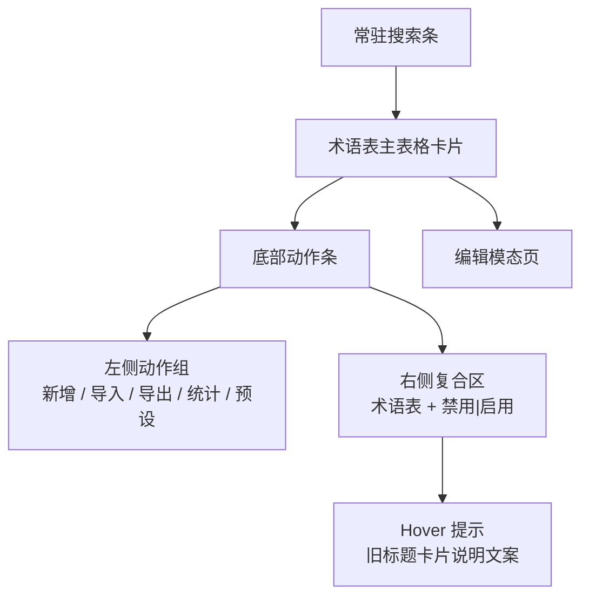
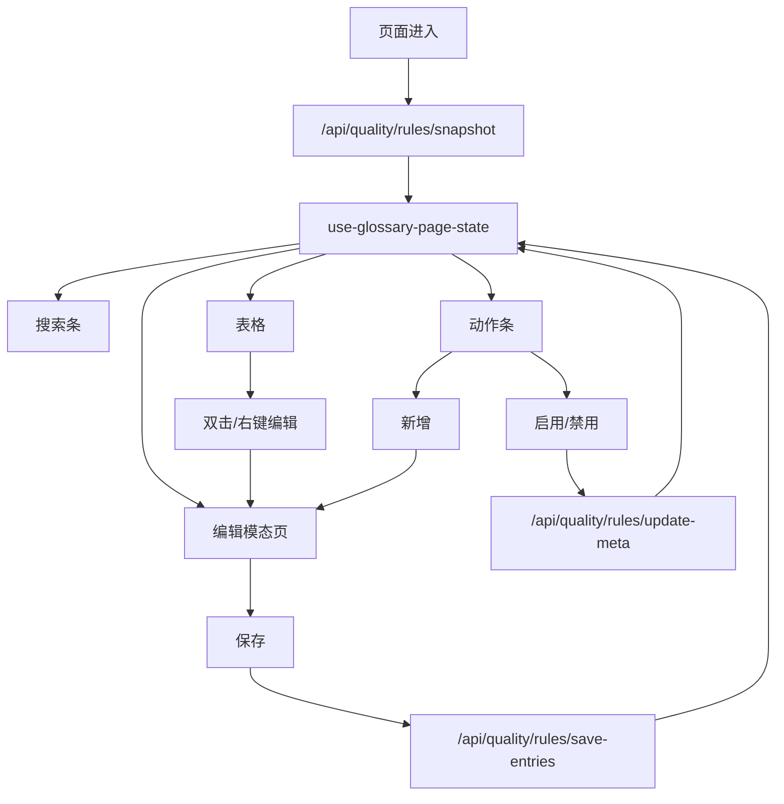

# 术语表页重构设计稿

## 1. 背景与目标

本设计用于指导 `frontend-vite` 中术语表页的正式实现，替换当前导航注册表中的占位调试页，并在不打破旧版用户认知的前提下，把旧版 PySide `GlossaryPage` 迁移为符合现有 Electron + React 渲染层规范的新页面。

本次设计已确认以下硬约束：

- 保留旧版页面中的原有文案、图标与核心交互语义，不额外发挥。
- 页面字号、间距、控件样式对齐 `frontend-vite/src/renderer` 下现有页面与控件布局。
- 右侧常驻编辑区移除，改为双击条目打开编辑模态页。
- 编辑区中的 `新增` 按钮迁移到底部动作条，其他编辑按钮保留在模态页中，不收入“更多”。
- 头部总开关不再使用 checkbox / switch，而改为按钮组。
- 术语表页搜索改为页面内常驻功能，不新增替换能力。
- 本次一并统一 `frontend-vite` 中现有同类布尔分段开关的文案表达，把 `关闭 / 打开` 调整为 `禁用 / 启用`。

## 2. 设计目标

### 2.1 用户目标

- 用户仍然能把术语表理解为“一个可搜索、可批量处理、可排序、可编辑的规则列表”。
- 用户从旧版迁移到新版后，不需要重新学习基础操作路径。
- 用户在高频操作时可以更快完成搜索、批量选择、拖拽排序和编辑。

### 2.2 工程目标

- 术语表页状态必须只有一个权威来源，避免表格、模态页、动作条各自维护副本。
- 术语表页应复用现有 `frontend-vite` 的设计系统与页面组织规则，不新开平行体系。
- 本次重构顺手沉淀一层共享表格外壳组件，供术语表页与工作台页等后续表格页复用。
- 本次不抽象“全功能通用业务表格组件”，避免 props 爆炸和过度封装。

## 3. 非目标

- 不在本次为术语表页新增“替换”能力。
- 不在本次改造文本保护页、文本替换页、自定义提示词页的页面布局。
- 不在本次引入新的测试框架。
- 不在本次把所有页面的布局都改成与术语表页完全一致，只统一同类布尔分段开关的文案与基础交互表达。

## 4. 旧版页面要点复盘

旧版 `frontend/Quality/GlossaryPage.py` 与其基类 `QualityRulePageBase.py`、编辑面板 `GlossaryEditPanel.py` 提供了以下关键行为：

- 页面结构是“头部说明卡 + 主表格 + 右侧编辑区 + 底部命令栏”。
- 条目列表是只读表格，单击改变选中项，支持 `Ctrl / Shift` 多选与右键菜单。
- 编辑区是唯一编辑入口，保存、删除、查询都通过编辑区触发。
- 任何可能切换上下文的动作都优先经过未保存保护；有草稿时先尝试保存，再继续后续动作。
- 空 `src` 条目不会作为有效数据持久化。
- 右键菜单包含删除、排序、大小写敏感启用/禁用。
- 底部命令栏包含导入、导出、搜索、统计、预设。
- 搜索栏默认隐藏，通过命令栏显隐切换。
- 总开关写入 `glossary` 规则的 `meta.enabled`。
- 查询操作通过 `/api/quality/rules/query-proofreading` 跳转到校对页。

本次重构必须保留这些旧认知中的主体语义，只在用户已明确指定的地方调整结构。

## 5. 页面总览

### 5.1 新页面结构

新页面采用以下信息层级：

具体定义如下：

- 页面顶部不再保留旧版独立头部说明卡。
- 原标题 `术语表` 融入底部动作条右侧复合区。
- 原说明文案不消失，而是作为右侧复合区的 tooltip 文案保留。
- 搜索条改为页面内容区顶部常驻，并在页面内部滚动时保持 sticky。
- 中部主体为大表格卡片。
- 底部动作条继续保留旧命令栏认知，但移除搜索按钮，右侧改为标题与总开关的复合区。

### 5.2 页面骨架

页面可拆解为以下三块：

1. 常驻搜索条
2. 术语表主表格
3. 底部动作条

其中编辑能力完全从主页面剥离，改由模态页承载。

## 6. 交互设计

### 6.1 列表选择与编辑入口

术语表主表格保留旧版主认知，并新增两项显式增强能力：

- 新增框选
- 将旧右键排序改为拖拽排序

具体规则如下：

| 交互 | 行为 |
| --- | --- |
| 单击行 | 更新当前主选中项 |
| `Ctrl / Shift` | 扩展多选 |
| 框选 | 批量选中连续行 |
| 双击行 | 打开该条目的编辑模态页 |
| 右键行 | 打开上下文菜单，并把上下文切到被右击的行 |

### 6.2 右键菜单

右键菜单保留旧版的批量处理定位，但内容作如下调整：

- 保留：`删除`
- 保留：`大小写敏感 -> 启用 / 禁用`
- 新增：`编辑`
- 移除：旧版 `排序` 子菜单

`编辑` 菜单项的语义为：

- 始终作用于右击的上下文行。
- 若该行原本不在当前选中集合中，先把当前上下文切到该行，再打开编辑模态页。

### 6.3 拖拽排序

排序入口从旧版右键菜单迁移为直接拖拽。

已确认的排序语义如下：

- 当拖动项属于当前已选中集合时，整个已选中集合一起移动。
- 被移动的多行保持原相对顺序不变。
- 拖拽完成后立即持久化，不新增额外“应用排序”步骤。
- 持久化失败时回滚到拖拽前顺序，并提示失败。

### 6.4 新增与编辑模态页

编辑模态页承载旧版右侧编辑区内容，字段与功能保持一致：

- 原文
- 译文
- 描述
- 规则（仅大小写敏感）

按钮保留如下：

- `保存`
- `删除`
- `查询`
- `取消`

按钮移除如下：

- `新增`

`新增` 的语义已经确认如下：

- 点击动作条中的 `新增` 后，直接打开一个空白编辑模态页。
- 列表中不会先插入空白条目。
- 只有在保存成功后，条目才真正写入列表。
- 若当前有选中项，则插入到该项后面。
- 若当前没有选中项，则追加到列表末尾。

### 6.5 模态关闭与未保存保护

模态页的关闭策略继承旧版“先保存再跳转”的精神，但改成适配模态页的统一收口：

- 可见关闭入口：
  - 模态右上角关闭按钮
  - 底部 `取消` 按钮
  - `Esc`
- 不允许点击遮罩关闭。

关闭流程统一为：

1. 若没有未保存改动，则直接关闭。
2. 若存在未保存改动，则先尝试自动保存。
3. 保存成功后关闭模态页。
4. 若校验失败或请求失败，则模态页保持打开，并显示错误反馈。

本次不引入“关闭即直接放弃草稿”的分支。

### 6.6 查询行为

模态页中的 `查询` 沿用旧版能力：

- 调用 `/api/quality/rules/query-proofreading`
- 拿到校对查询参数
- 跳转到校对页并执行查找

该能力不因为模态化而改变路径语义。

## 7. 搜索设计

### 7.1 搜索条定位

搜索条从“命令栏切换态”改为“页面常驻态”。

具体规则如下：

- 默认显示在表格上方。
- 页面内容滚动时保持 sticky。
- 不再通过动作条按钮切换显隐。
- 动作条中的搜索按钮移除，避免双入口。

### 7.2 搜索能力边界

保留旧版搜索能力，不额外扩展：

- 搜索输入
- 上一个匹配
- 下一个匹配
- 旧搜索卡中的搜索选项

明确不做：

- 表格字段筛选器体系
- 搜索替换
- 高级搜索 DSL

## 8. 动作条与总开关设计

### 8.1 动作条布局

动作条沿用旧版底部命令栏认知，拆分为左右两个区域：

- 左侧动作组：`新增 / 导入 / 导出 / 统计 / 预设`
- 右侧复合区：`术语表 + 禁用|启用`

### 8.2 右侧复合区

右侧复合区承担三个语义：

1. 页面标题
2. 规则启用状态
3. 说明提示入口

其显示形态应接近：

`术语表   [禁用 | 启用]`

交互要求如下：

- 按钮组选中态能明确表示当前状态。
- hover 到标题或整个复合区时，显示旧头部说明文案：
  `通过在提示词中构建术语表来引导模型翻译，可实现统一翻译、矫正人称属性等功能`
- 点击按钮组时写入 `/api/quality/rules/update-meta` 对应的 `enabled`。
- 若请求失败，则回滚视觉状态到上一次成功快照。

## 9. 共享组件与页面拆分策略

### 9.1 页面级模块拆分

术语表页建议新增以下文件：

- `frontend-vite/src/renderer/pages/glossary-page/page.tsx`
- `frontend-vite/src/renderer/pages/glossary-page/types.ts`
- `frontend-vite/src/renderer/pages/glossary-page/use-glossary-page-state.ts`
- `frontend-vite/src/renderer/pages/glossary-page/glossary-page.css`
- `frontend-vite/src/renderer/pages/glossary-page/components/glossary-search-bar.tsx`
- `frontend-vite/src/renderer/pages/glossary-page/components/glossary-table.tsx`
- `frontend-vite/src/renderer/pages/glossary-page/components/glossary-context-menu.tsx`
- `frontend-vite/src/renderer/pages/glossary-page/components/glossary-command-bar.tsx`
- `frontend-vite/src/renderer/pages/glossary-page/components/glossary-edit-dialog.tsx`
- `frontend-vite/src/renderer/pages/glossary-page/components/glossary-selection.ts`

### 9.2 共享布尔分段开关

本次建议新增一层可复用的小型共享部件，例如：

- `frontend-vite/src/renderer/widgets/boolean-segmented-toggle/boolean-segmented-toggle.tsx`

其职责仅包括：

- 统一 `禁用 | 启用` 双段按钮组结构
- 统一 `value=true/false` 到 UI 值的映射
- 统一 aria label、禁用态和基础尺寸

其不负责：

- 页面级说明文案
- 异步保存逻辑
- tooltip 内容

本次应迁移的现有消费点包括：

- `app-settings-page`
- `basic-settings-page`
- `expert-settings-page`
- `model-advanced-settings-dialog`
- 新增 `glossary-command-bar`

### 9.3 共享表格抽象策略

本次建议新增“共享表格外壳组件”，但不抽象“全功能通用业务表格”。

建议新增：

- `frontend-vite/src/renderer/widgets/data-table-frame/data-table-frame.tsx`

其职责包括：

- 表格卡片容器
- 表头与表体的结构分离
- sticky 头部与滚动容器
- 空态承载
- 统一的表面样式与基础表格节奏

其不负责：

- 多选
- 框选
- 拖拽排序
- 虚拟化
- 右键菜单
- 行级动作
- 编辑模态页

### 9.4 工作台表格的处理方式

工作台表格已经具备较重的专属行为：

- 虚拟化
- 拖拽排序
- 行上下文菜单
- 行动作按钮
- overlay 与占位行

因此本次建议：

- 保留 `workbench-file-table.tsx` 的业务层实现。
- 将其表格外壳部分迁移为基于共享 `data-table-frame` 组装。
- 术语表表格同样基于该共享外壳实现自己的行为层。

这样可以沉淀稳定共性，而避免过度抽象成 `GenericDataTable<T>`。

## 10. 状态流设计

### 10.1 单一状态源

术语表页的唯一权威状态来源是 `use-glossary-page-state.ts`。

该 hook 统一管理以下状态：

- `entries`
- `revision`
- `meta.enabled`
- 当前主选中行
- 已选中行集合
- 框选锚点
- 上下文菜单目标行
- 搜索词、匹配结果和当前匹配索引
- 模态开关、编辑模式、当前编辑条目
- pending 状态
- 统计结果
- 预设数据

页面上的其他组件只接受状态快照和事件回调，不直接持有可写业务副本。

### 10.2 数据流程

## 11. API 对接方案

术语表页只通过现有 Core API 对接，不额外引入新数据通路。

使用接口如下：

- `/api/quality/rules/snapshot`
- `/api/quality/rules/update-meta`
- `/api/quality/rules/save-entries`
- `/api/quality/rules/import`
- `/api/quality/rules/export`
- `/api/quality/rules/presets`
- `/api/quality/rules/presets/read`
- `/api/quality/rules/presets/save`
- `/api/quality/rules/presets/rename`
- `/api/quality/rules/presets/delete`
- `/api/quality/rules/query-proofreading`
- `/api/quality/rules/statistics`

对应的桌面文件对话框建议新增语义化 IPC：

- 术语规则导入文件选择
- 术语规则导出保存路径选择

文件类型限制沿用旧版：

- `*.json`
- `*.xlsx`

## 12. 错误处理与反馈

### 12.1 反馈原则

- 所有异步操作失败都使用统一 toast 反馈。
- 校验失败优先在模态内部保持上下文，不直接把用户踢出当前编辑态。
- 失败不吞草稿，不 silently rollback 用户输入。

### 12.2 关键失败场景

| 场景 | 处理方式 |
| --- | --- |
| 保存校验失败 | 模态页保持打开，展示字段错误和 toast |
| 保存请求失败 | 模态页保持打开，保留草稿 |
| 导入失败 | 保持当前列表不变，toast 提示 |
| 导出失败 | 不影响页面当前状态，toast 提示 |
| 拖拽排序失败 | 回滚顺序并提示失败 |
| 总开关切换失败 | 回滚按钮组选中态 |
| 查询失败 | 模态页保持打开并提示失败 |
| 统计失败 | 清理本轮加载态，保留页面其他功能可用 |

## 13. 文案与本地化策略

### 13.1 术语表页新增文案

`frontend-vite/src/renderer/i18n/resources/zh-CN/glossary-page.ts` 与对应 EN 文件需要从当前极简占位内容扩展为真实页面文案，包括：

- 搜索条文案
- 动作条文案
- 模态标题与按钮文案
- 删除确认文案
- 统计提示文案
- 预设菜单文案
- tooltip 说明文案
- 空态文案

### 13.2 全局切换文案统一

`frontend-vite/src/renderer/i18n/resources/zh-CN/app.ts`

当前：

- `disabled: 关闭`
- `enabled: 打开`

本次改为：

- `disabled: 禁用`
- `enabled: 启用`

对应英文资源同步更新，使两端语义保持一致。

## 14. 验证策略

### 14.1 自动验证

本次变更完成后应至少执行：

- `npm run lint`
- `npm run ui:audit`

本次不为此单独引入新测试框架。

### 14.2 手工验证

手工验证清单如下：

1. 术语表页加载快照、开关状态与列表展示是否正确。
2. 常驻搜索条是否能稳定搜索、跳转上一个/下一个匹配，并在滚动时保持 sticky。
3. 单击、多选、`Ctrl / Shift`、框选是否互相兼容。
4. 双击、右键 `编辑`、动作条 `新增` 是否都能正确打开模态页。
5. 模态页 `保存 / 删除 / 查询 / 取消 / Esc / 右上角关闭` 是否都遵循统一未保存保护。
6. 点击遮罩是否不会关闭模态页。
7. 拖拽单行与拖拽整组选中项时，顺序是否正确，失败时是否回滚。
8. 右键菜单里的 `删除` 与 `大小写敏感 启用 / 禁用` 是否仍可作用于多选集合。
9. 导入、导出、统计、预设是否保持旧语义。
10. 亮色 / 暗色主题下，表格、搜索条、动作条与模态页是否都可用。
11. `app-settings-page`、`basic-settings-page`、`expert-settings-page`、`model-advanced-settings-dialog` 中原 `关闭 / 打开` 文案是否全部统一为 `禁用 / 启用`。
12. 工作台表格迁到共享表格外壳后，原有行为是否无回归。

## 15. 风险与缓解

### 15.1 风险

- 术语表表格同时引入多选、框选、拖拽与上下文菜单，交互冲突风险较高。
- 模态页自动保存关闭逻辑比普通对话框更复杂，容易出现“关闭动作被吞”或“错误时误关闭”。
- 若共享表格外壳抽象过深，可能反过来拖累工作台表格与后续页面。

### 15.2 缓解策略

- 共享层只抽象表格外壳，不抽象行为层。
- 选择、框选、拖拽排序相关逻辑拆为可独立验证的小模块。
- 先让术语表与工作台共同收敛到共享表格外壳，再观察后续页面是否真的具备第二轮上提条件。

## 16. 实施顺序建议

推荐实施顺序如下：

1. 扩展术语表 i18n 文案，并统一 `app.toggle` 文案。
2. 提取共享 `boolean-segmented-toggle`。
3. 提取共享 `data-table-frame`，并让工作台表格先接入。
4. 搭建 `glossary-page` 页面骨架和状态 hook。
5. 完成常驻搜索条、动作条、右侧复合总开关。
6. 完成术语表表格、多选、框选、右键菜单与拖拽排序。
7. 完成编辑模态页与未保存保护。
8. 接入导入导出、统计、预设、查询。
9. 统一回归主题、交互与文案。

## 17. 结论

本方案将术语表页重构为“常驻搜索 + 主表格 + 底部动作条 + 模态编辑”的新结构，并保持旧版用户认知中的关键行为不变。与此同时，本次会顺手沉淀两类可复用资产：

- 统一 `禁用 | 启用` 的布尔分段开关
- 共享表格外壳组件

但不会在本次把表格行为层过度抽象成巨型通用组件，以保证范围可控、行为清晰、后续页面迁移路径稳定。
