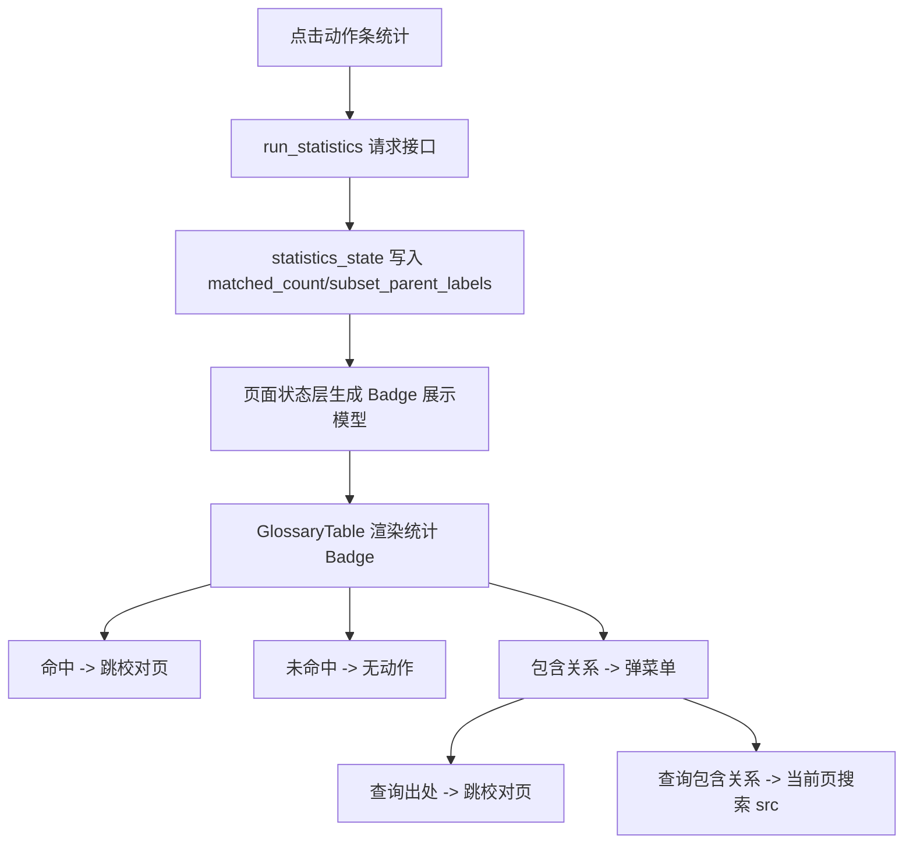

# 术语表页统计列重设计稿

## 1. 背景与范围

本文档用于补充 `docs/superpowers/specs/2026-04-09-glossary-page-design.md` 中术语表页的统计列设计，聚焦 `frontend-vite` 术语表表格的“状态列”重设计，以及编辑模态页中查询能力的迁移。

若本文与上一版设计稿存在冲突，以本文覆盖以下范围内的结论：

- 术语表表格中的 `状态` 列
- 编辑模态页中的 `查询` 按钮与查询入口
- 统计结果在术语表页内的展示、提示与点击行为

本文不重写术语表页的整体布局、搜索条、拖拽、多选、预设、导入导出等既有设计，只描述本次需求涉及的增量变化。

## 2. 已确认需求

本次设计已确认以下硬约束：

- 原表头 `状态` 改为 `统计`。
- 用户点击底部动作条中的 `统计` 按钮后，对每条术语的原文命中情况进行统计。
- 统计结果分为三种语义：
  - 命中
  - 未命中
  - 命中但存在包含关系
- 统计结果统一用 Badge 展示，不再显示纯文本数字。
- Hover Badge 时显示 tooltip。
- 点击 Badge 时按结果类型执行不同动作。
- 编辑模态页移除 `查询` 按钮，查询入口迁移到统计列。
- `查询包含关系` 复用当前术语表顶部搜索栏，把当前条目的原文写入搜索并立即执行。
- 术语条目发生编辑、新增、删除、导入、应用预设、拖拽排序后，旧统计结果允许继续保留，直到用户下次手动点击 `统计`。
- 本次不要求补齐真正的校对页实现；继续复用现有“写入 `proofreading_lookup_intent` 后跳转 `proofreading` 路由”的链路。

## 3. 设计目标

### 3.1 用户目标

- 用户一眼就能区分“没有命中”“命中了”“命中了但结果有歧义”三类统计结果。
- 用户不需要进入编辑模态页，也能直接从表格定位条目的出处或包含关系。
- 用户在包含关系场景下，可以在“跳校对页”和“留在当前页继续看”之间快速切换。

### 3.2 工程目标

- 统计结果仍然只有 `useGlossaryPageState` 这一处权威状态来源，不在表格组件内再维护并行语义状态。
- 表格组件只负责渲染 Badge、tooltip 和菜单触发，不直接承载导航或页面搜索逻辑。
- 本次变更尽量复用现有 `/api/quality/rules/statistics` 与 `/api/quality/rules/query-proofreading` 接口，不新增接口契约。

## 4. 非目标

- 不在本次实现真正的校对页搜索 UI。
- 不在本次引入新的统计缓存、过期标记或自动重算机制。
- 不在本次为包含关系新增独立筛选面板或关系视图。
- 不在本次修改术语表搜索条的布局和基础搜索能力。

## 5. 结构调整

### 5.1 页面边界

本次变更只落在术语表页内部，边界如下：

| 层级 | 文件位置 | 责任 |
| --- | --- | --- |
| 页面状态层 | `frontend-vite/src/renderer/pages/glossary-page/use-glossary-page-state.ts` | 请求统计接口、把原始统计结果映射为 Badge 语义、提供 Badge 点击动作 |
| 页面类型层 | `frontend-vite/src/renderer/pages/glossary-page/types.ts` | 定义统计 Badge 的展示类型与交互动作类型 |
| 页面展示层 | `frontend-vite/src/renderer/pages/glossary-page/components/glossary-table.tsx` | 渲染 `统计` 列、Badge、tooltip、包含关系菜单 |
| 页面编辑层 | `frontend-vite/src/renderer/pages/glossary-page/components/glossary-edit-dialog.tsx` | 删除 `查询` 按钮与对应 props |
| 页面装配层 | `frontend-vite/src/renderer/pages/glossary-page/page.tsx` | 把页面状态层产出的新 props 传给表格和模态页 |

### 5.2 设计原则

- 继续保留 `statistics_state` 作为统计数据的唯一来源。
- 页面状态层新增一层“统计 Badge 展示模型”，用于把底层的 `matched_count` 与 `subset_parent_labels` 映射为 UI 可直接消费的三态语义。
- 表格组件不自己解析 `matched_count_by_entry_id` 与 `subset_parent_labels_by_entry_id` 两张字典。
- 编辑模态页在本次回归为纯编辑入口，不再承担查询跳转职责。

## 6. 交互设计

### 6.1 统计按钮

底部动作条中的 `统计` 按钮继续复用现有接口 `/api/quality/rules/statistics`。

具体规则如下：

- 按钮在请求进行中保持禁用。
- 请求成功后，整表根据最新统计结果刷新 Badge。
- 请求失败后，沿用现有错误反馈，并把 `statistics_state` 清空为初始状态。
- 请求期间不为每一行单独展示 loading 态，避免表格抖动。

### 6.2 统计列三态

统计列统一使用 Badge 展示，状态判定规则如下：

| 条件 | Badge 语义 | 视觉样式 | 显示文本 |
| --- | --- | --- | --- |
| `matched_count === 0` | 未命中 | 失败色 Badge | `0` |
| `matched_count > 0` 且 `subset_parent_labels.length === 0` | 命中 | 成功色 Badge | 命中次数 |
| `matched_count > 0` 且 `subset_parent_labels.length > 0` | 命中但存在包含关系 | 警告色 Badge | 命中次数 |

未运行统计时，统计列保持空白，不把“未统计”伪装成 `0`。

### 6.3 Tooltip 规则

Badge 的 tooltip 内容按语义固定为：

| Badge 语义 | Tooltip 内容 |
| --- | --- |
| 命中 | `命中条目数：{COUNT}` |
| 未命中 | `命中条目数：0` |
| 命中但存在包含关系 | `命中条目数：{COUNT}` + 换行 + `存在包含关系：` + 换行 + `x -> y` 列表 |

其中：

- `x` 为当前条目的 `src`
- `y` 为 `subset_parent_labels` 中的每一项
- tooltip 使用多行文本渲染，保持换行

包含关系示例：

```text
命中条目数：3
存在包含关系：
Alice -> Alice Liddell
Alice -> Alice-san
```

### 6.4 点击行为

Badge 点击行为如下：

| Badge 语义 | 点击行为 |
| --- | --- |
| 命中 | 直接查询出处，跳转到校对页 |
| 未命中 | 无效果 |
| 命中但存在包含关系 | 弹出菜单，菜单项为 `查询出处` 与 `查询包含关系` |

菜单项语义固定如下：

- `查询出处`
  - 复用现有 `/api/quality/rules/query-proofreading` 链路
  - 写入 `proofreading_lookup_intent`
  - 跳转到 `proofreading` 路由
- `查询包含关系`
  - 留在当前术语表页
  - 把当前条目的 `src` 写入顶部搜索栏 `keyword`
  - 强制 `is_regex = false`
  - 触发一次现有搜索定位逻辑

### 6.5 与行选择、右键菜单的关系

- Badge 点击必须标记为“忽略框选 / 忽略行点击”的交互目标，避免与表格框选和单击选中冲突。
- 包含关系菜单只作用于 Badge 本体，不替换现有表格行右键菜单。
- 点击包含关系 Badge 打开的菜单是“统计结果动作菜单”，不是行上下文菜单的子项。

## 7. 数据与状态设计

### 7.1 统计展示模型

页面状态层新增统计 Badge 展示模型，类型定义如下：

```ts
type GlossaryStatisticsBadgeKind = 'matched' | 'unmatched' | 'related'

type GlossaryStatisticsBadgeState = {
  kind: GlossaryStatisticsBadgeKind
  matched_count: number
  subset_parent_labels: string[]
}
```

说明：

- `statistics_state` 仍然保存接口原始结果。
- `GlossaryStatisticsBadgeState` 是页面层派生结果，不单独持久化。
- 表格逐行渲染时，只消费这一层派生模型，而不直接判断底层字典。

### 7.2 状态流



### 7.3 统计结果保留策略

本次明确采用“保留旧结果直到下次手动统计”的策略：

- 编辑条目后，不自动清空统计列
- 新增条目后，不自动清空统计列
- 删除条目后，不自动清空统计列
- 导入、应用预设、拖拽排序后，不自动清空统计列

该策略的目的是保持实现简单，不引入额外的“统计结果已过期”提示态。文档必须明确这是一个有意为之的取舍，而不是遗漏。

## 8. 文案与样式

### 8.1 本地化键

本次新增或替换的术语表页文案键如下：

| 用途 | 键名 |
| --- | --- |
| 表头 `统计` | `glossary_page.fields.statistics` |
| Tooltip `命中条目数：{COUNT}` | `glossary_page.statistics.hit_count` |
| Tooltip `存在包含关系：` | `glossary_page.statistics.subset_relations` |
| 菜单项 `查询出处` | `glossary_page.statistics.action.query_source` |
| 菜单项 `查询包含关系` | `glossary_page.statistics.action.search_relation` |

说明：

- 当前 `glossary_page.fields.status` 在术语表表头中不再使用。
- ZH / EN 文案文件需要保持结构与行数一致。
- Tooltip 的多行文本由页面状态层拼装，展示层只负责渲染换行。

### 8.2 视觉表达

统计列样式遵循以下原则：

- `命中` 使用成功色 Badge
- `未命中` 使用失败色 Badge
- `命中但存在包含关系` 使用警告色 Badge
- 三类 Badge 的尺寸、圆角、字重与当前术语表页的规则 Badge 保持同一视觉体系
- 未命中 Badge 虽然不可点击，但 hover 仍然显示 tooltip

### 8.3 编辑模态页变化

编辑模态页按钮组移除 `查询`，保留如下按钮：

- `删除`
- `取消`
- `保存`

这意味着“查询”从模态页级动作下沉为列表级统计结果动作。用户不必先打开模态页，才能继续定位条目的出处或关系。

## 9. 预期改动范围

按本设计实施时，预期会涉及以下文件：

| 文件 | 预期改动 |
| --- | --- |
| `frontend-vite/src/renderer/pages/glossary-page/use-glossary-page-state.ts` | 生成统计 Badge 展示模型，承接 Badge 点击动作，移除模态页查询动作 |
| `frontend-vite/src/renderer/pages/glossary-page/types.ts` | 补充统计 Badge 类型 |
| `frontend-vite/src/renderer/pages/glossary-page/components/glossary-table.tsx` | 用 Badge 替换纯文本统计单元格，接入 tooltip 与菜单 |
| `frontend-vite/src/renderer/pages/glossary-page/components/glossary-edit-dialog.tsx` | 删除 `on_query` props 与查询按钮 |
| `frontend-vite/src/renderer/pages/glossary-page/page.tsx` | 调整表格与模态页 props 传递 |
| `frontend-vite/src/renderer/pages/glossary-page/glossary-page.css` | 新增统计 Badge 与统计菜单相关样式 |
| `frontend-vite/src/renderer/i18n/resources/zh-CN/glossary-page.ts` | 补中文文案 |
| `frontend-vite/src/renderer/i18n/resources/en-US/glossary-page.ts` | 对齐英文文案与结构 |

## 10. 验证清单

实施完成后，至少验证以下结果：

1. 表头文案已从 `状态` 改为 `统计`。
2. 首次未点击 `统计` 前，统计列为空白。
3. 点击 `统计` 后，未命中条目显示失败色 Badge 且文本为 `0`。
4. 点击 `统计` 后，普通命中条目显示成功色 Badge 且文本为命中次数。
5. 点击 `统计` 后，包含关系条目显示警告色 Badge 且文本为命中次数。
6. 三类 Badge 的 tooltip 文案与换行格式符合设计。
7. 点击普通命中 Badge 会写入 `proofreading_lookup_intent` 并跳转 `proofreading`。
8. 点击未命中 Badge 无动作。
9. 点击包含关系 Badge 会弹出 `查询出处 | 查询包含关系` 菜单。
10. 点击 `查询出处` 会复用现有校对页查询链路。
11. 点击 `查询包含关系` 会把顶部搜索栏改为当前条目 `src` 并立即执行搜索。
12. 编辑模态页中不再出现 `查询` 按钮。
13. 编辑或修改条目后，旧统计结果仍然保留，直到再次手动点击 `统计`。
14. 亮色 / 暗色主题下，Badge、tooltip、菜单都有可接受的可读性。

## 11. 已知限制与取舍

- 当前 `frontend-vite` 中的 `proofreading` 仍是占位调试页，因此“跳转到校对页搜索”的可见结果仍然是导航跳转与查询意图写入，而不是完整校对搜索界面。
- `查询包含关系` 只复用当前页搜索当前条目的 `src`，不会自动筛出所有包含关系目标项。
- 本次不显示“统计结果已过期”提示，因此用户在条目变更后看到的统计可能不是最新结果。这是已确认的产品取舍。

## 12. 与上一版设计稿的关系

本文对 `docs/superpowers/specs/2026-04-09-glossary-page-design.md` 中以下结论进行覆盖：

- 第 `6.4` 节中“编辑模态页保留 `查询` 按钮”的描述不再成立。
- 第 `6.6` 节中“查询行为位于模态页”的描述不再成立，查询入口迁移为统计列动作。
- 旧设计稿中以“状态列 / 统计结果”为纯文本展示的理解，统一替换为本文定义的三态 Badge 设计。

未被本文显式覆盖的部分，继续沿用上一版术语表页设计稿。
