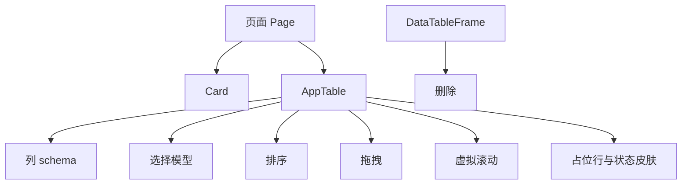
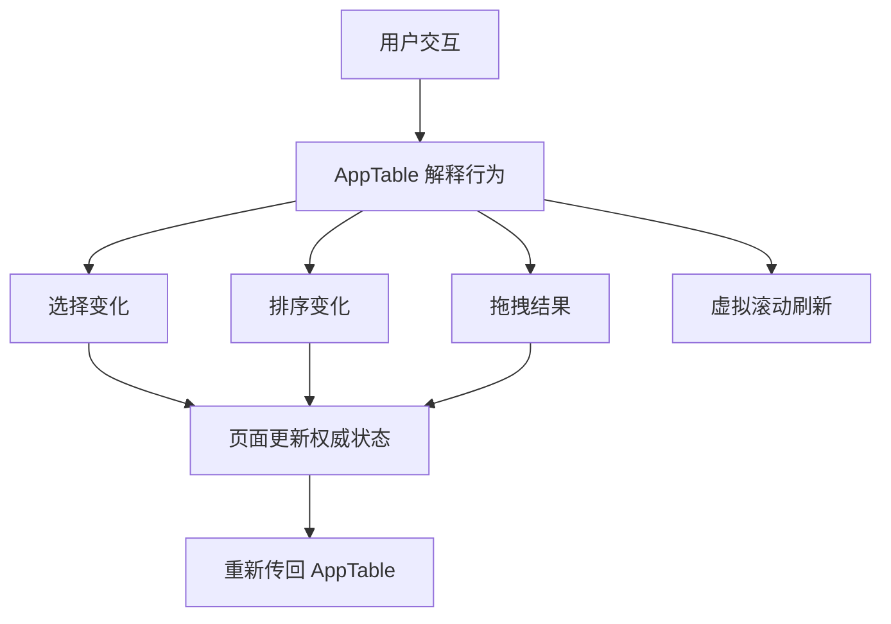

# frontend-vite `app-table` 设计

## 1. 背景

`frontend-vite` 当前至少存在两套相似但各自演化的表格实现：

- 术语页表格已经沉淀出较成熟的交互手感，包括排序、多选、框选、拖拽排序、虚拟滚动、占位行与统一状态皮肤。
- 工作台页表格具备虚拟滚动、拖拽排序和单选等能力，但表格骨架、交互解释和样式仍主要停留在页面内部。
- `DataTableFrame` 目前只承担极薄的卡片外壳职责，没有承接真正稳定的表格共性，已经不足以作为后续统一入口。

本次设计目标是将术语页表格中已经稳定的共性收敛为 `AppTable`，再用它重构工作台页表格，并同步清理不再需要的旧表格壳层和残留代码。

## 2. 目标与非目标

### 2.1 目标

1. 在 `src/renderer/widgets/` 中新增跨页面复用的 `AppTable` 组件。
2. 将表格视觉基线、交互骨架和状态皮肤从页面内部上提为统一能力。
3. 用 `AppTable` 重构工作台页表格，使其交互和视觉尽量向术语页对齐。
4. 将术语页表格中已成熟的共性能力下沉到 `AppTable`，让术语页保留业务特有部分。
5. 删除 `DataTableFrame`，并清理相关样式、文档和无用辅助代码。

### 2.2 非目标

1. 不为 `AppTable` 绑定外层 `Card`、标题、描述和页面区块编排。
2. 不支持列顺序拖拽重排。
3. 不支持独立的“暂无数据”空态面板。
4. 不把右键菜单内容、双击动作和行内业务控件实现做进组件内部。
5. 不额外发明大量特殊列类型，当前仅内建 `drag` 列和普通数据列。

## 3. 已确认的设计前提

本次对齐后，`AppTable` 的稳定前提如下：

- `AppTable` 是纯表格控件，不带卡片壳。
- 页面自己组合 `Card + AppTable`。
- `DataTableFrame` 彻底删除。
- `AppTable` 采用受控模式，页面持有权威状态。
- 组件内建统一列 schema、排序、选择、拖拽、虚拟滚动、占位行和状态皮肤。
- 列类型只内建 `drag` 列和普通列。
- 选择模型支持 `none / single / multiple`。
- 选择状态从第一版开始显式区分 `active / selected / anchor`。
- 空表时不显示独立空态，只显示占位行。
- 行级通用行为由 `AppTable` 统一解释，页面负责业务动作。

## 4. 方案选择

本次对比过三种实现方案：

| 方案 | 思路 | 结论 |
| --- | --- | --- |
| 单文件重组件 | 一个公开组件吃下所有表格能力 | 接入快，但后续会膨胀 |
| Headless Hook + View | 暴露状态 hook 和纯视图组件 | 灵活，但页面仍会保留太多重复骨架 |
| 目录化混合方案 | 公开单一 `AppTable`，内部按能力拆分私有模块 | 选用 |

最终选用目录化混合方案，原因如下：

- 对外 API 简洁，接入页面只需理解一个 `AppTable`。
- 对内可以按选择、拖拽、虚拟滚动、渲染骨架拆开，避免再次出现超大单文件。
- 最适合承接术语页复杂交互，同时也方便工作台页轻量接入。

## 5. 组件边界与落位

### 5.1 组件定位

`AppTable` 位于 `src/renderer/widgets/app-table/`，属于 `widgets/` 层的跨页面复用业务部件。

它负责统一的是“表格内部骨架”，包括：

- 列 schema
- 表头排序交互
- 选择模型与行级通用行为
- 行拖拽排序
- 虚拟滚动
- 占位行
- 表格状态皮肤

它不负责的是“页面区块容器”，包括：

- `Card`
- 标题与描述
- 页面级空态文案
- 区块留白和外层编排

### 5.2 结构关系



### 5.3 目录结构

建议目录结构如下：

```text
src/renderer/widgets/app-table/
  app-table.tsx
  app-table-types.ts
  app-table-selection.ts
  app-table-virtualization.ts
  app-table-dnd.ts
  app-table-render.tsx
  app-table.css
```

各文件职责如下：

| 文件 | 职责 |
| --- | --- |
| `app-table.tsx` | 公开组件入口，组装所有能力模块 |
| `app-table-types.ts` | 组件 props、列 schema、事件 payload 类型 |
| `app-table-selection.ts` | 单选、多选、区间选、框选的状态解释 |
| `app-table-virtualization.ts` | row 测量、spacer、占位行填充、virtualizer 适配 |
| `app-table-dnd.ts` | 行拖拽排序、overlay、拖拽组解析 |
| `app-table-render.tsx` | 表头、表体、占位行、拖拽列渲染骨架 |
| `app-table.css` | 组件私有命名空间样式 |

## 6. 公开接口与列 Schema

### 6.1 组件接口

`AppTable` 采用受控组件模式。页面传入当前数据和权威状态，组件只负责解释交互并抛出下一状态。

建议接口轮廓如下：

```ts
type AppTableProps<Row> = {
  rows: Row[]
  columns: AppTableColumn<Row>[]

  selection_mode: 'none' | 'single' | 'multiple'
  selected_row_ids: string[]
  active_row_id: string | null
  anchor_row_id: string | null

  sort_state: AppTableSortState | null
  drag_enabled: boolean

  get_row_id: (row: Row, index: number) => string
  get_row_can_drag?: (row: Row, index: number) => boolean

  on_selection_change: (payload: AppTableSelectionChange) => void
  on_sort_change: (payload: AppTableSortChange | null) => void
  on_reorder: (payload: AppTableReorderChange) => void

  on_row_double_click?: (payload: AppTableRowEvent<Row>) => void
  render_row_context_menu?: (payload: AppTableRowEvent<Row>) => ReactNode

  virtual_overscan?: number
  estimated_row_height?: number
  placeholder_row_strategy?: 'fill-viewport'
}
```

### 6.2 列 Schema

列 schema 当前只保留两类：

- `drag`
- 普通数据列

建议类型如下：

```ts
type AppTableColumn<Row> =
  | AppTableDragColumn
  | AppTableDataColumn<Row>

type AppTableDragColumn = {
  kind: 'drag'
  id: 'drag'
  width: number
  aria_label: string
}

type AppTableDataColumn<Row> = {
  kind: 'data'
  id: string
  title: ReactNode
  width?: number
  align?: 'left' | 'center' | 'right'
  sortable?: {
    disabled?: boolean
  }
  render_head?: () => ReactNode
  render_cell: (payload: AppTableCellPayload<Row>) => ReactNode
  render_placeholder?: () => ReactNode
}
```

### 6.3 设计约束

- 只有影响整张表骨架的列语义才进入组件内建类型。
- `actions`、`status`、`index` 等列不单独引入特殊类型，统一按普通数据列处理。
- 列宽、对齐、标题、排序能力和占位渲染都通过列 schema 明确表达。
- 页面不再直接手写完整的 `<TableHead>` / `<TableRow>` 骨架。

## 7. 交互状态流与行为语义

### 7.1 受控状态原则

页面持有这些权威状态：

- `rows`
- `sort_state`
- `selected_row_ids`
- `active_row_id`
- `anchor_row_id`

`AppTable` 在用户交互后只计算下一状态，并通过回调上抛，由页面决定是否接受并更新。

### 7.2 选择模型

选择模型支持三档：

- `none`
- `single`
- `multiple`

其中状态语义如下：

| 状态 | 作用 |
| --- | --- |
| `active_row_id` | 当前操作焦点 |
| `selected_row_ids` | 当前选区 |
| `anchor_row_id` | `Shift` 区间选锚点 |

行为规则如下：

1. 普通点击：设置 `active`，并按模式更新 `selected`。
2. `Ctrl` 点击：仅在 `multiple` 下增减选区，并更新 `active`。
3. `Shift` 点击：仅在 `multiple` 下按 `anchor` 做区间选，并更新 `active`。
4. 框选：仅在 `multiple` 下生效，输出新的 `selected`。
5. 右键：先把当前行设为 `active`，必要时同步为选中项。
6. 键盘移动：移动 `active`，并按模式决定是否同步 `selected`。

### 7.3 排序模型

排序状态建议保持二段式：

```ts
type AppTableSortState = {
  column_id: string
  direction: 'ascending' | 'descending'
}
```

表头排序交互的循环语义固定为：

- 未排序 -> 升序
- 升序 -> 降序
- 降序 -> 清除排序

`AppTable` 统一负责：

- 排序按钮位置
- 图标切换
- 可点击区域
- tooltip 与 aria 文案入口
- 禁用列的交互抑制

### 7.4 拖拽模型

拖拽只支持行拖拽排序，不支持列重排。

拖拽行为固定为：

1. 只有 `drag` 列中的手柄可以拖起。
2. 拖拽开始时先确认对应行 id。
3. 在 `multiple` 模式下，如果 `active_row_id` 属于 `selected_row_ids`，则拖整组选中项。
4. 否则只拖当前 active 行。
5. 拖拽完成后仅抛出新的有序 id 结果，不在组件内部修改数据源。

### 7.5 虚拟滚动与占位

`AppTable` 内建：

- scroll host
- viewport 获取
- row height 测量
- virtualizer
- top / bottom spacer
- 占位行填充

空表或短表时，通过“占位行填满视口”的方式维持节奏，不额外显示 empty state 面板。

### 7.6 行级事件分工

| 能力 | 归属 |
| --- | --- |
| 单击选中 | `AppTable` |
| 右键前选中 | `AppTable` |
| 键盘焦点移动 | `AppTable` |
| 双击默认动作 | 页面 |
| 上下文菜单内容 | 页面 |
| 行内按钮点击 | 页面 |

### 7.7 状态流示意



## 8. 视觉基线与样式职责

`AppTable` 统一接管以下视觉基线：

- 表头字号
- 表行高度
- 单元格左右 padding
- 分割线强度
- 表头壳背景与边框节奏

`AppTable` 统一接管以下状态皮肤：

- hover
- selected
- zebra
- dragging
- selection rail

页面层只保留：

- 外层 `Card` 布局
- 页面级间距与栅格
- 列内容内部的业务语义布局
- success / warning 等少量页面语义色

这意味着工作台页和术语页中大量表格专属皮肤 CSS 会被下沉到 `app-table.css`，页面不再重新定义同一套表格状态外观。

## 9. 迁移策略

### 9.1 工作台页迁移

工作台页是本次第一个完整迁入 `AppTable` 的页面。

迁移后页面负责：

- 组装 `columns`
- 传入 `entries`
- 传入 `selection_mode='single'`
- 传入 `selected_row_ids` 与 `active_row_id`
- 传入拖拽、双击、菜单等业务回调
- 外层包裹 `Card`

工作台页应删除的旧内容包括：

- 手写的 `<TableHeader>` / `<TableBody>` 结构
- 手写 virtualizer、spacer、overlay 组装
- 页面内部的行级选择解释
- 大部分工作台专属表格皮肤样式

保留的主要是：

- 文件名、格式、行数、操作列的业务渲染
- 操作菜单内容
- 工作台自己的数据请求和变更逻辑

### 9.2 术语页迁移

术语页迁移的重点不是重写，而是把现有成熟共性下沉到 `AppTable`。

术语页继续保留：

- 搜索与筛选条
- 术语页特有列内容
- 编辑、统计、规则切换等业务动作
- 对话框、命令条、上下文菜单

下沉到 `AppTable` 的部分包括：

- 排序触发器骨架
- 多选与区间选解释
- 框选骨架
- 行拖拽与 overlay 骨架
- 虚拟滚动、spacer、占位行
- 表格状态皮肤

## 10. 冗余代码与资源清理范围

本轮清理不应只删 `DataTableFrame` 文件本体，而应同步覆盖其相关残留。

建议清理范围如下：

1. 删除 `src/renderer/widgets/data-table-frame/` 整个目录。
2. 更新 `src/renderer/widgets/SPEC.md`，将 `DataTableFrame` 说明替换为 `AppTable`。
3. 删除工作台页旧表格骨架函数和不再被消费的虚拟滚动辅助代码。
4. 删除术语页和工作台页中只服务旧表格骨架的 CSS 选择器。
5. 检查并更新 `scripts/check-ui-design-system.mjs` 中与旧工作台表格结构耦合的白名单规则。
6. 删除其他已经无人引用的表格残留资源与命名。

清理判断标准如下：

- 没有消费者。
- 新 `AppTable` 已完整覆盖职责。
- 该代码或资源不再承担独立语义。

## 11. 验证策略

### 11.1 组件层

需要验证：

- 列渲染是否正确
- 排序切换循环是否正确
- 单选和多选模式行为是否正确
- 拖拽结果是否正确
- 占位行填充逻辑是否正确

### 11.2 页面层

需要验证：

- 工作台页单选是否稳定
- 工作台页右键前选中是否正常
- 工作台页拖拽排序是否正常
- 术语页 `Ctrl / Shift / 框选` 是否保持原行为
- 术语页多选拖拽是否继续遵循 `active + selected` 语义

### 11.3 视觉层

需要验证：

- 亮暗主题下表头壳是否一致
- 分割线强度是否一致
- hover / selected / zebra / dragging 状态是否一致
- selection rail 是否一致
- 空表与短表时占位行是否填满视口

## 12. 预期结果

本轮完成后，前端表格层会稳定为以下结构：

- `ui/table.tsx` 继续负责最底层表元素和 slot 契约
- `widgets/app-table/` 负责跨页面复用的表格骨架
- 术语页和工作台页只保留业务列和业务动作
- `DataTableFrame` 与相关残留彻底退出

最终收益如下：

1. 表格交互手感和视觉样式来源统一。
2. 工作台页与术语页不再维护重复表格骨架。
3. 后续新增相似表格时，可以直接复用 `AppTable`。
4. 表格层代码边界更清晰，便于长期维护。
