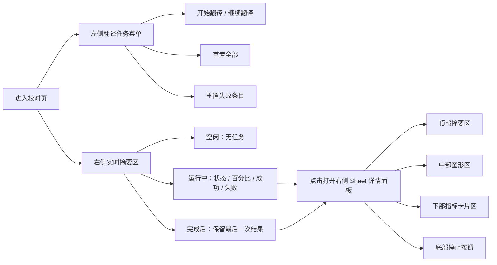

# 校对页任务动作条与翻译任务详情设计

- 日期：2026-04-15
- 状态：已确认，等待进入 `writing-plans`
- 作用范围：`frontend-vite` 校对页、任务 API、任务状态展示
- 参考来源：旧 Qt 翻译页、当前 `frontend-vite` 校对页与工作台页

## 🎯 这份设计要把旧翻译页的任务控制迁到校对页里。

本次设计的核心目标是移除 `frontend-vite` 中独立存在的 `translation`、`analysis` 占位页，把“翻译任务”的主入口迁到校对页动作条，同时让校对页获得一个可持续观察翻译运行状态的任务摘要区和右侧详情面板。

本次设计明确包含以下目标：

- 移除独立的 `translation`、`analysis` 占位导航入口与相关残留资源。
- 在校对页新增动作条，并把“翻译任务”作为项目级任务控制入口。
- 在动作条右侧新增实时任务摘要区，用于常驻展示翻译任务状态。
- 通过右侧详情面板承载旧翻译页的大部分实时信息，包括进度环、波形图和指标卡片。
- 保持旧翻译页的关键任务语义，包括“开始翻译 / 继续翻译”“停止”“重置全部”“重置失败条目”和输出 Token 速度波形图。

本次设计明确不包含以下内容：

- 不实现分析任务的真实路径；本轮只保留禁用按钮占位。
- 不恢复独立翻译页或独立分析页。
- 不把旧翻译页原样搬运到 React；新界面按校对页的结构重组。
- 不在本阶段实现新的高级调度能力，如暂停、定时启动或任务历史列表。

## 🧭 用户路径会被拆成“控制、观察、深入查看”三层。



新的用户路径分成三层：

1. 左侧 `翻译任务` 菜单负责发出任务动作。
2. 动作条右侧实时摘要区负责快速感知当前翻译状态。
3. 点击右侧摘要区后，从右侧拉出详情面板，承载旧翻译页的大部分实时指标与停止操作。

这种分层让“做什么”和“现在怎么样了”彻底分开，避免把动作和信息全部塞进同一个下拉菜单中。

## 🏗️ 校对页的页面结构会调整成以动作条为第一任务入口。

校对页的稳定结构调整为：

```text
错误提示
动作条
搜索条
表格
筛选 / 编辑 / 确认对话框
```

动作条位于错误提示与搜索条之间，原因如下：

- 动作条承载的是项目级任务操作，优先级高于搜索与局部替换。
- 搜索条继续专注“局部编辑、替换、过滤”。
- 新增的任务控制不会和表格中的局部重译、局部重置语义混在一起。

动作条的左右区域职责如下：

| 区域 | 内容 | 职责 |
| --- | --- | --- |
| 左侧 | `翻译任务`、`分析任务` | 任务控制入口 |
| 右侧 | 实时任务摘要区 | 任务状态常驻反馈与详情入口 |

## 🧱 组件会先收口在校对页内部，不提前抽成伪通用层。

本次改动优先放在 `pages/proofreading-page` 内部，目录结构建议调整为：

```text
pages/proofreading-page/
  page.tsx
  proofreading-page.css
  use-proofreading-page-state.ts
  components/
    proofreading-task-command-bar.tsx
    proofreading-task-menu.tsx
    proofreading-task-runtime-summary.tsx
    proofreading-task-detail-sheet.tsx
    proofreading-task-confirm-dialog.tsx
```

各组件职责如下：

| 组件 | 职责 |
| --- | --- |
| `proofreading-task-command-bar.tsx` | 校对页顶部动作条壳层，编排左侧按钮区和右侧摘要区 |
| `proofreading-task-menu.tsx` | `翻译任务` 下拉菜单，承载进度条、开始/继续、重置动作 |
| `proofreading-task-runtime-summary.tsx` | 动作条右侧实时摘要区，负责空闲、运行中、完成后的摘要展示 |
| `proofreading-task-detail-sheet.tsx` | 从右侧拉出的详情面板，承载旧翻译页式实时信息 |
| `proofreading-task-confirm-dialog.tsx` | 统一承接重置与停止的确认对话框 |

本次不提前上提到 `widgets/`，原因如下：

- 当前只有校对页一个真实消费者。
- `分析任务` 本轮仍是禁用占位，不足以支持稳定抽象。
- 右侧摘要与详情面板强依赖校对页当前的任务入口与状态组合，过早抽象只会制造伪通用 API。

## 🎛️ 左侧翻译任务菜单使用 `DropdownMenu + Progress + AlertDialog` 组合。

左侧动作区包含两个按钮：

| 按钮 | 状态 | 行为 |
| --- | --- | --- |
| `翻译任务` | 可用 | 点击打开 `DropdownMenu` |
| `分析任务` | 禁用 | 仅占位，不弹菜单，不接逻辑 |

`翻译任务` 菜单的稳定结构如下：

```text
[ 顶部状态区：彩色进度条 + 百分比 ]
---------------------------------
开始翻译 / 继续翻译
---------------------------------
重置全部
重置失败条目
```

菜单细节规则如下：

- 顶部状态区不是普通菜单项，而是一块不可点击的自定义区域。
- 菜单顶部只展示彩色进度条与百分比，不展示额外状态文案。
- 若当前已有翻译进度，则主动作显示为 `继续翻译`；否则显示 `开始翻译`。
- `重置全部` 与 `重置失败条目` 都属于破坏性动作，必须先弹确认框。
- 在空闲态下，两个重置按钮都保持启用，不因“当前没有失败条目”或“当前没有进度”而禁用。
- 任务运行中允许打开菜单查看进度，但菜单内的动作项统一禁用。
- 本轮不把 `停止` 放进下拉菜单，停止动作只在右侧详情面板底部提供。

## 📊 动作条右侧会新增一个常驻的实时任务摘要区。

右侧实时任务摘要区是一个完整的响应区域，但只有在“存在可查看结果”时才允许点击。

摘要区展示规则如下：

| 场景 | 展示内容 | 是否可点击 |
| --- | --- | --- |
| 从未有过可展示的翻译结果 | `无任务` | 否 |
| 翻译运行中 | `状态 + 百分比 + 成功条目 + 失败条目` 的紧凑摘要 | 是 |
| 翻译完成或停止后 | 保留最后一次结果，直到下一次任务开始 | 是 |

这里的“无任务”表示当前没有可展示的翻译记录或历史结果。只要页面已经持有最近一次翻译结果，摘要区就继续显示最后一次结果，而不是退回 `无任务`。

摘要区本身只承担“快速概览”，不展示详细图形与全部指标。它的职责是让用户不点开菜单也能扫到当前任务状态，并把右侧详情面板作为更深一层的信息入口。

## 🧷 右侧详情面板使用 `Sheet` 承载旧翻译页式实时信息。

实现上优先使用 shadcn 的 `Sheet`，并设置为从右侧滑入。原因如下：

- 当前需求是桌面端右侧信息面板，而不是移动端偏手势语义的抽屉。
- `Sheet` 更贴近“详情侧栏”的桌面端交互语义。
- 顶部标题、中部滚动内容、底部固定操作区都与 `Sheet` 的结构天然匹配。

右侧详情面板在交互上可以被产品层描述为“任务抽屉”，但技术实现使用 `Sheet` 更稳妥。

当前项目尚未接入 shadcn 的 `Sheet` 组件，因此实现阶段需要先通过 shadcn CLI 把 `sheet` 基础组件加入 `frontend-vite`，再在校对页内部完成详情面板装配。

详情面板的稳定结构如下：

```text
[ 顶部摘要区 ]
状态 / 百分比 / 成功 / 失败

[ 中部图形区 ]
进度环 + 输出 Token 速度波形图

[ 下部指标卡片区 ]
时间 / 已处理 / 剩余 / 失败 / 速度 / Token / 实时任务数 ...

[ 底部固定按钮区 ]
停止
```

## 🌊 波形图保持旧翻译页语义，继续展示输出 Token 速度波形。

旧 Qt 翻译页中的波形图并不是“条目吞吐量”，而是输出 Token 速度随时间变化的波形。新设计明确保持这一定义，不改变口径。

波形图语义如下：

- 数据源：输出 Token 速度。
- 展示方式：随时间滚动的速度波形。
- 作用：帮助用户感知当前翻译输出速度是否稳定，而不是只看单个瞬时数值。

这项定义必须在实现阶段保持一致，避免出现“外观像旧页、数据口径却换了”的语义漂移。

## 📦 详情面板中的指标会尽量贴近旧翻译页，但不照搬旧交互。

右侧详情面板需要保留旧翻译页的高价值信息。建议展示以下指标：

| 分组 | 指标 |
| --- | --- |
| 摘要区 | 任务状态、完成百分比、成功条目、失败条目 |
| 图形区 | 进度环、输出 Token 速度波形图 |
| 指标卡片区 | 已耗时、剩余时间、已处理条目、失败条目、剩余条目、平均速度、输出 Token、输入 Token、实时任务数 |

这里有两个明确设计决定：

1. 新面板不保留旧页里“点卡片切换模式”的交互。
   原因是右侧面板已经承载很多信息，卡片再切换模式会增加认知成本。

2. 时间和 Token 不再通过单卡切换展示两种语义，而是直接以稳定字段展示。
   例如时间区直接展示 `已耗时` 与 `剩余时间`，Token 区直接展示 `输入 Token` 与 `输出 Token`。

这些指标会被压缩成更适合 `Sheet` 的布局，而不是复刻旧页的完整大面板。

## 🔢 成功、失败、已处理与百分比的口径需要保持一致。

为避免实现阶段出现数值定义漂移，本次设计固定以下口径：

- 完成百分比：`line / max(1, total_line)`。
- 已处理条目：优先使用 `processed_line`，若其不可用则回退到 `line`。
- 失败条目：使用 `error_line`。
- 成功条目：使用 `max(0, 已处理条目 - 失败条目)`。
- 剩余条目：使用 `max(0, total_line - line)`。

这个口径与旧翻译页当前的卡片更新逻辑保持一致，可避免新旧页面统计含义不一致。

## 🔗 数据流会保持“全局忙碌态”和“翻译专属快照”分离。

本次设计固定以下数据分层：

| 语义 | 权威来源 | 用途 |
| --- | --- | --- |
| 全局工程加载态与忙碌态 | `DesktopRuntimeContext` | 控制按钮禁用态、跨页面忙碌保护 |
| 校对页翻译专属任务快照 | `use-proofreading-page-state` 内维护 | 驱动菜单进度、右侧摘要和详情面板 |
| 校对表格数据 | `/api/proofreading/snapshot` | 驱动表格与局部编辑 |

校对页内部需要维护两类翻译任务状态：

- `translation_task_snapshot`：当前可用于 UI 刷新的翻译任务快照。
- `last_translation_task_snapshot`：最近一次可展示的翻译结果，用于完成后保留摘要。

同步规则如下：

1. 页面初始化时通过 `POST /api/tasks/snapshot` 且请求体为 `{"task_type": "translation"}` 拉取翻译专属快照。
2. 当全局 `task_snapshot.task_type === "translation"` 时，用全局任务状态更新当前翻译快照。
3. 当翻译任务完成或停止后，把结果写入 `last_translation_task_snapshot`。
4. 只有当下一次翻译任务开始时，才覆盖上一轮保留结果。

这样可以避免未来有其他任务类型运行时，右侧摘要和菜单顶部进度被错误覆盖。

## 🛰️ 任务接口与事件桥接需要补齐 reset 能力。

现有 API 已具备：

- `POST /api/tasks/start-translation`
- `POST /api/tasks/stop-translation`
- `POST /api/tasks/snapshot`

本次设计要求补齐以下两个任务级 reset 接口：

| 路径 | 说明 |
| --- | --- |
| `POST /api/tasks/reset-translation-all` | 重置整个项目的翻译进度 |
| `POST /api/tasks/reset-translation-failed` | 重置整个项目中的失败翻译条目 |

这两个接口必须保持任务级语义，而不是伪装成 proofreading 局部编辑接口。原因如下：

- 它们的作用范围是整个项目，而不是当前筛选或当前选中条目。
- 它们和旧翻译页的“重置全部 / 重置失败条目”是同一类全局任务动作。
- 放在 `tasks` 组下比散落到 `proofreading` 更符合模块边界。

reset 动作执行完成后，前端需要复用现有失效刷新链路，让校对页表格正确刷新。建议行为如下：

1. Core 完成 reset 动作。
2. 通过已有稳定 topic 触发 `proofreading.snapshot_invalidated`。
3. 校对页收到失效通知后刷新 proofreading snapshot。

这样可以避免在 reset 后额外发明一条新的表格刷新通道。

## ▶️ 菜单动作与详情面板动作的接口映射是固定的。

| 入口 | 动作 | 接口 | 说明 |
| --- | --- | --- | --- |
| 左侧菜单 | `开始翻译` | `POST /api/tasks/start-translation`，`{"mode": "NEW"}` | 当前没有翻译进度时使用 |
| 左侧菜单 | `继续翻译` | `POST /api/tasks/start-translation`，`{"mode": "CONTINUE"}` | 当前已有翻译进度时使用 |
| 左侧菜单 | `重置全部` | `POST /api/tasks/reset-translation-all` | 先确认后执行 |
| 左侧菜单 | `重置失败条目` | `POST /api/tasks/reset-translation-failed` | 先确认后执行 |
| 右侧详情面板底部 | `停止` | `POST /api/tasks/stop-translation` | 先确认后执行 |

三个破坏性或中断性动作的确认规则如下：

- `重置全部`：必须弹确认框。
- `重置失败条目`：必须弹确认框。
- `停止`：必须弹确认框。

## 🚦 各入口的启用态和点击规则必须保持稳定。

| 场景 | 翻译任务按钮 | 菜单主动作 | 菜单两个重置动作 | 右侧摘要区 | 详情面板停止按钮 | 分析任务按钮 |
| --- | --- | --- | --- | --- | --- | --- |
| 未加载工程 | 禁用 | 禁用 | 禁用 | 显示 `无任务`，不可点击 | 不显示或禁用 | 禁用 |
| 从未有过结果且空闲 | 可用 | `开始翻译` | 启用 | 显示 `无任务`，不可点击 | 不可触达 | 禁用 |
| 翻译运行中 | 可打开菜单 | 禁用 | 禁用 | 显示实时摘要，可点击 | 启用 | 禁用 |
| 翻译完成后 | 可打开菜单 | `继续翻译` | 启用 | 保留最后一次结果，可点击 | 禁用 | 禁用 |
| 停止请求已发出 | 可打开菜单 | 禁用 | 禁用 | 保持当前结果，可点击 | 禁用并显示停止中 | 禁用 |

这里的一个重要决定是：

- 当右侧摘要区显示 `无任务` 时，它只是状态占位，不可点击。
- 当右侧摘要区显示运行中结果或最后一次结果时，它就是详情入口。

## ✂️ 独立占位页与相关资源会被一起清理，但不影响真实能力。

本次清理边界如下：

| 位置 | 动作 |
| --- | --- |
| `app/navigation/schema.ts` | 删除 `translation`、`analysis` 两个独立导航项 |
| `app/navigation/screen-registry.ts` | 删除两个占位 screen 注册 |
| `pages/analysis-page/` | 删除占位残留目录与资源 |
| 仅服务这两个占位页的调试引用 | 一并清理 |

以下内容不在删除范围内：

- `translation-prompt`
- `analysis-prompt`
- 后端翻译与分析任务 API
- 校对页现有的局部重译与局部重置能力
- `debug-panel-page` 中仍被其他入口使用的部分

## 🧪 验证范围需要同时覆盖布局、交互、状态和接口。

实现后至少需要验证以下内容：

| 类型 | 验证项 |
| --- | --- |
| 导航 | 侧边栏不再出现独立的“翻译”“分析”占位页 |
| 结构 | 校对页动作条出现在错误提示与搜索条之间 |
| 左侧控制 | `翻译任务` 可打开菜单，`分析任务` 为禁用态 |
| 菜单反馈 | 顶部进度条与百分比能正确反映翻译进度 |
| 菜单动作 | `开始翻译 / 继续翻译` 的切换语义正确 |
| reset | 两个重置动作都需要确认，空闲态都可点击 |
| 右侧摘要 | 空闲态显示 `无任务`，无任务时不可点击 |
| 完成态摘要 | 翻译结束后保留最后一次结果，直到下一次任务开始 |
| 右侧面板 | 点击摘要后能打开右侧 `Sheet`，布局为上摘要、中图形、下卡片、底部按钮 |
| 波形图 | 展示的是输出 Token 速度波形，而不是条目吞吐 |
| 停止 | 底部停止按钮需确认，提交后进入停止中态 |
| 刷新 | reset 后 proofreading snapshot 能自动刷新 |
| 主题 | 亮 / 暗主题下动作条、菜单、摘要区、右侧面板都正常 |
| 静态检查 | `npm run lint`、`npm run renderer:audit`、`npx tsc -p tsconfig.json --noEmit`、`npx tsc -p tsconfig.node.json --noEmit` |

## 📍 这份 spec 的落点已经足够进入实现计划阶段。

当前设计已经明确了以下实现所需关键边界：

- UI 结构边界
- 任务动作与反馈的职责分层
- 数据口径和状态口径
- reset API 的新增需求
- 旧翻译页指标中哪些要迁移，哪些交互不再保留

本设计没有保留占位词、待定字段或未决范围，下一步可以直接进入 `writing-plans`，把实现拆成 API、状态、组件、样式和验证几个工作块。
