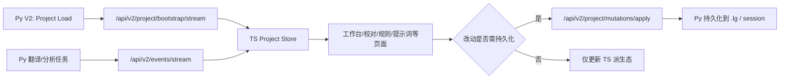
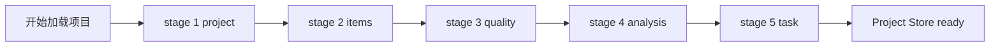
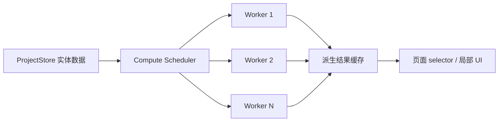
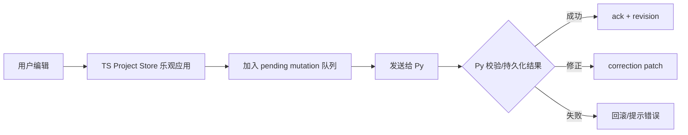
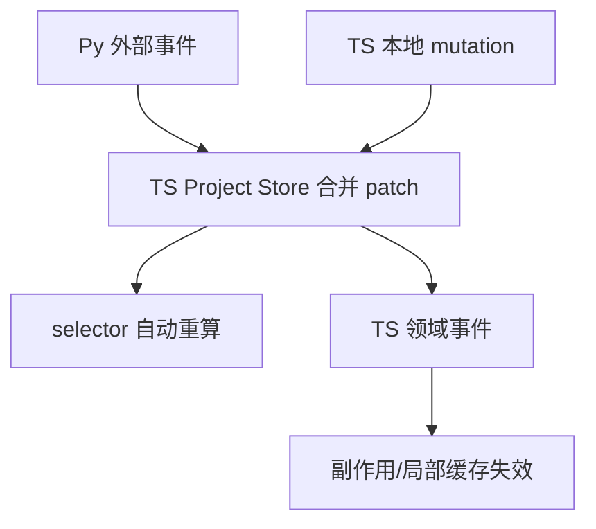
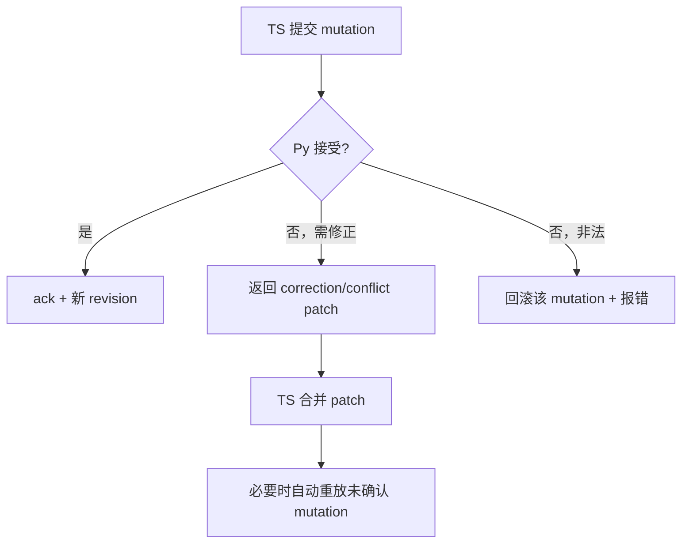
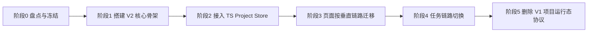
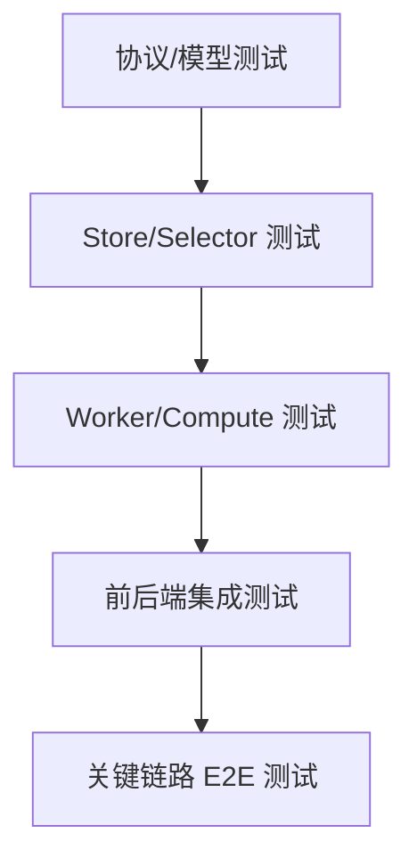

# LinguaGacha V2 项目运行态协议设计

## 1. 文档元信息

| 字段 | 内容 |
| --- | --- |
| 状态 | 待评审 |
| 日期 | 2026-04-21 |
| 主题 | V2 项目运行态协议与前后端边界重划 |
| 适用范围 | Python Core `api/`、`module/Data/`、Electron `frontend/src/renderer` |
| 目标读者 | 协议设计者、Python Core 开发者、Electron/React 开发者 |

## 2. 背景与问题

当前 V1 协议以页面为中心组织读写流程：应用启动时只 hydration 轻量快照，页面进入后再各自拉取 `snapshot`，运行中再依赖 SSE invalidation 或局部 patch 决定是否重拉。这个模型已经暴露出几类结构性问题：

1. 页面快照与项目真实实体重复建模，协议与 UI 结构强耦合。
2. 很多纯前端可推导的派生态仍然需要回到 Python 端重算，交互往返次数偏多。
3. 跨页面联动依赖“收到事件后判断是否刷新页面”，而不是依赖统一状态仓和领域变化语义。
4. 任务结果、持久化结果、页面本地状态之间的权威边界不够清晰，导致协议逐渐混合了读模型、写模型和刷新信号。

本设计希望把 V1 改造成一套新的 V2 协议，使 TS 端真正持有项目运行态，Python 端收敛为持久化与任务执行后端。

## 3. 设计目标

### 3.1 核心目标

1. 此次重构以“对用户透明”为目标；除性能、反馈时机和内部实现方式外，原则上不引入用户可感知的业务逻辑与功能效果变化。
2. 在项目加载时，把当前项目运行态所需的核心实体数据完整交付到 TS 端。
3. TS 端成为项目运行态事实源，页面直接从统一状态仓读取，而不是继续各自拉页面快照。
4. 对校对检查、规则统计等“任务小、数量多”的计算密集型派生任务，建立能更充分利用多核资源的新运行时，不再受 Python GIL 的单核瓶颈主导。
5. 需要持久化的数据由 TS 端实时增量同步到 Python 端。
6. 不需要持久化的派生结果留在 TS 端本地，不再反向同步到 Python 端。
7. 翻译、分析等后台任务仍由 Python 端执行，其结果通过 patch/event 回灌 TS 状态仓。
8. 开发完成后整体删除 V1 项目运行态协议，不保留长期双轨兼容。

### 3.2 非目标

1. 不在 V2 中继续维护页面级 `snapshot` 作为主模型。
2. 不把所有应用级状态都塞进项目 bootstrap，例如最近工程、应用语言等全局状态不属于本次重构核心。
3. 不把 V2 设计成泛化的 JSON Patch 总线，避免丢失领域语义。
4. 不引入长期共存的 V1/V2 兼容层；双轨只允许作为迁移阶段的短期策略。
5. 不以本次协议重构为名主动改变现有业务规则、默认值、页面交互语义或结果判定口径；若必须调整，需单独立项说明。
6. 不要求在本次重构中顺带消灭与项目运行态无关的旧 app 级接口，例如 `settings`、`extra` 等接口族不属于本次 V1 退场范围。

## 4. 总体结论

V2 的一句话定义如下：

> V2 协议以项目为中心，而不是以页面为中心；TS 持有项目运行态，Python 负责持久化与任务执行。

围绕这句话，本设计给出以下边界：

| 领域 | 运行态权威 | 最终事实/守门者 |
| --- | --- | --- |
| 项目运行态实体 | TS | Python 持久化结果 |
| 页面派生结果 | TS | TS |
| 需持久化的数据写入 | TS 发起、Python 落盘 | Python |
| 翻译/分析任务执行结果 | Python | Python |
| 重载项目后的恢复态 | Python 导出的 bootstrap | Python |



## 5. V2 bootstrap 设计

### 5.1 基本原则

V2 不采用“单个巨大首包 + 长时间无反馈”的加载模型，而采用一次加载流程内的**分段 bootstrap**。完整运行态仍由 Python 端交付给 TS 端，但交付方式是分段流式，而不是必须等所有数据都准备完再一次返回。

分段 bootstrap 的目标：

1. 让 UI 能显示明确的加载进度，例如“正在加载项目骨架”“正在加载条目”“正在加载规则”。
2. 让 TS 尽早建立项目骨架状态，而不是长时间等待一个终态响应。
3. 让 Python 端按领域块逐段准备并发送数据，降低单次响应压力。

### 5.2 协议入口

建议 V2 bootstrap 维持单一入口，由该入口内部输出分段事件流。

结合当前代码库现状，这里需要额外约束：

1. 现有 `CoreApiServer.add_stream_route()` 只原生支持 `GET` 流式路由。
2. 现有渲染层长期事件流入口基于浏览器 `EventSource`，天然也是 `GET`。
3. 当前项目加载命令本身已经是独立的 `POST` 写操作，因此 bootstrap 更适合作为“当前已加载项目的流式读取”，而不是把“加载项目 + 传输首包”揉进同一个 POST 流。

因此，V2 bootstrap 的首选形态应为独立的 `GET` 流式读取，例如：

- `GET /api/v2/project/bootstrap/stream`

其中：

1. `project load/create` 继续作为独立命令入口存在。
2. `bootstrap stream` 负责读取“当前已加载项目”的分段运行态。
3. 当前代码中的全局 `/api/events/stream` 只是 V1 事实；V2 运行时事件流应独立收口到 `/api/v2/events/stream`，而 bootstrap stream 仍是一条一次性加载流，不与长期事件流混用。

这里进一步增加一条迁移约束：

1. V2 对外 HTTP / SSE URL 必须统一显式带上 `/api/v2/...` 前缀。
2. V1 保持当前原路径形态，不额外补 `/api/v1/...`。
3. 迁移期间允许 V1 与 V2 并存，但新增协议语义只能进入 `/api/v2/...`。
4. 这样在迁移完成后，可以直接把 `/api/v2` 之外仍承担项目运行态协议的旧路由整体删除，而不是逐个散点清理。

不推荐拆成多个独立 HTTP 首拉接口，例如：

- `/api/v2/project/bootstrap/items`
- `/api/v2/project/bootstrap/quality`
- `/api/v2/project/bootstrap/analysis`

因为那会把加载编排责任重新推回 TS 页面层，破坏“协议以项目为中心”的目标。

### 5.3 分段事件结构

```ts
type BootstrapStage =
  | 'project'
  | 'items'
  | 'quality'
  | 'analysis'
  | 'task'

type BootstrapEvent =
  | { type: 'stage_started'; stage: BootstrapStage; message: string }
  | { type: 'stage_payload'; stage: BootstrapStage; payload: unknown }
  | { type: 'stage_completed'; stage: BootstrapStage }
  | {
      type: 'completed'
      projectRevision: number
      sectionRevisions: SectionRevisionsDto
    }
  | { type: 'failed'; stage: BootstrapStage; message: string }
```

### 5.4 推荐分段顺序



每个 stage 表达的是**领域块**，不是页面块。这里明确禁止以下命名与切法：

- `workbench_page_data`
- `proofreading_page_data`
- `glossary_page_data`

### 5.5 bootstrap 应包含的数据

bootstrap 只传项目运行态实体，不传页面临时视图。推荐至少包含以下部分：

| 类别 | 内容 |
| --- | --- |
| `project` | 项目路径、加载状态、项目语言、项目级设置子集、必要元信息 |
| `files` | 文件列表、顺序、文件级状态、文件标识 |
| `items` | 原文、译文、状态、关联文件、必要索引字段 |
| `quality` | 术语表、文本替换、文本保护、与当前项目强相关的质量规则 |
| `prompts` | 当前项目运行态使用的提示词配置 |
| `analysis` | 当前项目已有分析结果、候选池与分析摘要 |
| `task` | 当前任务状态、必要进度、任务类型 |
| `revision` | `projectRevision` 与各 section revision |

这里的“项目级设置子集”特指当前项目运行态真正依赖的配置，不应直接复用现有 `/api/settings/app` 的整包结构。像 `app_language`、`recent_projects` 这类 app 级状态继续留在 bootstrap 之外。

### 5.6 bootstrap 明确排除的数据

以下数据不应进入 bootstrap 主协议：

| 不进首包的数据 | 原因 |
| --- | --- |
| 工作台当前筛选结果 | 纯页面派生态 |
| 校对页过滤后的列表 | 由 `items + quality + filters` 推导 |
| 各页面选中态、展开态、排序态 | 明确属于 UI 态 |
| 规则页临时搜索结果与统计 badge | 可由 TS 本地计算 |
| 最近工程、应用语言等 app 级状态 | 不属于当前项目运行态实体 |
| 预设菜单列表 | 资源浏览态，不是本次项目运行态核心实体 |

### 5.7 V2 传输编码与字段稳定性

#### 5.7.1 V1 现状评估

V1 目前大量依赖显式 `to_dict/from_dict` 模式来保持字段稳定性，这个方向本身是可靠的：字段名、默认值、归一化逻辑都被清楚写在模型类里，边界稳定性较好，也便于测试。

但从当前代码形态来看，V1 在服务端输出路径上存在大量以下模式：

1. `dict -> from_dict() -> frozen dto -> to_dict()`
2. 列表项逐个 `from_dict()` 再逐个 `to_dict()`
3. 大量重复字段名跟着每个 JSON object 反复输出

这种对称式编码在小响应里问题不大，但在 V2 bootstrap 这种“大量实体、分段输出”的场景下会额外带来：

| 成本 | 表现 |
| --- | --- |
| CPU | 重复对象构造、重复字段归一化、重复 `to_dict` 遍历 |
| 内存 | 同一批数据在 `dict`、DTO、输出 `dict` 三层之间短时共存 |
| 负载体积 | 每条记录都重复输出相同 key，`items`/`files` 体量大时浪费明显 |
| 发送延迟 | 必须先构建完整中间结构，才容易开始发送某一段 |

因此，V1 的 `to_dict/from_dict` 思路适合作为**边界显式建模方式**，但不适合原样照搬为 V2 bootstrap 的主传输方案。

#### 5.7.2 候选方案评估

| 方案 | 优点 | 问题 | 结论 |
| --- | --- | --- | --- |
| 继续沿用对称 `to_dict/from_dict` | 最贴近现状，显式字段稳定 | 大首包 CPU/内存开销高，重复 key 多 | 不推荐作为 V2 bootstrap 主方案 |
| 改用通用自动序列化 | 代码短 | 字段约束变弱，边界不够显式，调试与长期演进风险高 | 不推荐 |
| 继续使用 JSON，但改成版本化传输块编码 | 仍保留可读性与调试便利，能减少重复 key 和中间对象 | 编码/解码逻辑比普通 object JSON 更复杂 | 推荐 |
| 二进制协议 | 体积与编码速度可能更好 | 调试、迁移、前后端联调成本高，超出本次重构目标 | 暂不采用 |

#### 5.7.3 推荐方案：显式 schema + 分块行集编码

V2 推荐保留“字段必须显式稳定”的设计原则，但把传输层改成**不对称编码**：

1. **入站请求**（mutation、task command、控制命令）继续使用显式 parser/normalizer，保留类似 `from_dict` 的防御性能力。
2. **出站小对象**（project meta、task meta、summary）继续使用显式对象 JSON。
3. **出站大集合**（`items`、`files`、部分 `analysis candidates`）改为版本化的 `fields + rows` 或 `schema + rows` 编码，避免每条记录重复输出 key。
4. Python 服务端输出路径避免再走 `from_dict(...).to_dict()` 式往返，而是直接从领域快照构造传输块。

推荐传输块示意：

```ts
type RowBlockPayload = {
  schema: 'project-items.v1'
  fields: ['item_id', 'file_id', 'src', 'dst', 'status']
  rows: Array<[number, string, string, string, string]>
}
```

或分块形式：

```ts
type ChunkedRowBlockPayload = {
  schema: 'project-items.v1'
  fields: string[]
  chunkIndex: number
  chunkCount: number
  rows: unknown[][]
}
```

这种设计的关键点：

1. **字段仍然稳定**：由 `schema` 和 `fields` 明确声明，稳定性不依赖隐式反射。
2. **体积更小**：大集合只传一次字段名，避免每行重复 key。
3. **编码更轻**：Python 可以直接按行写出，不必为每项构造中间 DTO 再转字典。
4. **TS 更好落仓**：前端可直接按字段下标映射进 `ProjectStore`，适合批量建仓。

#### 5.7.4 推荐的编码分层

V2 建议把“模型稳定性”和“传输效率”拆成两层，不再由一套 `to_dict/from_dict` 同时承担：

| 层 | 职责 | 建议做法 |
| --- | --- | --- |
| 领域模型层 | 明确字段语义、默认值、不可变性 | 继续使用 dataclass/frozen DTO 或等价结构 |
| 输入边界层 | 解析 TS -> Py 请求 | 显式 parser/normalizer，保留 `from_dict` 式能力 |
| 输出传输层 | Py -> TS bootstrap/patch 编码 | 显式 schema + object/row block 混合编码 |

换句话说，V2 不是放弃字段稳定性，而是避免把“字段稳定性”错误地等同于“所有场景都要对象对称序列化”。

#### 5.7.5 实施建议

1. 对 `bootstrap.project`、`bootstrap.task`、`bootstrap.summary` 这类小对象，仍使用对象 JSON。
2. 对 `bootstrap.items`、`bootstrap.files` 这类高基数集合，使用版本化 row block。
3. 对日常 mutation ack、correction patch、task patch，优先继续使用对象 JSON，保持可读性与调试便利。
4. 若需要进一步压缩 Python 侧对象开销，可在 V2 传输 DTO 上评估 `slots=True` 等微优化，但这属于次级优化，不替代编码模型调整。

## 6. TS Project Store 与页面消费模型

### 6.1 统一状态仓

V2 中，前端不再以页面各自维护的 `snapshot state` 作为主模型，而是建立统一的 `ProjectStore`。所有项目相关页面都从该状态仓读取实体，再由 selector 生成各自视图。

推荐的状态仓分区：

```ts
type ProjectStoreState = {
  project: ProjectDto
  files: FileMapDto
  items: ItemMapDto
  quality: QualityStateDto
  prompts: PromptStateDto
  analysis: AnalysisStateDto
  task: TaskStateDto
  revisions: ProjectRevisionState
  pendingMutations: PendingMutation[]
}
```

### 6.2 页面消费规则

页面消费模型统一收口为：

1. 页面从 `ProjectStore` 读取实体层数据。
2. 页面通过 selector 计算表格、统计、筛选结果等派生态。
3. 页面私有 UI 态仍留在页面本地，例如选中态、滚动位置、弹窗开关。

这意味着 V2 中不再鼓励页面直接依赖以下模式：

- `api_fetch('/api/...snapshot')`
- 收到 invalidation 后自行决定要不要重拉页面快照
- 页面私有状态与项目实体状态并行维护两套真相

### 6.3 TS 计算运行时与多核策略

#### 6.3.1 设计判断

本次重构是否应该一并实现多核利用目标，结论如下：

> 建议把“多核利用的计算运行时”作为本次重构的核心交付之一，但不建议把所有潜在 CPU 热点一次性全部迁完。

原因是：

1. 这次重构的主收益不只是协议简化，也是把大量派生计算从 Python 单线程 GIL 约束中解放出来。
2. 如果只改协议边界、不同时建立新的多核计算运行时，很多高频派生计算仍会卡在 Python 端，本次重构的主要性能目标会落空。
3. 但如果把所有潜在计算热点都要求在同一轮完成，会显著抬高迁移风险，也更容易破坏“对用户透明”的目标。

因此，本次重构应当一次性落地**新计算运行时骨架 + 首批核心热点迁移**，而不是一次性穷尽所有优化可能。

#### 6.3.2 为什么不优先走 Python 多进程

当前热点代码特征包括：

1. `ResultChecker` 以条目为单位做大量字符串、正则、相似度与术语命中扫描。
2. `QualityRuleStatistics` 以规则和文本集合为输入做大量字面量/正则命中与包含关系计算。
3. 这类任务单次粒度不大，但调用频繁、总量大、对交互响应时间敏感。

这类任务理论上也可以通过 Python `multiprocessing` / `ProcessPoolExecutor` 利用多核，但它在本项目中不是优先方案，原因是：

| 问题 | 说明 |
| --- | --- |
| 状态搬运成本高 | `ProjectSession`、条目、规则、缓存都在 Python 进程内，拆到多进程需要频繁序列化与复制 |
| 小任务调度开销高 | 任务粒度越小，多进程调度与进程间传输越容易吃掉收益 |
| 与本次边界重构方向相反 | V2 的目标本来就是让派生计算尽量留在 TS，不再反复回到 Py |
| 调试与一致性成本高 | 需要额外处理进程池生命周期、取消、结果回并与错误传播 |

因此，针对本次重构中的“派生视图计算”类热点，优先建议迁到 TS 侧的新计算运行时，而不是在 Python 侧补多进程池。

#### 6.3.3 推荐方案：ProjectStore + Worker Pool

建议在 `ProjectStore` 之上新增统一的 TS 计算运行时，由专门的 Worker Pool 承接高频、可并行、纯计算型任务。



推荐职责划分：

| 组件 | 职责 |
| --- | --- |
| `ProjectStore` | 保存实体层真相与 section revision |
| `ComputeScheduler` | 负责任务切片、取消、去抖、并发数控制 |
| `WorkerPool` | 执行纯计算任务，不直接持有页面状态 |
| `DerivedCache` | 缓存警告结果、统计结果、筛选中间索引等派生物 |

#### 6.3.4 本次重构必须落地的计算热点

建议在本次重构中明确落地以下热点，而不是把它们留到未来：

| 热点 | 建议 |
| --- | --- |
| 校对页检查链路 | 迁到 TS Worker Pool，按条目块并行计算警告、术语命中等派生结果 |
| 校对页筛选/搜索/排序 | 在 TS 侧完成；达到阈值后切到 Worker Pool 并行 |
| 术语页统计 | 迁到 TS Worker Pool，承接命中计数与包含关系扫描 |

这些场景是此次重构的主收益来源，也最能证明 V2 不只是“协议换皮”。

#### 6.3.5 本次重构不强制一次性做完的范围

以下内容不建议被捆绑成同一里程碑的硬退出条件：

1. 所有页面的全部派生计算都迁到 Worker。
2. Python 侧所有 CPU 热点都补上多进程并行。
3. 所有低频统计、边角工具、导出前整理等计算都在本次完成迁移。

换句话说，本次应交付的是：

1. 一套可复用的 TS 多核计算骨架。
2. 至少两类核心热点的实战迁移。
3. 对后续热点迁移可直接复用的任务协议、缓存与取消机制。

而不是：

1. “全项目所有 CPU 热点一次性完全收尾”。

#### 6.3.6 一致性要求

由于这些计算原来主要在 Python 端完成，本次迁移必须以“结果口径不变”为前提。建议：

1. 优先迁纯函数/纯逻辑算法，不迁带强副作用或强 IO 依赖的部分。
2. 为校对检查和规则统计建立 V1/V2 对照样例，确保迁移后结果口径一致。
3. 把 Worker 产出的派生结果视为可重建缓存，而不是新的实体真相。

## 7. V2 mutation 设计

### 7.1 设计原则

V2 的持久化写协议不采用“一操作一个接口”的页面式接口簇，也不采用完全泛化的 JSON Patch。推荐模型是：

> 传输入口尽量少，但 mutation 类型必须强语义、强类型。

建议保留一个主写入口：

- `POST /api/v2/project/mutations/apply`

### 7.2 请求结构

```ts
type MutationEnvelope = {
  clientMutationId: string
  projectId: string
  baseRevision: number
  mutations: ProjectMutation[]
}
```

其中 `ProjectMutation` 应为明确表达领域语义的联合类型：

```ts
type ProjectMutation =
  | { type: 'item.update_text'; itemId: number; fields: { dst?: string; status?: string } }
  | { type: 'item.update_batch'; changes: ItemUpdateDto[] }
  | { type: 'quality.glossary.upsert'; entries: GlossaryEntryDto[] }
  | { type: 'quality.glossary.remove'; entryIds: string[] }
  | { type: 'quality.text_replacement.replace_all'; entries: TextReplacementEntryDto[] }
  | { type: 'quality.text_preserve.replace_all'; entries: TextPreserveEntryDto[] }
  | { type: 'prompt.update'; taskType: string; prompt: PromptDto }
  | { type: 'project.settings.update'; changes: Partial<ProjectSettingsDto> }
  | { type: 'file.add'; sourcePath: string }
  | { type: 'file.delete'; relPaths: string[] }
  | { type: 'file.reorder'; orderedRelPaths: string[] }
```

### 7.3 TS 侧执行模型



TS 侧的基本行为：

1. 用户操作先更新本地状态仓。
2. 需要持久化的实体变更立刻进入 pending 队列。
3. TS 立即向 Python 提交 mutation。
4. Python 返回 ack、correction patch 或 rejection。
5. TS 根据响应把乐观态转成已确认态、被修正态或失败回滚态。

### 7.4 Python 返回结构

```ts
type MutationApplyResult = {
  clientMutationId: string
  accepted: boolean
  newRevision: number
  updatedSections: string[]
  appliedMutations: Array<{
    index: number
    status: 'applied' | 'corrected' | 'rejected'
    patch?: ProjectPatch[]
    error?: {
      code: string
      message: string
    }
  }>
}
```

这里的 `patch` 不只是失败兜底，也用于把 Python 端落盘后规范化的最终结果回灌给 TS，例如：

1. 字段被标准化、裁剪或去重。
2. 批量操作后实体顺序被整理。
3. 文件导入产生新的实体标识或关联结构。

## 8. 事件与跨页面联动

### 8.1 设计目标

V2 不再把事件主要当作“页面是否需要刷新”的信号，而是当作**状态仓变化传播与副作用触发机制**。

核心结论：

> V2 禁止以页面名义设计失效事件；事件必须表达领域变化，而不是页面刷新意图。

### 8.2 三层联动模型



#### 第一层：Store 更新

共享实体变化后，所有依赖该实体的页面通过 selector 自动获得新的派生结果。跨页面联动的第一机制是统一状态仓，而不是广播“页面刷新”。

#### 第二层：TS 领域事件

当 selector 自动更新还不够时，允许 Store 在合并 mutation 或 patch 后派发 TS 内部领域事件，例如：

| 事件名 | 用途 |
| --- | --- |
| `project.items.changed` | 条目内容、状态、归属文件变化 |
| `project.files.changed` | 文件增删改、重排 |
| `project.quality.changed` | 术语、替换、保护规则变化 |
| `project.prompts.changed` | 提示词变化 |
| `project.analysis.changed` | 分析结果或候选变化 |
| `project.task.changed` | 任务状态、进度或终态变化 |

#### 第三层：Py -> TS 外部事件

Python 端只发送 TS 本地无法自行得知的事件：

| 保留事件类型 | 说明 |
| --- | --- |
| `bootstrap` 分段进度 | 首次加载过程可视化 |
| 任务进度事件 | 翻译、分析等后台任务进度 |
| mutation ack/correction | 对 TS 主动提交的确认或修正 |
| task patch | 后台任务完成后的实体/任务 patch |
| external patch | 其他外部来源导致的变化 |

以下事件在 V2 中应被移除：

- `workbench.snapshot_changed`
- `proofreading.snapshot_invalidated`
- 任何“某页面需要刷新”的 topic

### 8.3 section revision 与局部重算

为了避免高成本派生逻辑无差别全量重算，Store 应维护 section revision：

```ts
type SectionRevisions = {
  project: number
  files: number
  items: number
  quality: number
  prompts: number
  analysis: number
  task: number
}
```

页面或 selector 可以订阅具体 section 的版本变化，决定何时重建局部缓存。例如：

1. `quality` 变化后，校对页重建 warning 相关派生结果。
2. `files` 变化后，工作台重置受影响的选中态或排序态。
3. `items` 变化后，校对页或工作台重算自身列表视图。

## 9. revision、冲突与任务结果回灌

### 9.1 版本模型

V2 不建议只保留单一全局 revision，而应同时维护：

| 层级 | 用途 |
| --- | --- |
| `projectRevision` | 项目整体同步基线 |
| `sectionRevisions` | 各领域块局部同步基线 |

```ts
type ProjectRevisionState = {
  projectRevision: number
  sections: SectionRevisions
}
```

### 9.2 pending mutation 队列

TS Store 应维护轻量 pending 队列，用于跟踪尚未被 Python 确认的本地乐观写入：

```ts
type PendingMutation = {
  clientMutationId: string
  baseRevision: number
  mutations: ProjectMutation[]
  submittedAt: number
  status: 'pending' | 'acked' | 'rejected'
}
```

其作用包括：

1. 让 UI 能区分“已显示但未确认”的状态。
2. 冲突后允许自动重放未确认 mutation。
3. 帮助调试 mutation 生命周期与阻塞点。

### 9.3 冲突分类

V2 中不应把所有错误都压成笼统的 `REVISION_CONFLICT`。推荐至少区分：

| 冲突类型 | 说明 | 建议处理 |
| --- | --- | --- |
| `stale_base_revision` | 提交基线落后 | 合并最新 patch 后自动重试 |
| `entity_conflict` | 同一实体被其他来源修改 | 返回冲突 patch，按实体修正 |
| `invalid_mutation` | mutation 语义非法 | 直接拒绝并提示 |

### 9.4 冲突处理策略



推荐优先级如下：

1. 优先 patch 修正。
2. 其次自动重放未确认 mutation。
3. 再次才是局部重新 bootstrap。
4. 整项目重载只作为兜底，不作为常规路径。

### 9.5 任务结果回灌

翻译、分析等任务结果仍以 Python 端为事实源。任务完成后，Python 不再发送“页面刷新”信号，而是直接发送 task patch 合并到 `ProjectStore`。

| 任务 | 回灌内容 |
| --- | --- |
| 翻译任务 | `items` 更新、状态变化、任务摘要变化 |
| 分析任务 | 候选池更新、分析摘要变化、任务摘要变化 |
| 批量重置/重翻 | 受影响 item patch、相关 section revision 变化 |

推荐统一事件包结构：

```ts
type ProjectPatchEvent = {
  eventId: string
  source: 'mutation_ack' | 'mutation_correction' | 'task' | 'external'
  projectRevision: number
  updatedSections: string[]
  patch: ProjectPatch[]
  relatedClientMutationId?: string
}
```

## 10. V2 迁移策略与落地顺序

### 10.1 总策略

V2 采用“独立建设、垂直迁移、完成即删旧”的迁移方式：

1. V2 独立建设，不在 V1 上继续堆兼容层。
2. 允许迁移期间短期双轨，但双轨只服务迁移，不服务长期共存。
3. 一旦某条垂直链路迁到 V2，就尽快删除对应的 V1 消费逻辑。
4. V1 项目运行态协议在迁移完成后整体删除，不保留回退口子。
5. V2 必须在 URL 路径和边界文件路径上显式分轨；V1 保持原位置，V2 统一落在带 `V2` / `v2` 标识的路径下。
6. 路径分轨只作用于协议边界、运行时承载层、桥接层、测试与文档，不要求把共享领域逻辑复制为两套。

### 10.2 阶段划分



### 10.3 阶段 0：盘点与冻结

这一阶段需要产出 V1 -> V2 替换矩阵，并冻结 V1 的新增行为。新功能不再接入 V1，只允许修复现有缺陷。

推荐的替换矩阵示例：

| V1 | V2 |
| --- | --- |
| `/api/workbench/snapshot` | `bootstrap.files/items + TS selector` |
| `/api/proofreading/snapshot` | `bootstrap.items/quality + TS selector` |
| `/api/proofreading/filter` | TS 本地派生 |
| `workbench.snapshot_changed` | patch + `files/items` revision |
| `proofreading.snapshot_invalidated` | patch + `items/quality` revision |

### 10.4 阶段 1：V2 核心骨架

Python 端优先建设：

1. `/api/v2/project/bootstrap/stream`
2. `/api/v2/project/mutations/apply`
3. `/api/v2/events/stream`
4. `projectRevision + sectionRevisions`
5. ack、correction patch、task patch 基础结构
6. `api/` 内 V2 边界文件路径统一收口到带 `V2` 标识的模块或目录，避免与 V1 文件交错堆叠

TS 端优先建设：

1. `ProjectStore`
2. bootstrap stream 消费器
3. `ComputeScheduler` 与 `WorkerPool`
4. patch applier
5. pending mutation queue
6. section revision 与领域事件框架
7. 前端运行时文件路径统一收口到带 `v2` 标识的模块或目录，避免在同一文件内长期混写 V1/V2 主路径

### 10.5 阶段 2：项目态承载层接入

先迁移应用级项目加载与状态承载层，再迁页面：

1. 迁移桌面运行时中的项目加载流程。
2. 接入 bootstrap 进度 UI。
3. 接入统一 `ProjectStore`。
4. 建立 `ComputeScheduler`、Worker 生命周期和派生缓存基础设施。
5. 建立通用 selector、mutation hook 与领域事件桥接。

### 10.6 阶段 3：按垂直切片迁页面

推荐顺序：

| 顺序 | 模块 | 理由 |
| --- | --- | --- |
| 1 | 工作台 | 验证 `files/items` 实体仓与核心列表行为 |
| 2 | 校对页 | 验证 Worker 计算运行时与派生视图留在 TS 是否成立 |
| 3 | 规则页 | 验证 mutation、统计计算、持久化与跨页面联动 |
| 4 | 提示词页 | 补齐配置类协议 |
| 5 | 模型页及其余边角页 | 作为收尾 |

### 10.7 阶段 4：任务链路切换

任务链路切换目标：

1. 翻译/分析启动命令接入 V2。
2. 任务进度事件接入 V2 task event。
3. 任务终态结果通过 task patch 回灌 `ProjectStore`。
4. 删除“任务结束 -> 页面判断要不要整页刷新”的 V1 逻辑。

### 10.8 阶段 5：删除 V1 项目运行态协议

删除内容包括：

1. V1 旧路由。
2. V1 旧 SSE topic。
3. 前端页面中对 V1 `snapshot` 接口的直接依赖。
4. 旧的 invalidation 与页面重拉逻辑。
5. 与 V1 项目运行态协议相关的文档描述。
6. 仍残留在非 `v2` URL、非 `V2` / `v2` 边界路径中的旧运行时承载代码与测试。

## 11. 验证策略与风险控制

### 11.0 验收总原则

V2 的首要验收原则不是“内部架构变漂亮了”，而是“对用户透明”。换句话说：

1. 用户原则上不应感知到业务逻辑和功能效果变化。
2. 用户可以感知到的变化，只应包括加载反馈更清晰、交互等待更短、跨页面联动更自然等运行时体验优化。
3. 若 V2 导致业务结果、默认值、提示语义或页面交互语义变化，该变化必须被视为额外需求，而不是协议重构的自然副产物。

### 11.1 验证分层



| 层级 | 关注点 |
| --- | --- |
| 协议/模型测试 | bootstrap event、mutation、patch、revision 结构稳定性 |
| Store/Selector 测试 | patch 合并、selector 派生、领域事件派发、section revision 变化 |
| Worker/Compute 测试 | 任务切片、取消、并发执行、派生结果正确性与稳定性 |
| 前后端集成测试 | mutation -> ack/correction -> store 对齐闭环 |
| 关键链路 E2E | 跨页面联动、任务回灌、删旧后回归、V1/V2 行为等价 |

### 11.2 最低必测场景

| 场景 | 必测内容 |
| --- | --- |
| V1/V2 业务等价回归 | 同一项目在关键页面的结果、默认值、判定口径一致 |
| 分段 bootstrap | stage 顺序、失败中断、进度文案、最终 ready |
| 校对 Worker 并行计算 | 结果与 V1 一致，且取消/重算语义正确 |
| 术语统计 Worker 并行计算 | 命中计数与包含关系结果与 V1 一致 |
| 工作台编辑 | 乐观更新、ack、revision 推进 |
| 规则页改动影响校对页 | `quality` 变化后校对派生结果自动更新 |
| 文件增删改 | 工作台、校对页、统计摘要联动正确 |
| 冲突修正 | correction patch 合并与必要重放 |
| 任务回灌 | 翻译/分析结果 patch 正确更新项目仓 |
| 局部失败 | mutation 被拒绝后的回滚与提示 |
| 删旧回归 | 页面不再偷偷请求 V1 接口与 topic |

### 11.3 观测与调试能力

实现阶段建议同步建设以下观测能力：

1. bootstrap stage 调试轨迹
2. mutation 日志与 `clientMutationId` 对账
3. patch 合并日志与 `updatedSections`
4. Worker 任务队列、取消与耗时日志
5. pending 队列调试视图
6. task patch 轨迹日志

推荐至少能串起如下调试链路：

```text
用户操作 -> TS 乐观应用 -> 计算任务派发/或 mutation 发送 -> Worker 结果或 Py ack/correction -> store 合并 -> domain event -> 页面派生更新
```

### 11.4 主要风险与缓解

| 风险 | 表现 | 缓解手段 |
| --- | --- | --- |
| 用户感知到行为变化 | 默认值、提示、结果口径或交互语义变化 | 把透明性列为验收项，补 V1/V2 对照回归 |
| 多核目标未兑现 | 协议改了，但热点计算仍卡在单线程 | 把 Worker 运行时与首批热点迁移纳入本次交付 |
| TS/Py 状态分叉 | 页面显示与落盘结果不一致 | revision + ack + correction patch |
| 事件过度泛滥 | 到处重算、来源不明 | 禁止页面失效事件，只保留领域事件 |
| bootstrap 过重 | 加载慢、用户无反馈 | 分段 bootstrap + 进度文案 |
| 派生逻辑迁移漂移 | V1/V2 结果不一致 | 对照测试与关键派生结果比对 |
| 删旧不彻底 | 残留旧请求与旧 topic | 替换矩阵 + 扫描 + E2E 回归 |

## 12. V1 删除前退出条件

以下条件全部满足后，才能删除 V1 项目运行态协议：

| 条件 | 标准 |
| --- | --- |
| bootstrap 完整可用 | 主页面不再依赖 V1 首拉 |
| 核心热点并行计算已接管 | 校对检查与规则统计已由 Worker 运行时承担主路径 |
| 核心 mutation 已切换 | 工作台、规则页、校对页关键写操作已走 V2 |
| 任务 patch 已接管 | 不再依赖 V1 invalidation 驱动刷新 |
| V2 路径分轨完成 | 项目运行态相关新 URL 统一落在 `/api/v2/...`，新边界文件统一落在带 `V2` / `v2` 标识的路径 |
| 替换矩阵清零 | 所有旧接口与旧 topic 均已替代或删除 |
| 删旧守卫生效 | 扫描与测试能阻止旧 URL、旧 topic、旧运行时入口被重新引入 |
| 关键 E2E 全绿 | 最低必测场景全部通过 |

## 13. 对现有文档的同步要求

当 V2 开始落地实现后，需要同步更新以下文档：

| 文档 | 需要同步的内容 |
| --- | --- |
| `docs/ARCHITECTURE.md` | 新增 V2 协议阅读入口与迁移后的阅读路径 |
| `api/SPEC.md` | V2 路由、事件、revision、mutation、task patch 事实 |
| `frontend/SPEC.md` | Electron 前端与 Python Core 的新运行时边界 |
| `frontend/src/renderer/SPEC.md` | `ProjectStore`、页面消费规则、领域事件与 selector 约束 |
| `module/Data/SPEC.md` | 数据层与 V2 bootstrap/mutation/task patch 的真实落点 |

## 14. 最终结论

本设计最终收敛为以下几条核心原则：

1. V2 以项目为中心，而不是以页面为中心。
2. TS 持有项目运行态，Python 负责持久化与任务执行。
3. bootstrap 采用分段流式交付，传实体、不传页面派生态。
4. 校对检查、规则统计等高频派生计算在 TS 侧通过 Worker Pool 充分利用多核资源。
5. 需持久化的数据通过类型化 mutation 实时同步到 Python。
6. 跨页面联动以 `ProjectStore`、领域事件和 section revision 为主，不再依赖页面刷新信号。
7. 任务结果通过 patch 回灌 `ProjectStore`，而不是通过 invalidation 触发页面重拉。
8. V2 独立建设、按垂直链路迁移，完成后整体删除 V1 项目运行态协议。
