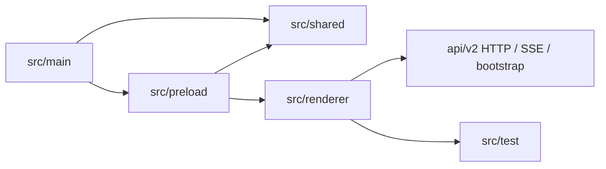

# `frontend` 子工程规格

## 一句话总览
`frontend/` 是 LinguaGacha 的 Electron + React 子工程，采用 `main / preload / shared / renderer / test` 五段结构：主进程负责桌面宿主与原生能力，预加载负责安全桥接，共享层负责跨端契约与 Core API 地址解析，渲染层负责界面与运行态消费，`src/test/` 负责前端测试环境装配。

## 阅读顺序
1. 先读本文，确认子工程根目录、构建入口、主进程 / 预加载 / 共享层边界。
2. 如果改动落在页面结构、导航、组件落位、样式边界，继续读 [`src/renderer/SPEC.md`](./src/renderer/SPEC.md)。
3. 如果改动落在 `ProjectStore`、bootstrap、`project.patch` 或页面变更信号，继续读 [`src/renderer/app/project-runtime/SPEC.md`](./src/renderer/app/project-runtime/SPEC.md)。
4. 如果改动涉及 Python Core 契约、SSE topic、bootstrap stage 或 HTTP 路径，继续读 [`../api/SPEC.md`](../api/SPEC.md)。

## 子工程边界图

## 顶层目录与入口
| 路径 | 职责 |
| --- | --- |
| `package.json` | 子工程命令入口；声明 `dev`、`build`、`lint`、`test`、`renderer:audit`、`preview` |
| `components.json` | shadcn CLI 配置权威来源；约束 `@/shadcn`、`@/widgets`、`@/hooks` 等别名 |
| `electron.vite.config.ts` | Electron / Vite 构建入口；renderer root 固定为 `src/renderer`，开发态 host 固定为 `127.0.0.1` |
| `src/main/` | Electron 主进程；窗口创建、标题栏策略、原生对话框、外链打开、开发态调试入口 |
| `src/preload/` | `contextBridge` 暴露 `window.desktopApp`，不持有页面状态 |
| `src/shared/` | 主进程 / 预加载 / 渲染层共享契约、桌面壳层常量、Core API 地址解析 |
| `src/renderer/` | React 渲染层；目录规则见 [`src/renderer/SPEC.md`](./src/renderer/SPEC.md) |
| `src/test/` | Vitest 前端测试环境入口；由 `setup.ts` 提供公共测试装配 |
| `public/` | 原始静态资源，例如应用图标 |

## Main / Preload / Shared 的真实边界
### `src/main/`
- 负责：
  - 创建窗口与标题栏 overlay 策略
  - 打开文件 / 目录选择器
  - 外部链接打开与应用退出
  - 开发态 DevTools 快捷键与远程调试端口
- 开发态会打开 Chromium remote debugging 端口 `9222`，方便外部自动化工具直接附着 Electron 实例。
- 不负责：
  - 页面状态
  - HTTP 请求编排
  - React 组件树逻辑

### `src/preload/`
- 只通过 `contextBridge.exposeInMainWorld('desktopApp', ...)` 暴露桌面能力。
- 对渲染层公开的稳定能力包括：
  - `shell`
  - `coreApi.baseUrl`
  - 文件 / 目录选择
  - 外链打开
  - 主题标题栏同步
  - `getPathForFile()`
- 不维护页面缓存、运行态状态或 UI 逻辑。

### `src/shared/`
- 是桌面壳层契约的唯一权威来源。
- 最关键的共享规则：
  - `core-api-base-url.ts` 负责解析 Core API 地址
  - `desktop-shell.ts` 负责标题栏高度、安全区、控制按钮侧
  - `ipc-channels.ts` 维护 IPC channel 常量

## Core API 地址的真实来源
`window.desktopApp.coreApi.baseUrl` 最终来自 `src/shared/core-api-base-url.ts`，解析顺序固定为：
1. 环境变量 `LINGUAGACHA_CORE_API_BASE_URL`
2. 启动参数 `--core-api-base-url=...`
3. 默认地址 `http://127.0.0.1:38191`

渲染层不会盲信这个地址，而是继续通过 `desktop-api.ts` 请求 `/api/health` 做探活确认。

## 与渲染层的接缝
- 渲染层的稳定入口在 [`src/renderer/SPEC.md`](./src/renderer/SPEC.md)。
- `desktop-api.ts` 是渲染层访问 Core API 的唯一 HTTP / SSE 入口。
- `app/project-runtime/` 负责消费 `/api/v2/project/bootstrap/stream` 与 `/api/v2/events/stream`，不要在页面里重新拼第二套项目运行态客户端。

## 命令与验证入口
| 命令 | 用途 |
| --- | --- |
| `npm run dev` | 启动 Electron 开发环境 |
| `npm run build` | 前端类型检查 + Electron 构建与打包 |
| `npm run lint` | ESLint 检查 |
| `npm run test` | Vitest 一次性测试 |
| `npm run test:watch` | Vitest 监听模式 |
| `npm run renderer:audit` | 渲染层设计系统与样式边界硬规则审查 |
| `npm run preview` | 预览打包后的 Electron 构建产物 |

## 修改建议
| 变更类型 | 优先落点 |
| --- | --- |
| 构建入口、renderer root、开发态 host、alias | `electron.vite.config.ts` |
| 主进程窗口、标题栏、原生对话框、开发态调试 | `src/main/index.ts` |
| 桌面桥接接口 | `src/shared/*` -> `src/preload/index.ts` -> 渲染层消费代码 |
| Core API base URL 解析规则 | `src/shared/core-api-base-url.ts` |
| 页面、导航、组件与样式 | [`src/renderer/SPEC.md`](./src/renderer/SPEC.md) |
| `ProjectStore` 与 V2 运行态消费 | [`src/renderer/app/project-runtime/SPEC.md`](./src/renderer/app/project-runtime/SPEC.md) |

## 维护约束
- Electron 子工程只存在一套桌面桥接入口：`window.desktopApp`。
- 渲染层的项目运行态主路径只存在一套：`desktop-api.ts` + `app/project-runtime/`。
- 如果主进程、预加载、共享契约或构建入口变化，会直接影响整个桌面前端，必须同步更新本文。
