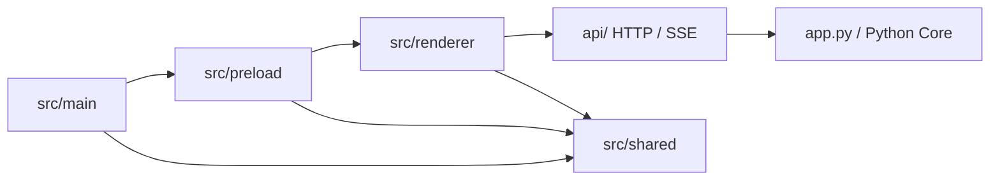

# frontend 子工程规格

## 一句话总览
`frontend` 是 LinguaGacha 的 Electron + React 子工程，采用 `main / preload / shared / renderer` 四段结构：主进程负责桌面宿主，预加载负责安全桥接，共享层负责跨端契约，渲染层负责界面、导航、状态与样式。

## 阅读顺序
1. 先读本文，确认 `frontend/` 根目录、Electron 壳层、桥接边界与命令入口。
2. 如果改动落在页面结构、样式分层、导航、状态组织或组件落位，继续读 [`src/renderer/SPEC.md`](./src/renderer/SPEC.md)。
3. 如果改动涉及 Python Core 交互、HTTP / SSE 契约或探活策略，继续读 [`../api/SPEC.md`](../api/SPEC.md)。

## 子工程边界图

## 本文件负责什么
- 解释 `frontend/` 根目录的结构、Electron 壳层边界、桥接入口与命令体系。
- 说明 `src/main/`、`src/preload/`、`src/shared/` 与 `src/renderer/` 的职责切分。
- 为后续进入 [`src/renderer/SPEC.md`](./src/renderer/SPEC.md) 或 [`../api/SPEC.md`](../api/SPEC.md) 提供稳定入口。

## 本文件不负责什么
- 不展开 `src/renderer/` 内部页面、widgets、shadcn 与样式约束细节。
- 不重复转写 HTTP / SSE 契约正文。
- 不替代仓库级文档说明整体模块关系与非前端模块阅读路径。

## 顶层目录与入口
| 路径 | 职责 |
| --- | --- |
| `package.json` | 子工程命令入口，集中声明 `dev`、`build`、`lint`、`renderer:audit` 与 `preview` |
| `components.json` | shadcn CLI 配置权威来源，定义 `style`、`base`、全局 CSS 和 `@/shadcn` / `@/widgets` 等别名 |
| `electron.vite.config.ts` | Electron / Vite 构建入口与 renderer 别名配置 |
| `electron-builder.json5` | Electron 打包配置 |
| `scripts/` | 子工程级脚本与审查工具，例如 `check-renderer-design-system.mjs` 与 `dev-launcher.mjs` |
| `src/main/` | Electron 主进程；只处理窗口创建、原生对话框、标题栏策略与 IPC 落地 |
| `src/preload/` | `window.desktopApp` 桥接层；只暴露渲染层必须消费的桌面能力 |
| `src/shared/` | 主进程、预加载与渲染层共享的桌面契约、壳层常量和 Core API 地址解析规则 |
| `src/renderer/` | React 渲染层；具体分层、样式边界、组件落位与审查规则见 [`src/renderer/SPEC.md`](./src/renderer/SPEC.md) |
| `public/` | 以原始路径暴露给 HTML / Electron 的静态资源，例如 `icon.png` 与字体文件 |

## Electron / Shared 侧边界
- `src/main/` 不承载页面状态、业务请求流程或渲染层工具。
- `src/preload/` 只组织 `contextBridge` 暴露对象，不维护页面状态与 UI 逻辑。
- IPC channel、桌面壳层信息、桥接类型、标题栏高度和 Core API 地址解析统一收敛在 `src/shared/`。
- Core API 地址解析由 [`src/shared/core-api-base-url.ts`](./src/shared/core-api-base-url.ts) 负责；`src/preload/index.ts` 只桥接单一权威地址，渲染层再负责探活与缓存。

## 与 Python Core 的边界
- Electron 前端与 Python Core 的运行时通信统一走 `api/` 暴露的 HTTP / SSE 契约，不直接 import Python 模块。
- 前端只消费标准化快照、事件与命令响应；业务状态权威来源始终在 Python Core。
- 若需要新增桥接能力，优先判断它属于桌面壳层能力、前端状态编排还是 Core API 契约，避免把职责堆进单个目录。

## 渲染层入口
- 渲染层所有稳定规则统一收敛在 [`src/renderer/SPEC.md`](./src/renderer/SPEC.md)。
- 修改 `src/renderer/` 下的目录落位、样式分层、组件归属、命名空间、审查脚本或导航入口时，先读 `src/renderer/SPEC.md`。
- `src/renderer/shadcn/` 是 shadcn CLI 管理的基础组件目录；`components.json` 中 `aliases.ui` 的值固定指向 `@/shadcn`。

## 命令与审查
| 命令 | 用途 |
| --- | --- |
| `npm run dev` | 启动开发环境 |
| `npm run build` | 类型检查、构建 renderer 与 Electron 产物并执行打包 |
| `npm run lint` | ESLint 检查 |
| `npm run renderer:audit` | 渲染层设计系统与样式边界硬规则审查 |
| `npm run preview` | Electron 预览构建产物 |

## 改动入口建议
1. 调整构建入口、输出目录、Vite alias 或 renderer root 时，优先修改 `electron.vite.config.ts`，再同步检查 `package.json` 与 `components.json`。
2. 调整桌面桥接接口时，先改 `src/shared/` 契约，再同步 `src/preload/index.ts` 与渲染层消费代码。
3. 调整 Electron 窗口、标题栏或原生能力时，优先修改 `src/main/` 与 `src/shared/`，不要把桌面宿主逻辑散落到渲染层。
4. 调整渲染层分层、组件落位、样式边界、导航与页面入口时，直接进入 [`src/renderer/SPEC.md`](./src/renderer/SPEC.md) 对照实施。

## 维护约束
- `frontend/SPEC.md` 是 Electron 子工程的总规格入口；涉及根目录结构、主进程、预加载、共享契约或阅读顺序变化时，优先更新本文。
- `src/renderer/SPEC.md` 只负责渲染层内部规则；若变更只影响渲染层局部，不要把细节上提到本文。
- 仓库级入口文档链接前端说明时，直接指向本文。
- 本文只向更下游的前端局部说明或真实依赖文档延伸，不反向回链 `docs/ARCHITECTURE.md`，避免形成循环入口。
