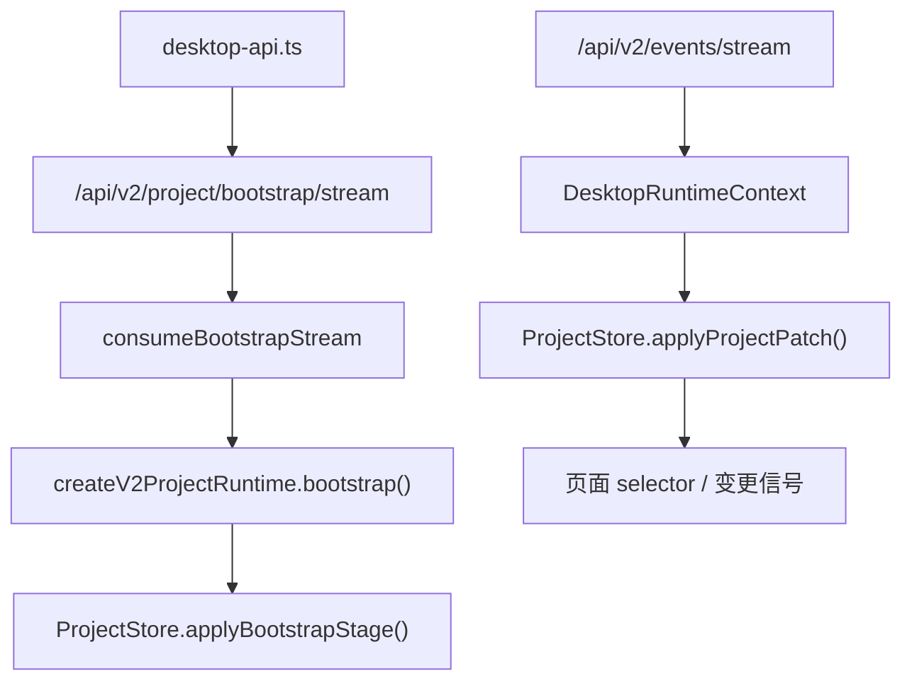

# `app/project-runtime` 规范说明

## 一句话总览
`frontend/src/renderer/app/project-runtime/` 负责把 V2 bootstrap 流和 `project.patch` 事件流收口成渲染层可消费的 `ProjectStore`。它不是页面本身，也不是 HTTP 客户端全集；它只负责“建立项目运行态、合并补丁、提供稳定 selector 与页面变更信号”。

## 阅读顺序
| 任务类型 | 优先阅读 |
| --- | --- |
| 理解 `ProjectStore` 数据形状与 patch 语义 | `project-store.ts` |
| 理解 bootstrap 事件如何落入 store | `bootstrap-stream.ts` -> `use-project-runtime.ts` |
| 理解桌面运行时如何消费它 | `../state/desktop-runtime-context.tsx` |
| 理解后端如何产生 stage / patch | [`api/SPEC.md`](../../../../../api/SPEC.md) -> `api/v2/Application/ProjectBootstrapAppService.py` -> `module/Data/Project/V2/RuntimeService.py` |

## 目录职责
| 路径 | 职责 |
| --- | --- |
| `project-store.ts` | `ProjectStore` 状态形状、bootstrap stage、patch operation、revision 合并规则 |
| `bootstrap-stream.ts` | 把 SSE bootstrap 事件转成阶段化消费接口 |
| `use-project-runtime.ts` | 组织 bootstrap 消费，把 stage payload 归一化后写入 `ProjectStore` |
| `selectors.ts` | 面向页面的稳定读取入口 |

## 真实运行链路

## `ProjectStore` 的稳定分区
当前 store 固定分成下面 7 个 stage / section：

| stage | 用途 | 当前来源 |
| --- | --- | --- |
| `project` | 当前工程路径与 loaded 状态 | bootstrap `project` 块、`replace_project` patch |
| `files` | 文件索引与文件类型 | bootstrap row block、`merge_files` patch |
| `items` | 条目主表最小视图 | bootstrap row block、`merge_items` patch |
| `quality` | glossary / replacement / text preserve 当前运行态 | bootstrap `quality` 块 |
| `prompts` | translation / analysis prompt 的 text + enabled | bootstrap `prompts` 块 |
| `analysis` | 分析候选摘要与运行态统计 | bootstrap `analysis` 块、`replace_analysis` patch |
| `task` | 当前任务快照 | bootstrap `task` 块、`replace_task` patch |

`ProjectStore.revisions` 额外维护：
- `projectRevision`
- `sections[stage]`

## bootstrap 的当前协议事实
### stage 顺序
后端当前固定按下面顺序输出：
1. `project`
2. `files`
3. `items`
4. `quality`
5. `prompts`
6. `analysis`
7. `task`

### stage payload 形状
| stage | 线上的主要形状 | TS 落地后的形状 |
| --- | --- | --- |
| `project` | `{ project: { path, loaded } }` | 原样写入 `store.project` |
| `files` | `RowBlock(fields, rows)` | 转成 `Record<rel_path, file_record>` |
| `items` | `RowBlock(fields, rows)` | 转成 `Record<item_id, item_record>` |
| `quality` / `prompts` / `analysis` / `task` | 普通对象 | 直接作为对应 section 快照 |

注意：
- `files` 使用 `rel_path` 作为 key。
- `items` 使用 `item_id` 作为 key。
- bootstrap 完成后，`onCompleted()` 只负责把 revision 信息补回 store，不再重写前面阶段数据。

## `project.patch` 的当前补丁语义
### patch operation
| `op` | 作用 |
| --- | --- |
| `merge_files` | 合并文件记录，不整段替换 |
| `merge_items` | 合并条目记录，不整段替换 |
| `replace_project` | 整段替换 `project` |
| `replace_quality` | 整段替换 `quality` |
| `replace_prompts` | 整段替换 `prompts` |
| `replace_analysis` | 整段替换 `analysis` |
| `replace_task` | 整段替换 `task` |

### 当前事件来源
- 翻译任务 DONE 时，后端会优先发 `merge_items + replace_task`
- 分析任务 DONE 时，后端会优先发 `replace_analysis + replace_task`
- 文件操作完成后，后端可能只发“受影响 section 列表”，让前端重新 bootstrap 当前项目运行态

## `DesktopRuntimeContext` 与页面信号
`DesktopRuntimeContext` 做三件事：
1. 初始化 `settings_snapshot`、`project_snapshot`、`task_snapshot`
2. 持有 `ProjectStore`
3. 把 `project.patch` 和设置变化进一步派生为页面可消费的变更信号

### 派生信号
| 信号 | 作用域 | 主要消费者 |
| --- | --- | --- |
| `workbench_change_signal` | `global` / `file` / `order` | 工作台页 |
| `proofreading_change_signal` | `global` / `file` / `entry` | 校对页 |

### 触发规则
- `project.patch` 命中 `project` / `files` / `items` 时，会触发工作台信号。
- `project.patch` 命中 `project` / `items` / `quality` / `prompts` / `analysis` / `task` 时，会触发校对信号。
- `settings.changed` 只有当 `keys` 包含 `source_language` 或 `mtool_optimizer_enable` 时，才会同时 bump 两类页面信号。

## 当前页面仍然怎么用它
- 工作台与校对页的主读路径已经转到 `ProjectStore + selector / worker`。
- 但页面在显式文件操作后，仍可能继续请求：
  - `/api/v2/project/workbench/file-patch`
  - `/api/v2/project/proofreading/file-patch`
  - `/api/v2/project/proofreading/entry-patch`
- 也就是说，`ProjectStore` 负责“运行态事实源”，页面 patch API 负责“局部重建重型视图”。

## 修改建议
| 变更类型 | 优先落点 |
| --- | --- |
| bootstrap stage 名称、顺序或 payload 形状 | 本文 + `project-store.ts` + 后端 bootstrap 服务 |
| 新增 / 删除 patch operation | 本文 + `project-store.ts` + `api/v2/Bridge/EventBridge.py` |
| 页面如何把 patch 转成 change signal | `../state/desktop-runtime-context.tsx` |
| 纯页面派生读取逻辑 | `selectors.ts` 或对应页面 hook |

## 维护约束
- `ProjectStore` 只保存“项目运行态最小事实”，不要把页面私有筛选、对话框状态、表格排序 UI 状态塞进来。
- 运行态协议变化时，前后端文档必须同步更新：本文和 [`api/SPEC.md`](../../../../../api/SPEC.md) 要一起改。
- 如果某个需求只影响单页的重型视图重建，不要先改 `ProjectStore`；先判断它是不是应该继续走页面 patch API。
