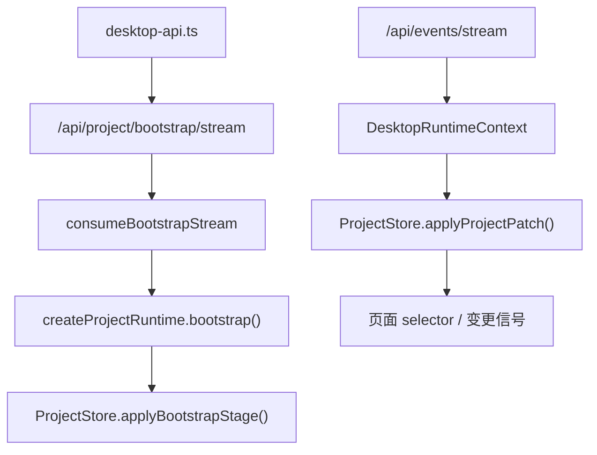

# `app/project-runtime` 规范说明

## 一句话总览
`frontend/src/renderer/app/project-runtime/` 负责把 bootstrap 流和 `project.patch` 事件流收口成渲染层可消费的 `ProjectStore`。它不承担页面 UI，也不承担读写所有 HTTP 路由；它只负责建立项目运行态、合并补丁、暴露稳定 selector 和页面变更信号。

## 阅读顺序
| 任务类型 | 优先阅读 |
| --- | --- |
| 理解 `ProjectStore` 数据形状与 patch 语义 | `project-store.ts` |
| 理解 bootstrap 事件如何落入 store | `bootstrap-stream.ts` -> `use-project-runtime.ts` |
| 理解桌面运行时如何消费它 | `../state/desktop-runtime-context.tsx` |
| 理解后端如何产生 stage / patch | [`api/SPEC.md`](../../../../../api/SPEC.md) -> `api/Application/ProjectBootstrapAppService.py` -> `module/Data/Project/ProjectRuntimeService.py` |

## 目录职责
| 路径 | 职责 |
| --- | --- |
| `project-store.ts` | `ProjectStore` 状态形状、bootstrap stage、patch operation、revision 合并规则 |
| `bootstrap-stream.ts` | 把 SSE bootstrap 事件转成阶段化消费接口 |
| `use-project-runtime.ts` | 组织 bootstrap 消费，把 stage payload 归一化后写入 `ProjectStore` |
| `selectors.ts` | 面向页面的稳定读取入口 |
| `quality-statistics.ts` | 基于 `ProjectStore.items` 计算 glossary / replacement / text preserve 统计，供质量页共享 |

## 真实运行链路

## `ProjectStore` 的稳定分区
store 固定分成下面 8 个 stage / section：

| stage | 用途 | 来源 |
| --- | --- | --- |
| `project` | 工程路径与 loaded 状态 | bootstrap `project` 块、`replace_project` patch |
| `files` | 文件索引与文件类型 | bootstrap row block、`merge_files` patch |
| `items` | 条目主表最小视图 | bootstrap row block、`merge_items` patch |
| `quality` | glossary / replacement / text preserve 运行态 | bootstrap `quality` 块 |
| `prompts` | translation / analysis prompt 的 text + enabled | bootstrap `prompts` 块 |
| `analysis` | 分析候选摘要与运行态统计 | bootstrap `analysis` 块、`replace_analysis` patch |
| `proofreading` | 校对运行态 revision | bootstrap `proofreading` 块、`replace_proofreading` patch |
| `task` | 任务快照 | bootstrap `task` 块、`replace_task` patch |

`ProjectStore.revisions` 额外维护：
- `projectRevision`
- `sections[stage]`

## bootstrap 协议事实
### stage 顺序
后端固定按下面顺序输出：
1. `project`
2. `files`
3. `items`
4. `quality`
5. `prompts`
6. `analysis`
7. `proofreading`
8. `task`

### stage payload 形状
| stage | 线上的主要形状 | TS 落地后的形状 |
| --- | --- | --- |
| `project` | `{ project: { path, loaded } }` | 原样写入 `store.project` |
| `files` | `RowBlock(fields, rows)` | 转成 `Record<rel_path, file_record>` |
| `items` | `RowBlock(fields, rows)` | 转成 `Record<item_id, item_record>` |
| `quality` / `prompts` / `analysis` / `proofreading` / `task` | 普通对象 | 直接作为对应 section 快照 |

注意：
- `files` 使用 `rel_path` 作为 key。
- `items` 使用 `item_id` 作为 key。
- `files` / `items` 的块类型由 stage 决定，不额外依赖 `schema` 标签。
- bootstrap 完成后，`onCompleted()` 负责把 revision 信息补回 store；前面阶段数据由各自的 `stage_payload` 写入。

## `project.patch` 补丁语义
### patch operation
| `op` | 作用 |
| --- | --- |
| `merge_files` | 合并文件记录，不整段替换 |
| `merge_items` | 合并条目记录，不整段替换 |
| `replace_files` | 整段替换 `files`，只给 destructive file flow 使用 |
| `replace_items` | 整段替换 `items`，只给 destructive item/file flow 使用 |
| `replace_project` | 整段替换 `project` |
| `replace_quality` | 整段替换 `quality` |
| `replace_prompts` | 整段替换 `prompts` |
| `replace_analysis` | 整段替换 `analysis` |
| `replace_proofreading` | 整段替换 `proofreading` |
| `replace_task` | 整段替换 `task` |

### 稳定语义
- 带 `patch` 数组的事件表示增量补丁，由 `ProjectStore.applyProjectPatch(...)` 直接合并。
- `project.patch` 现在只承载可直接合并的运行态补丁，不再承担 reset 刷新提示语义。
- 翻译、分析与校对重译这类异步链路，以及后端显式发出的 `PROJECT_RUNTIME_PATCH`，会使用服务器 `project.patch`。
- 质量规则、提示词、校对同步写、预过滤、分析候选导入术语、工作台文件操作、translation reset 与 analysis reset 都属于同步 mutation；这类路径以本地 patch + `ProjectMutationAck` 对齐 revision，不等待额外 SSE 回灌。

## `DesktopRuntimeContext` 与页面信号
`DesktopRuntimeContext` 做三件事：
1. 初始化 `settings_snapshot`、`project_snapshot`、`task_snapshot`
2. 持有 `ProjectStore`
3. 把本地 patch、`project.patch` 和设置变化进一步派生为页面可消费的变更信号

### 本地 patch 提交通道
- `DesktopRuntimeContext` 通过 `commit_local_project_patch(...)` 暴露渲染层唯一的本地运行态写入口。
- 同步 mutation 先在 TS 侧计算下一个 section，再用这条入口写入 `ProjectStore`。
- 服务器 `project.patch` 与本地 patch 共用同一套后处理：`ProjectStore.applyProjectPatch(...)`、`task_snapshot` 合并、`workbench_change_signal / proofreading_change_signal` bump。
- 同步 mutation 成功路径统一为“本地 patch -> HTTP 持久化 -> `align_project_runtime_ack(...)`”；失败路径统一为“回滚 -> `refresh_project_runtime()`”。
- 本地 patch 的 revision 由前端按命中的 section 合成，服务端 ack 负责把 revision 对齐到真实值。

### 派生信号
| 信号 | 作用域 | 主要消费者 |
| --- | --- | --- |
| `workbench_change_signal` | `global` / `file` / `order` | 工作台页 |
| `proofreading_change_signal` | `global` / `file` / `entry` | 校对页 |

### 触发规则
- 本地 patch 或 `project.patch` 命中 `project` / `files` / `items` 时，会触发工作台信号。
- 本地 patch 或 `project.patch` 命中 `project` / `items` / `quality` / `prompts` / `analysis` / `proofreading` / `task` 时，会触发校对信号。
- `settings.changed` 只有当 `keys` 包含 `source_language` 或 `mtool_optimizer_enable` 时，才会同时 bump 两类页面信号。

## 页面如何继续消费它
- 工作台与校对页通过 `ProjectStore` 加页面本地派生逻辑消费项目运行态。
- 工作台收到 `workbench_change_signal` 后，用 `buildWorkbenchView(project_store.getState())` 重建视图。
- `ProjectStore` 负责运行态事实源；工作台依赖 `selectors.ts` 本地重建视图，质量页依赖 `quality-statistics.ts`，校对页依赖页面本地 runtime 派生校对结果。

## 修改建议
| 变更类型 | 优先落点 |
| --- | --- |
| bootstrap stage 名称、顺序或 payload 形状 | 本文 + `project-store.ts` + 后端 bootstrap 服务 |
| 新增 / 删除 patch operation | 本文 + `project-store.ts` + `api/Bridge/ProjectPatchEventBridge.py` |
| 页面如何把 patch 转成 change signal | `../state/desktop-runtime-context.tsx` |
| 纯页面派生读取逻辑 | `selectors.ts` 或对应页面 hook |

## 维护约束
- `ProjectStore` 只保存“项目运行态最小事实”，不要把页面私有筛选、对话框状态、表格排序 UI 状态塞进来。
- 运行态协议变化时，前后端文档必须同步更新：本文和 [`api/SPEC.md`](../../../../../api/SPEC.md) 要一起改。
- 页面命令如果会改动项目运行态，应优先判断它能否落成 `commit_local_project_patch + project.patch` 的共用语义，而不是再开并行 patch API。
