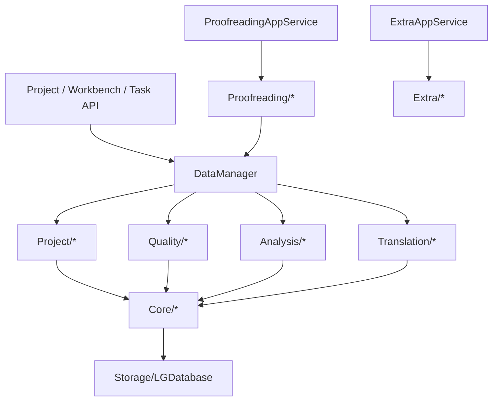

# `module/Data` 规范说明

## 一句话总览
`module/Data` 承担项目数据、规则、分析、校对与 Extra 工具等“以数据为中心”的服务实现。`DataManager` 仍是工程加载、工作台、质量规则、分析和翻译链路的主入口；`Proofreading/` 与 `Extra/` 则由 `api/Application` 直接组合成用例层能力。

## 阅读顺序
| 任务类型 | 优先阅读 |
| --- | --- |
| 工程加载/卸载 | `DataManager.py` -> `Project/ProjectLifecycleService.py` |
| 新建工程、导入源文件、工作台文件操作 | `DataManager.py` -> `Project/ProjectService.py` / `Project/ProjectFileService.py` / `Project/WorkbenchService.py` |
| 预过滤重跑 | `DataManager.py` -> `Project/ProjectPrefilterService.py` |
| 规则页、提示词、预设 | `DataManager.py` -> `Quality/QualityRuleService.py` -> `Quality/QualityRuleFacadeService.py` / `PromptService.py` / `QualityRulePresetService.py` |
| 分析进度、候选池、导入术语 | `DataManager.py` -> `Analysis/AnalysisService.py` |
| 翻译条目准备与重置 | `DataManager.py` -> `Translation/TranslationItemService.py` / `Translation/TranslationResetService.py` |
| 校对页快照、筛选、保存、重翻 | `api/Application/ProofreadingAppService.py` -> `Proofreading/*` |
| 繁简转换、姓名字段 | `api/Application/ExtraAppService.py` -> `Extra/*` |
| 会话缓存、meta、rules、items、assets | `Core/*` |
| SQL、schema、事务细节 | `Storage/LGDatabase.py` |

## 目录结构
| 路径 | 职责 |
| --- | --- |
| `DataManager.py` | 工程级数据入口；协调会话、规则、分析、翻译、工作台事件与跨 service 流程 |
| `Core/` | `ProjectSession`、`Item`、`Project` 以及 `Meta/Rule/ItemService/Asset/Batch` 基础能力 |
| `Storage/LGDatabase.py` | `.lg` 的 schema、SQL、事务与序列化实现 |
| `Project/` | 工程创建/加载/卸载、文件操作、预过滤、导出路径、工作台快照，以及 V2 runtime snapshot / patch / revision 支撑 |
| `Quality/` | 规则快照、变更、预设、提示词与分析候选导入术语的规则侧逻辑 |
| `Analysis/` | 分析进度、候选聚合、checkpoint 与分析结果写回 |
| `Proofreading/` | 校对页快照、筛选、revision 冲突、保存、重检与重翻 |
| `Extra/` | 繁简转换、姓名字段提取与导入术语 |
| `Translation/` | 翻译任务取条目与翻译失败/重置后的数据整理 |

## 边界与入口
- `DataManager` 持有 `ProjectSession`，负责工程加载态、规则/条目缓存、事件发射和跨 service 编排。
- 运行时 `Config` 是语言设置的权威来源；当前工程 `.lg` 中的 `source_language` / `target_language` meta 只做镜像摘要，由 `DataManager` 在工程加载后与设置变更时同步。
- `Project/`、`Quality/`、`Analysis/`、`Translation/` 这四条主链路以 `DataManager` 为入口，不在 API 层绕过它直接拼装内部依赖。
- `Item` / `Project` 这类数据层基础实体已经收口到 `Core/`，不再放在仓库根级独立模块里。
- `Proofreading/` 由 `api/Application/ProofreadingAppService.py` 组合使用；它依赖 `DataManager` 读取当前工程、提交 mutation，并自行维护筛选、revision 与重检逻辑。
- `Extra/` 由 `api/Application/ExtraAppService.py` 组合使用；它直接提供繁简转换与姓名字段能力，不承担工程生命周期管理。
- `ProjectSession` 只做当前工程会话状态容器；`LGDatabase` 只做 SQL、schema 和事务，不承担业务流程。
- 新增数据链路时，先判断它属于工程编排、规则/分析/翻译、校对，还是 Extra 工具，不要把所有逻辑都压回 `DataManager`。

### 明确禁止
- 禁止把 SQL 散到 `Storage/LGDatabase.py` 之外。
- 禁止在 API 层直接持有 `ProjectSession` 或自己操作数据库连接。
- 禁止把新的项目级状态随手塞回 `DataManager`，先判断它是不是 `ProjectSession`、某个领域 service 或 API 状态仓库的职责。
- 禁止为了图省事把新 service 平铺回 `module/Data` 根目录。

## 关键链路

| 场景 | 真实入口 |
| --- | --- |
| 工程创建/加载/卸载 | `DataManager` -> `ProjectService` / `ProjectLifecycleService` |
| 工作台文件增删改、批量文件操作与文件级补丁 | `DataManager` -> `ProjectFileService` / `WorkbenchService` |
| V2 项目运行态 bootstrap / patch 构建 | `V2ProjectBootstrapAppService` / `V2ProjectRuntimeService` -> `DataManager` |
| 规则、提示词、预设 | `DataManager` -> `QualityRuleService` / `PromptService` / `QualityRulePresetService` |
| 分析进度、候选导入 | `DataManager` -> `AnalysisService` / `QualityRuleGlossaryImportService` |
| 翻译取条目、翻译重置 | `DataManager` -> `TranslationItemService` / `TranslationResetService` |
| 校对页快照、筛选、保存、重翻 | `ProofreadingAppService` -> `ProofreadingSnapshotService` / `ProofreadingMutationService` / `ProofreadingRetranslateService` |
| 繁简转换、姓名字段 | `ExtraAppService` -> `TsConversionService` / `NameFieldExtractionService` |

## 子包职责速查
### `Core`
- `ProjectSession`：当前工程会话状态与缓存权威来源
- `Item` / `Project`：数据层共享实体与导入导出链路中的基础对象
- `MetaService` / `RuleService` / `ItemService` / `AssetService`：基础数据读写与缓存整理
- `BatchService`：`items / rules / meta` 的统一事务写回
- `DataTypes` / `DataEnums`：跨层冻结快照类型与通用枚举

### `Project`
- `ProjectService`：创建工程、收集源文件、预览工程
- `ProjectLifecycleService`：加载/卸载工程与加载后整理
- `ProjectPrefilterService`：预过滤是否需要重跑与实际执行；当前比较口径只依赖 `source_language` 与 `mtool_optimizer_enable`，并支持由调用方控制是否补发整页刷新事件
- `ProjectFileService`：文件导入、更新、重置、删除，以及批量 `replace/reset/delete` 的单事务提交
- `ExportPathService`：导出路径规则
- `WorkbenchService`：工作台聚合快照与按文件路径裁切 entry patch
- `Project/V2/RuntimeService`：把当前工程实体编码成 V2 bootstrap block 与 task patch 可复用的稳定记录
- `Project/V2/RevisionService` / `Project/V2/MutationService`：维护 V2 `projectRevision`、section revision 与 mutation 写入口

### `Quality`
- `QualityRuleService`：规则领域总门面
- `QualityRuleFacadeService` / `QualityRuleSnapshotService` / `QualityRuleMutationService`：规则读写与快照整理
- `QualityRulePresetService`：规则预设读写
- `PromptService`：自定义提示词读写与模板
- `QualityRuleGlossaryImportService`：分析候选导入术语前的预演与过滤

### `Analysis`
- `AnalysisService`：分析链路对外门面
- `AnalysisRepository`：分析表读写与事务内 meta 同步
- `AnalysisCandidateService`：候选聚合、去重与转术语
- `AnalysisProgressService`：checkpoint、覆盖率与待分析项整理

### `Proofreading`
- `ProofreadingSnapshotService`：校对页整页快照与加载结果
- `ProofreadingEntryPatchService`：校对页按 `item_id` 裁切双视图补丁
- `ProofreadingFilterService`：筛选、搜索与术语命中过滤
- `ProofreadingMutationService`：单条/批量保存与 revision 冲突保护
- `ProofreadingRecheckService`：单条重检
- `ProofreadingRetranslateService`：批量重翻
- `ProofreadingRevisionService`：校对页 revision 管理

### `Extra`
- `TsConversionService`：繁简转换选项与任务启动
- `NameFieldExtractionService`：姓名字段提取、整表翻译与导入术语

### `Translation`
- `TranslationItemService`：翻译任务取条目
- `TranslationResetService`：翻译失败/重置后的进度整理与状态回写

## 页面快照真实依赖与失效判定
### 工作台快照
- `WorkbenchService` 当前真正聚合的是文件集合、文件顺序、条目侧 `file_path / file_type / status` 的汇总结果，以及 API 响应层补入的 `file_op_running`。
- 判断工作台是否需要刷新时，优先看文件集合、顺序或状态聚合是否变化；单条 `dst` 文本变化本身不构成工作台失效，只有它进一步改动 `status`、`file_path` 或文件集合时才需要联动。
- 文件重排只影响工作台；质量规则、提示词与分析任务终态当前都不会直接改动工作台快照。

### 校对页快照
- 校对页快照不是“条目列表缓存”，而是 `items_all -> build_review_items() -> ResultChecker -> warning_map -> 默认筛选/摘要/失败术语缓存` 的组合结果。
- 判断校对页是否需要失效时，除了看条目内容，还要看进入 review 范围的条目集合和检查语义是否变化；规则、术语、文本保护模式、`source_language` 等都可能命中这条链。
- `target_language` 当前只同步工程 meta 镜像，不参与预过滤比较，也不是工作台/校对页快照的真实依赖。

### 设置与规则变化的当前口径
| 变更 | 工作台 | 校对页 | 当前约束 |
| --- | --- | --- | --- |
| `source_language` | 全局 | 全局 | 会改变预过滤结果与校对检查语义 |
| `mtool_optimizer_enable` | 全局 | 全局 | 会成批改动预过滤与状态聚合结果 |
| `target_language` | 无 | 无 | 只同步工程摘要，不触发页面刷新或预过滤 |
| `check_kana_residue` / `check_hangeul_residue` / `check_similarity` | 无 | 无 | `ResultChecker` 当前未消费这些开关 |
| 术语表、前置替换、后置替换 | 无 | 条目级 | 由 `ProofreadingImpactAnalyzer` 收敛到受影响条目，工作台不再联动 |
| 文本保护条目内容 | 无 | 条目级 | 仅 `CUSTOM` 模式下按 regex 命中候选收敛 |
| 文本保护模式 | 无 | 全局 | 会整体改变校对检查语义 |

- 分析任务完成/重置、提示词变更、应用语言变化与最近项目变化，当前都不属于工作台或校对页快照的真实依赖，默认不应补发页面刷新。

## 当前已落地的文件级刷新事实
- `DataManager` 当前负责把文件操作统一收口到稳定态后再发结构化刷新事件，避免前端在预过滤未完成时读取半成品快照。
- `DataManager.emit_workbench_refresh()` / `emit_proofreading_refresh()` 是当前文件级刷新事件的唯一拼装入口。
- `DataManager.emit_project_item_change_refresh()` 当前负责把条目级写入统一映射成 `workbench scope=file + proofreading scope=entry`。
- `ProjectFileMutationResult` 已从单文件结果扩成批量结果，统一携带 `rel_paths`、`removed_rel_paths` 与 `order_changed`。
- `ProjectItemChange` 当前统一承载条目级刷新所需的 `item_ids`、`rel_paths` 与 `reason`。
- `WorkbenchService.build_entry_patch()` 负责从最新工作台快照中裁出受影响文件的 entry 列表。
- `ProofreadingEntryPatchService` 当前负责从最新校对快照中按 `target_item_ids` 裁出 `full_items / filtered_items`。
- 翻译批量提交、校对保存/替换/重译，以及 `translation_reset_failed` 当前都已经改成条目级差异刷新，不再依赖任务终态后的整页兜底刷新。
- 批量 `replace/reset/delete` 当前都按“一次事务 + 一次事件”的语义落地；前端多选操作不再需要逐个文件排队触发刷新。
- 文件重排当前只触发工作台 `scope="order"` 刷新；文件增删改则同时触发工作台和校对页 `scope="file"` 刷新。
- 对 Electron 渲染层主路径来说，工作台/校对页已不再依赖 `workbench.snapshot_changed` 与 `proofreading.snapshot_invalidated`；后台任务终态改为通过 V2 `project.patch` 回灌 `ProjectStore`。

## 修改建议
| 变更类型 | 优先落点 |
| --- | --- |
| 会话缓存、meta/rule/item/asset 基础读写 | `Core/` |
| 表结构、SQL、事务 | `Storage/LGDatabase.py` |
| 工程创建、加载、工作台文件流转 | `Project/` |
| 规则、提示词、预设、规则统计 | `Quality/` |
| 分析 checkpoint、候选池、导入术语 | `Analysis/` |
| 校对页快照、筛选、保存、重翻 | `Proofreading/` |
| 繁简转换、姓名字段 | `Extra/` |
| 翻译取条目与重置 | `Translation/` |

### 什么时候改 `DataManager`
- 需要新增对外公开方法时
- 需要新增 `Base.Event` 发射点时
- 需要跨 `Project / Quality / Analysis / Translation` 组合多个 service 时
- 需要统一新的后台线程入口时

如果只是某个子领域内部逻辑变化，优先改对应 service，不要先动 `DataManager`。

## 维护约束
- `DataManager` 是工程级门面，不是任意逻辑的回收站。
- `ProjectSession` 只保存当前工程会话状态；流程控制状态不要随手塞进去。
- `Proofreading/` 与 `Extra/` 已经有独立服务分层，不要为了省事回退成页面或 API 直接拼数据。
- 代码改动如果改变了阅读入口、目录职责或主链路，要同步更新本文。

