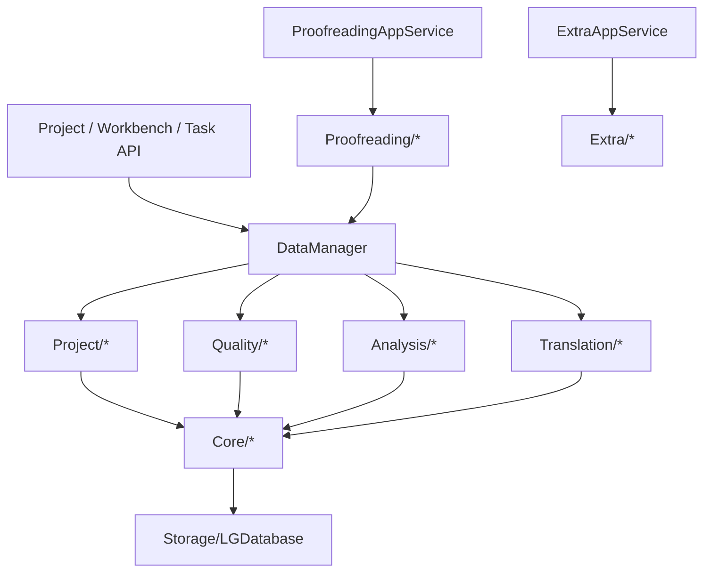

# `module/Data` 规范说明

## 一句话总览
`module/Data` 承担工程事实、规则、分析、翻译、校对辅助与 Extra 数据服务等“以数据为中心”的实现。`DataManager` 是工程级数据门面；`Proofreading/` 与 `Extra/` 通过 `api/Application` 组合成用例层能力。

## 阅读顺序
| 任务类型 | 优先阅读 |
| --- | --- |
| 工程加载/卸载 | `DataManager.py` -> `Project/ProjectLifecycleService.py` |
| 新建工程、导入源文件、工作台文件操作 | `DataManager.py` -> `Project/ProjectService.py` / `Project/ProjectFileService.py` / `Project/ProjectRuntimeService.py` |
| 预过滤重跑 | `DataManager.py` -> `Project/ProjectPrefilterService.py` |
| 规则页、提示词、预设 | `DataManager.py` -> `Quality/QualityRuleService.py` -> `Quality/QualityRuleFacadeService.py` / `PromptService.py` / `QualityRulePresetService.py` |
| 分析进度、候选池、候选聚合 | `DataManager.py` -> `Analysis/AnalysisService.py` |
| 翻译条目准备与重置 | `DataManager.py` -> `Translation/TranslationItemService.py` / `Translation/TranslationResetService.py` |
| 校对页保存、重翻与本地 runtime 输入事实 | `api/Application/ProofreadingAppService.py` -> `Proofreading/*` |
| 繁简转换、姓名字段 | `api/Application/ExtraAppService.py` -> `Extra/*` |
| 外部文件格式解析与写回 | [`../File/SPEC.md`](../File/SPEC.md) -> `../File/FileManager.py` |
| 后台任务执行、请求与停止语义 | [`../Engine/SPEC.md`](../Engine/SPEC.md) -> `../Engine/*` |
| 会话缓存、meta、rules、items、assets | `Core/*` |
| SQL、schema、事务细节 | `Storage/LGDatabase.py` |

## 目录结构
| 路径 | 职责 |
| --- | --- |
| `DataManager.py` | 工程级数据入口；协调会话、规则、分析、翻译、工作台事件与跨 service 流程 |
| `Core/` | `ProjectSession`、`Item`、`Project` 以及 `Meta/Rule/ItemService/Asset/Batch` 基础能力 |
| `Storage/LGDatabase.py` | `.lg` 的 schema、SQL、事务与序列化实现 |
| `Project/` | 工程创建/加载/卸载、文件操作、预过滤、导出路径，以及项目运行态编码 / patch / revision 支撑 |
| `Quality/` | 规则快照、变更、预设与提示词逻辑 |
| `Analysis/` | 分析进度、候选聚合、checkpoint 与分析结果写回 |
| `Proofreading/` | 校对条目范围判断、revision 冲突、保存、重检与重翻 |
| `Extra/` | 繁简转换、姓名字段提取与导入术语 |
| `Translation/` | 翻译任务取条目与翻译失败/重置后的数据整理 |

## 边界与入口
- `DataManager` 持有 `ProjectSession`，负责工程加载态、条目与规则缓存、事件发射和跨 service 编排。
- `Project/`、`Quality/`、`Analysis/`、`Translation/` 四条主链路通过 `DataManager` 对外暴露；API 层不绕过它自行拼内部依赖。
- `Proofreading/` 由 `ProofreadingAppService` 组合使用，负责校对范围判断、revision 冲突保护、保存、重检和重翻。
- `Extra/` 由 `ExtraAppService` 组合使用，负责繁简转换、姓名字段和导入术语相关能力，不承担工程生命周期。
- 运行时 `Config` 是语言设置权威来源；工程 `.lg` 中的 `source_language` / `target_language` 只保留镜像摘要，由 `DataManager` 在工程加载和设置变更时同步。
- 分析候选导入术语的预演和筛选属于前端 planner；Python 数据层保留候选聚合、候选数缓存和分析结果持久化。
- `ProjectSession` 只做工程会话状态容器，`Storage/LGDatabase.py` 只做 SQL、schema 与事务。
- `module/File` 负责格式解析和写回，`module/Engine` 负责任务执行；`module/Data` 只提供工程事实、任务输入和批量提交入口。

### 明确禁止
- 禁止把 SQL 散到 `Storage/LGDatabase.py` 之外。
- 禁止在 API 层直接持有 `ProjectSession` 或自己操作数据库连接。
- 禁止把新的项目级状态随手塞回 `DataManager`，先判断它是不是 `ProjectSession`、某个领域 service 或 API 状态仓库的职责。
- 禁止为了图省事把新 service 平铺回 `module/Data` 根目录。

## 关键链路

| 场景 | 真实入口 |
| --- | --- |
| 工程创建/加载/卸载 | `DataManager` -> `ProjectService` / `ProjectLifecycleService` |
| 工作台文件增删改、批量文件操作与运行态事实同步 | `DataManager` -> `ProjectFileService` / `ProjectRuntimeService` |
| 项目运行态 bootstrap / patch 构建 | `ProjectBootstrapAppService` / `ProjectRuntimeService` -> `DataManager` |
| 规则、提示词、预设 | `DataManager` -> `QualityRuleService` / `PromptService` / `QualityRulePresetService` |
| 分析进度、候选聚合 | `DataManager` -> `AnalysisService` |
| 翻译取条目、翻译重置 | `DataManager` -> `TranslationItemService` / `TranslationResetService` |
| 校对页保存、重翻与 revision | `ProofreadingAppService` -> `ProofreadingMutationService` / `ProofreadingRetranslateService` / `ProofreadingRevisionService` |
| 繁简转换、姓名字段 | `ExtraAppService` -> `TsConversionService` / `NameFieldExtractionService` |

## 子包职责速查
### `Core`
- `ProjectSession`：工程会话状态与缓存权威来源
- `Item` / `Project`：数据层共享实体与导入导出链路中的基础对象
- `MetaService` / `RuleService` / `ItemService` / `AssetService`：基础数据读写与缓存整理
- `BatchService`：`items / rules / meta` 的统一事务写回
- `DataTypes` / `DataEnums`：跨层冻结快照类型与通用枚举

### `Project`
- `ProjectService`：创建工程、收集源文件、预览工程
- `ProjectLifecycleService`：加载/卸载工程与加载后整理
- `ProjectPrefilterService`：预过滤是否需要重跑与实际执行；比较口径只依赖 `source_language` 与 `mtool_optimizer_enable`
- `ProjectFileService`：工作台文件的只读解析、路径/顺序校验与文件操作互斥控制
- `ExportPathService`：导出路径规则
- `Project/ProjectRuntimeService`：把工程实体编码成项目 bootstrap block 与 task patch 可复用的稳定记录

### `Quality`
- `QualityRuleService`：规则领域总门面
- `QualityRuleFacadeService` / `QualityRuleSnapshotService` / `QualityRuleMutationService`：规则读写与快照整理
- `QualityRulePresetService`：规则预设读写
- `PromptService`：自定义提示词读写与模板

### `Analysis`
- `AnalysisService`：分析链路对外门面
- `AnalysisRepository`：分析表读写与事务内 meta 同步
- `AnalysisCandidateService`：候选聚合、去重与转术语
- `AnalysisProgressService`：checkpoint、覆盖率与待分析项整理

### `Proofreading`
- `ProofreadingFilterService`：校对条目范围判断与人工编辑状态推导
- `ProofreadingMutationService`：单条/批量保存与 revision 冲突保护
- `ProofreadingRecheckService`：复用 `ResultChecker` 的单条/批量重检
- `ProofreadingRetranslateService`：批量重翻
- `ProofreadingRevisionService`：校对页 revision 管理

### `Extra`
- `TsConversionService`：繁简转换选项与任务启动
- `NameFieldExtractionService`：姓名字段提取、整表翻译与导入术语

### `Translation`
- `TranslationItemService`：翻译任务取条目
- `TranslationResetService`：翻译失败/重置后的进度整理与状态回写

## 页面快照真实依赖与失效判定
### 工作台快照
- 工作台快照由前端基于 `ProjectStore.files + items` 本地聚合；数据层只负责提供稳定文件事实、条目事实与运行态刷新信号。
- 判断工作台是否需要刷新时，优先看文件集合、顺序或状态聚合是否变化；单条 `dst` 文本变化本身不构成工作台失效，只有它进一步改动 `status`、`file_path` 或文件集合时才需要联动。
- 文件重排只影响工作台；质量规则、提示词与分析任务终态不会直接改动工作台快照。
- `file_op_running` 只属于渲染层工作台 hook 的本地 UI 状态，不是 `module/Data` 或 API 派生快照的一部分。

### 校对页本地 runtime
- Electron 主路径上的校对页依赖 `ProjectStore.items + quality/prompts + proofreading revision + settings_snapshot` 在 TS 本地派生逻辑中重算。
- Python `Proofreading/` 负责 mutation、重检辅助与 revision 管理；校对页是否需要重算，取决于条目事实、规则运行态和 `source_language` 等输入是否变化。
- `target_language` 只同步工程 meta 镜像，不参与预过滤比较，也不是工作台/校对页本地 runtime 的真实依赖。

### 设置与规则变化口径
| 变更 | 工作台 | 校对页 | 约束 |
| --- | --- | --- | --- |
| `source_language` | 全局 | 全局 | 会改变预过滤结果与校对检查语义 |
| `mtool_optimizer_enable` | 全局 | 全局 | 会成批改动预过滤与状态聚合结果 |
| `target_language` | 无 | 无 | 只同步工程摘要，不触发页面刷新或预过滤 |
| `check_kana_residue` / `check_hangeul_residue` / `check_similarity` | 无 | 无 | `ResultChecker` 未消费这些开关 |
| 术语表、前置替换、后置替换 | 无 | 全局 | 主路径通过 `ProjectStore`、本地 patch 与 `project.patch` 维持跨页一致性 |
| 文本保护条目内容 | 无 | 全局 | 主路径通过 `ProjectStore`、本地 patch 与 `project.patch` 维持跨页一致性 |
| 文本保护模式 | 无 | 全局 | 会改变校对检查语义，切换后由前端本地 patch 立即触发校对 runtime 刷新 |

- 分析任务完成/重置、应用语言变化与最近项目变化，都不属于工作台快照的真实依赖，默认不应补发工作台刷新。

## 文件级同步写契约
- `DataManager` 负责把工作台同步 mutation 收口到稳定数据态，并统一执行 revision 校验、分析持久化事实清理与 ack 构造。
- `ProjectFileService.parse_file_preview(...)` 只负责读取本地文件、调用 `module/File` 解析器并返回标准化 preview；它不落库、不清缓存、不发事件。
- 工作台 `add / replace / reset / delete / delete-batch / reorder` 的最终业务事实由前端 planner 先在 `ProjectStore` 中生成并本地 patch；Python 侧持久化 finalized payload 后返回 `ProjectMutationAck`。
- 会重建 `items` 或 `analysis` 事实的工作台同步 mutation，必须在同一事务里同时写入 items/meta，并清空 `analysis_item_checkpoint` 与 `analysis_candidate_aggregate`。
- `ProjectItemChange` 只用于条目级增量 patch，例如翻译任务批量提交终态条目。
- 校对 `save-item`、`replace-all`、`save-all(reset)` 也是同步 mutation；`retranslate-items` 保持任务型链路。
- 对 Electron 主路径来说，同步 mutation 通过 `commit_local_project_patch(...) + ProjectMutationAck` 对齐 `ProjectStore` revision；`project.patch` 只留给异步任务、reset 和校对重译等链路。

## 修改建议
| 变更类型 | 优先落点 |
| --- | --- |
| 会话缓存、meta/rule/item/asset 基础读写 | `Core/` |
| 表结构、SQL、事务 | `Storage/LGDatabase.py` |
| 工程创建、加载、工作台文件流转 | `Project/` |
| 规则、提示词、预设、规则统计 | `Quality/` |
| 分析 checkpoint、候选池、候选聚合 | `Analysis/` |
| 校对页条目范围、保存、重检、重翻 | `Proofreading/` |
| 繁简转换、姓名字段 | `Extra/` |
| 翻译取条目与重置 | `Translation/` |

### 什么时候改 `DataManager`
- 需要新增对外公开方法时
- 需要新增 `Base.Event` 发射点时
- 需要跨 `Project / Quality / Analysis / Translation` 组合多个 service 时
- 需要统一新的后台线程入口时

如果只是某个子领域内部逻辑变化，优先改对应 service，不要先动 `DataManager`。

## 维护约束
- `DataManager` 是工程级门面，不是任意逻辑的回收站。
- `ProjectSession` 只保存工程会话状态；流程控制状态不要随手塞进去。
- `Proofreading/` 与 `Extra/` 采用独立服务分层，页面和 API 都不直接拼装这两块领域事实。
- 代码改动如果改变了阅读入口、目录职责或主链路，要同步更新本文。

