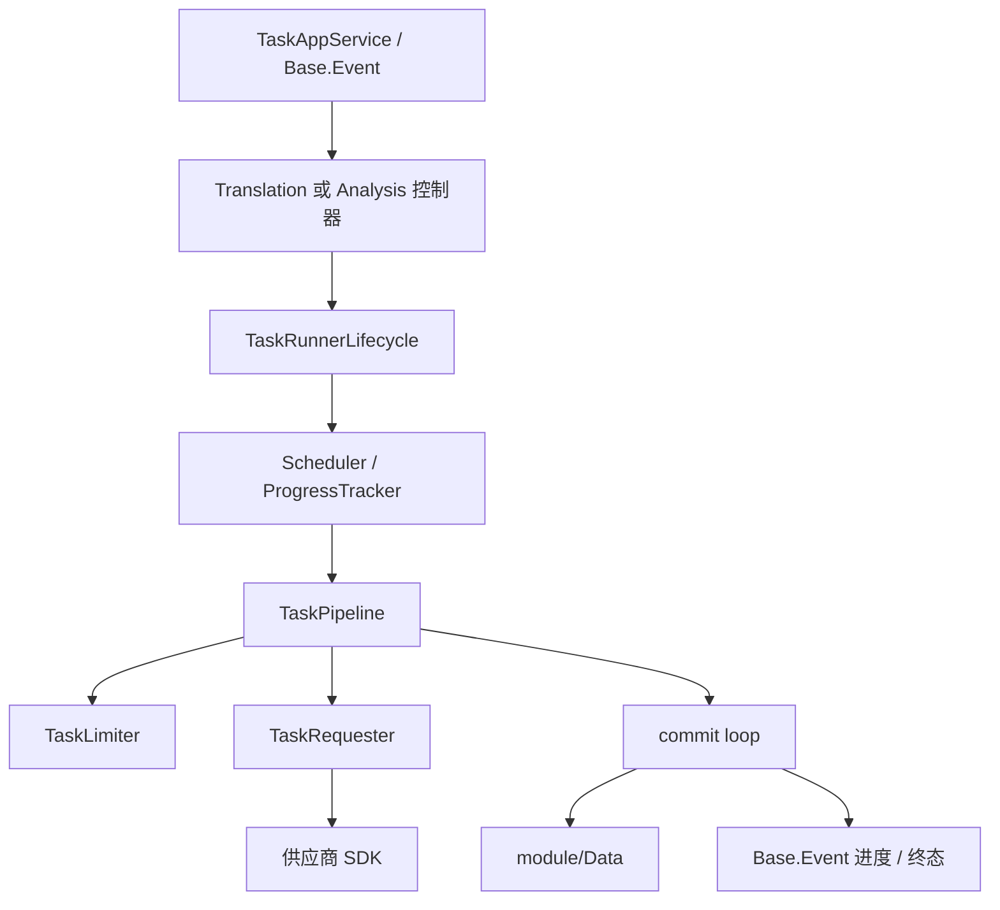

# `module/Engine` 规范说明

## 一句话总览
`module/Engine` 负责 LinguaGacha 的后台任务执行骨架。它不持有工程事实，也不直接定义 HTTP 协议；它关心的是翻译 / 分析任务如何启动、切块、限流、请求、提交、停止和收尾。

## 阅读顺序
| 任务类型 | 优先阅读 |
| --- | --- |
| 理解共享任务生命周期 | `Engine.py` -> `TaskRunnerLifecycle.py` -> `TaskPipeline.py` |
| 调整切块、上文或并发缓冲规则 | `TaskScheduler.py` -> `Translation/TranslationScheduler.py` / `Analysis/AnalysisScheduler.py` |
| 调整供应商请求、流式消费、思考参数或超时 | `TaskRequester.py` -> `TaskRequesterStream.py` -> `TaskRequesterClientPool.py` |
| 调整翻译任务主链路 | `Translation/Translation.py` -> `Translation/TranslationTaskHooks.py` -> `Translation/*` |
| 调整分析任务主链路 | `Analysis/Analysis.py` -> `Analysis/AnalysisTaskHooks.py` -> `Analysis/*` |
| 调整停止、重试、终态事件语义 | `TaskRunnerLifecycle.py` -> `TaskPipeline.py` -> `api/SPEC.md` |

## 目录结构
| 路径 | 职责 |
| --- | --- |
| `Engine.py` | 全局任务引擎单例；维护 `status`、`request_in_flight_count` 与翻译 / 分析控制器实例 |
| `TaskRunnerLifecycle.py` | 翻译与分析共享的任务生命周期骨架：占用忙碌态、准备、执行、收尾、DONE / ERROR 事件发射 |
| `TaskPipeline.py` | 通用 producer / worker / commit 三段流水线；统一高优重试队列、批量提交与停止收尾 |
| `TaskScheduler.py` | 共享切块与 preceding chunk 规则，不持有领域状态 |
| `TaskLimiter.py` | 并发 / RPS / RPM 限流器 |
| `TaskRequester.py` | 同步流式请求器；屏蔽 OpenAI / Anthropic / Google / Sakura 差异 |
| `TaskRequesterStream.py` | 流式消费、硬超时、stop 检查与安全关闭 |
| `TaskRequestExecutor.py` / `TaskRequestErrors.py` | 请求执行辅助与异常类型 |
| `Translation/` | 翻译任务的控制器、调度器、任务对象、进度跟踪与 hooks |
| `Analysis/` | 分析任务的控制器、调度器、上下文模型、进度跟踪与 hooks |
| `APITest/` | 模型连通性测试链路，不参与翻译 / 分析主流程 |

## 真实主链路

## 共享边界
### `Engine`
- `Engine.status` 是全局忙碌态的唯一权威来源，翻译与分析不会并行运行。
- `request_in_flight_count` 统计“当前真正占用网络请求的数量”，它不是限流器的并发上限，也不是队列长度。
- UI 需要实时请求数时，应走 `Engine.get_request_in_flight_count()` 对应的事件补丁，不要自己推导。

### `TaskRunnerLifecycle`
- 负责共享的“任务外框”，包括：
  - 忙碌态占用与释放
  - 工程已加载 / 激活模型存在校验
  - 执行计划初始化
  - 统一的 DONE / ERROR / STOPPING 事件发射
  - 任务结束后的 `cleanup` / `after_done`
- 这里不写翻译或分析领域分支；领域差异通过 `TaskRunnerHooks` 注入。

### `TaskPipeline`
- 统一把任务执行拆成三段：
  - producer：流式生产初始上下文
  - worker：取上下文并执行请求
  - commit loop：串行落库、生成重试上下文、聚合进度
- 高优队列只给重试 / 拆分任务使用，确保失败补位优先于继续吞新任务。
- commit loop 是唯一允许生成 retry context 的地方，避免 worker 线程各自回写导致顺序漂移。

### `TaskRequester`
- 请求器本身是同步的，并发由线程池和 `TaskPipeline` 提供。
- 当前已落地的供应商分支：
  - OpenAI 兼容
  - Anthropic
  - Google Gemini
  - SakuraLLM
- 输出退化检测、stop 检查、SDK 超时缓冲都在请求器 / `TaskRequesterStream` 这一层，不要回写到翻译或分析控制器里。

## 翻译与分析的真实分工
| 关注点 | 翻译 | 分析 |
| --- | --- | --- |
| 运行时主控制器 | `Translation/Translation.py` | `Analysis/Analysis.py` |
| 计划构建 | 基于待翻译 `Item` 切块与上文块 | 基于分析候选 / checkpoint 构建 `AnalysisTaskContext` |
| 提交阶段 | 批量写回条目、统计 token / 行数、触发局部刷新 | 批量写回 checkpoint / glossary entry、同步候选统计 |
| 成功后收尾 | 落库存量状态、可自动导出译文 | 可自动导入术语表；CLI 模式可直接导出 glossary |
| 运行时事实缓存 | `items_cache` + `extras` | `extras` + `current_task_contexts` |

## 这些语义最容易踩线
### 停止语义
- “停止请求”不是立刻中断网络 IO；它先把引擎状态切到 `STOPPING`，之后由流水线和 SDK 超时逐步收尾。
- `should_stop()` 的权威组合条件是：
  - `Engine.status == STOPPING`
  - 或控制器自己的 `stop_requested == True`

### 终态语义
- `TaskRunnerLifecycle` 最终总会把引擎状态收回 `IDLE`。
- 对 API / 前端暴露的终态映射继续由 `PublicEventBridge` 解释：
  - `SUCCESS -> DONE`
  - `FAILED -> ERROR`
  - `STOPPED -> IDLE`

### 并发与限流
- `TaskLimiter` 控制“允许开始请求的节奏”。
- `request_in_flight_count` 反映“已经真正发出去的请求数”。
- 如果要改 UI 的实时请求展示，请优先检查 `TaskRequester.emit_request_in_flight_progress()`，不是 `TaskLimiter`。

## 修改建议
| 变更类型 | 优先落点 |
| --- | --- |
| 忙碌态、启动 / 停止 / DONE 事件统一语义 | `TaskRunnerLifecycle.py` |
| 任务生产 / 重试 / commit 批处理规则 | `TaskPipeline.py` |
| 切块、上文窗口、文件边界规则 | `TaskScheduler.py` |
| 并发、RPS / RPM 推导 | `TaskLimiter.py` + `TaskRunnerLifecycle.build_task_limits()` |
| 供应商 SDK 参数、流式消费、退化检测、超时 | `TaskRequester.py` / `TaskRequesterStream.py` |
| 翻译任务特有的导出、质量快照、批量写回 | `Translation/*` |
| 分析任务特有的 checkpoint、候选池、自动导入术语 | `Analysis/*` |

## 维护约束
- `module/Engine` 不持有项目数据真相；落库、条目状态和工程 revision 仍然交给 `module/Data`。
- 共享骨架只抽“真正被翻译与分析共同依赖的规则”；不要为了看起来统一，把领域差异硬塞回公共层。
- 如果改动会影响任务事件的字段、终态或停止语义，必须同步检查 [`api/SPEC.md`](../../api/SPEC.md)。
