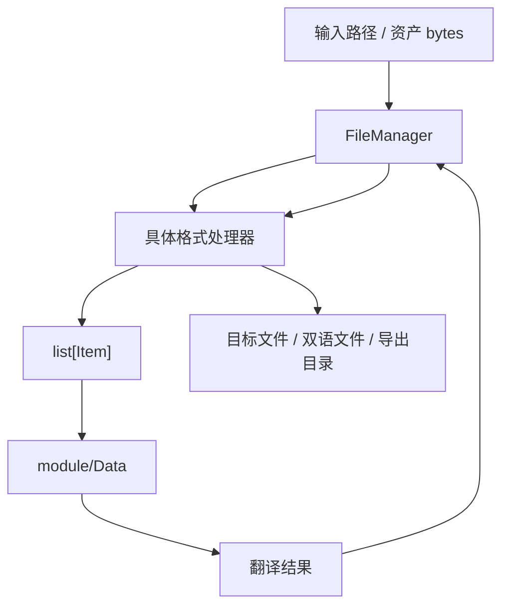

# `module/File` 规范说明

## 一句话总览
`module/File` 负责把外部文件格式转换成 `Project + Item`，以及在翻译完成后把 `Item` 写回目标格式。它不负责工程生命周期、数据库事务或任务调度；它关心的是“如何识别格式、如何提取条目、如何安全写回”。

## 阅读顺序
| 任务类型 | 优先阅读 |
| --- | --- |
| 理解统一入口与格式分发 | `FileManager.py` |
| 新增或修改普通文本 / 表格 / JSON 格式 | 对应格式文件 + `FileManager.py` |
| 修改 `.trans` 接入或写回 | `TRANS/TRANS.py` -> 对应子处理器 |
| 修改 Ren'Py 解析或写回兼容 | `RenPy/RenPy.py` -> `RenPyExtractor.py` / `RenPyWriter.py` |
| 修改 EPUB 解析或 AST / Legacy 写回策略 | `EPUB/EPUB.py` -> `EPUBAst.py` / `EPUBAstWriter.py` / `EPUBLegacy.py` |
| 调整前端格式展示或导入提示 | `frontend/src/renderer/pages/project-page/support-formats.ts` |

## 目录结构
| 路径 | 职责 |
| --- | --- |
| `FileManager.py` | 唯一格式分发入口；按扩展名把路径 / bytes 派发给具体格式处理器 |
| `MD.py` / `TXT.py` / `ASS.py` / `SRT.py` | 基础文本与字幕格式 |
| `EPUB/` | EPUB AST 解析与 AST / Legacy 双写回策略 |
| `RenPy/` | Ren'Py AST 解析、提取、兼容 legacy extra_field 的写回 |
| `KVJSON.py` / `MESSAGEJSON.py` | JSON 系列格式 |
| `XLSX.py` / `WOLFXLSX.py` | 通用表格与 WOLF 专用翻译表格 |
| `TRANS/` | `.trans` 工程格式及其游戏引擎子处理器 |

## 真实数据流

## `FileManager` 的稳定职责
- `read_from_path()`：
  - 扫描输入目录或单文件
  - 为工程生成临时 `Project` id
  - 按扩展名调用具体格式处理器
- `parse_asset()`：
  - 面向 `DataManager` 资产字典的单文件解析入口
  - 直接以 `rel_path + bytes` 做分发，不依赖真实磁盘路径
- `write_to_path()`：
  - 在 `DataManager.timestamp_suffix_context()` 内统一调用各格式 writer
  - 由 `DataManager` 决定最终输出目录、双语目录和时间戳后缀

## 支持的格式与分发优先级
| 扩展名 | 读取处理器 | 写回处理器 | 需要特别注意的规则 |
| --- | --- | --- | --- |
| `.md` | `MD` | `MD` | 纯文本路径 |
| `.txt` | `TXT` | `TXT` | 纯文本路径 |
| `.ass` | `ASS` | `ASS` | 字幕格式 |
| `.srt` | `SRT` | `SRT` | 字幕格式 |
| `.epub` | `EPUB` | `EPUB` | 写回会在 AST / Legacy 两套 writer 之间自动选择 |
| `.xlsx` | 先 `WOLFXLSX`，失败再 `XLSX` | `WOLFXLSX` / `XLSX` | WOLF 识别优先于通用表格 |
| `.rpy` | `RenPy` | `RenPy` | 写回兼容 AST extra_field 与 legacy extra_field |
| `.trans` | `TRANS` | `TRANS` | 内部还会按 `gameEngine` 二次分发 |
| `.json` | 先 `KVJSON`，失败再 `MESSAGEJSON` | `KVJSON` / `MESSAGEJSON` | `KVJSON` 优先于消息 JSON |

## 这些细节不容易从目录名看出来
### `.xlsx` 的双重判定
- `FileManager.parse_asset()` 读 `.xlsx` 时先尝试 `WOLFXLSX`。
- 只有当 WOLF 解析结果为空时，才回退到 `XLSX`。
- `XLSX.read_from_stream()` 自己也会再次排除 WOLF 表头，保证两层判断一致。

### `.json` 的优先级
- `KVJSON` 是“键值对文本映射”格式，优先尝试。
- 只有 `KVJSON` 返回空条目时，才回退到 `MESSAGEJSON`。
- 这意味着新增 JSON 子格式时，必须先想清楚和现有两种格式的判定顺序。

### `.trans` 的二次分发
- `.trans` 不是单一格式，它会根据 `project.gameEngine` 选择处理器：
  - `KAG`
  - `WOLF`
  - `RENPY`
  - `RPGMAKER`
  - `NONE`
- 写回优先使用 `trans_ref` 做最小补丁更新；缺失时才退回 legacy 重建路径。

### EPUB 的双写回策略
- `EPUB` 会检查每个条目是否都带有 `extra_field.epub.parts`。
- 全部满足时走 `EPUBAstWriter`。
- 只要存在缺少 `extra_field.epub.parts` 的条目，就统一走 `EPUBLegacy`，避免混用两套写回语义。

## 修改建议
| 变更类型 | 优先落点 |
| --- | --- |
| 新增一种扩展名格式 | 新建格式处理器 + `FileManager.py` 分发 |
| 调整既有格式的解析规则 | 对应格式文件 |
| 调整写回路径、输出目录或时间戳策略 | `DataManager` 与对应 writer，而不是 `FileManager` 自己拼路径 |
| 调整前端项目页的“支持格式”展示 | `frontend/src/renderer/pages/project-page/support-formats.ts` |

## 新增格式时的最低检查清单
1. 解析入口是否同时支持 `read_from_path()` 和 `read_from_stream()`。
2. `Item.file_type`、`file_path`、`row`、`status` 是否稳定。
3. 写回是否需要依赖原始 asset bytes，而不是从已变形的 `Item` 反推。
4. 是否要补前端项目页格式说明。
5. 是否要同步更新 [`docs/ARCHITECTURE.md`](../../docs/ARCHITECTURE.md) 和本文。

## 维护约束
- `module/File` 不直接操作数据库，也不直接决定项目是否“已加载”。
- 输出路径统一来自 `DataManager`，不要在各格式 writer 里私自发明第二套目录规则。
- 如果新增格式需要特殊兼容逻辑，优先收口在对应格式门面类里，不要把大量分支继续堆回 `FileManager.py`。
