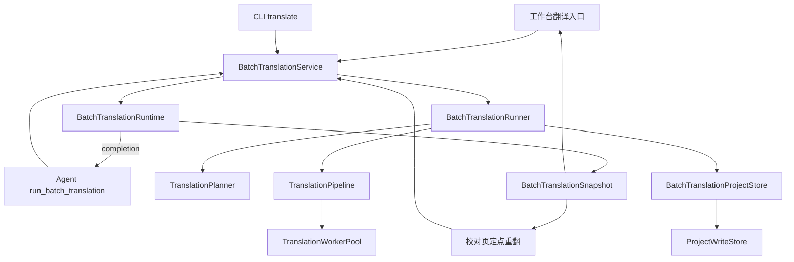

# Agent 批量翻译接入与任务系统专业化实施方案

## 1. 目标

本方案把批量翻译作为 LinguaGacha 唯一的后台任务能力接入产品 Agent，并删除已经由 Agent 工作流取代的旧分析任务。实施完成后，工作台、CLI 与 Agent 共用同一套批量翻译运行时、规划器、worker、增量写入和进度事实；代码不再维持 `translation | analysis` 的通用任务多态。

本次重构以最终结构的可维护性为目标，不保留旧任务协议、旧分析入口或类型别名等兼容层。工作台翻译任务的产品功能与业务逻辑保持不变，内部实现可以重组和改名，但必须由行为测试证明没有改变既有结果。

## 2. 已确认需求

|主题|确定契约|
|---|---|
|Agent 工具名|`run_batch_translation`|
|Agent 工具参数|第一版为零参数对象，不提供 `scope`、`item_ids` 或其它调度参数|
|Agent 调用范围|调用工作台普通全量翻译的同一开始／继续语义|
|Agent 对话|工具运行期间阻塞当前 Agent 轮次，工具到达终态后模型才继续|
|结果表达|工具返回现有翻译进度与终态的紧凑摘要，Agent 正常报告结果|
|任务执行|内部继续负责切块、并发、限流、重试、文本保护、增量提交和停止|
|应用生命周期|仅保证应用持续运行期间工具终态能够回到当前 Agent 轮次；不持久化待恢复工具调用|
|工作台|现有翻译任务的开始、继续、重置、重翻、停止、进度、完成提示和导出流程全部保留|
|入口关系|工作台与 Agent 并行存在，共用同一批量翻译能力和同一活动运行|
|分析任务|旧后台分析任务、候选、checkpoint、专用 prompt、模型用途、CLI 与工作台入口全部移除|
|错误处理|不新增“局部失败／运行级失败”等产品分类；已有条目成功与失败统计照常进入结果|
|兼容策略|不增加旧 API 转发、旧类型 re-export、旧字段兼容解析、旧 CLI 别名或双写|

## 3. 不在本次范围内

- `run_batch_translation` 不接受指定 item；校对页现有的定点重翻继续使用批量翻译服务的 `items` scope。
- 不改变工作台全量翻译和定点重翻的筛选、重试、状态推进、重置、导出提示或 UI 行为。
- 不为 Agent 工具增加专用进度组件、暂停、热修改配置、后台忘记式执行或跨重启恢复。
- 不改变 Agent 的 `review` 路径；已有译文的审校、修正和少量定点处理继续使用 Agent 工作区能力。
- 不删除已经导入为正式 glossary 的质量规则。
- 不自动删除 userdata 中可能存在的旧分析提示词预设文件；运行时不再发现、读取或展示这些文件。删除用户文件是独立的破坏性产品决定。
- 不把“分析”这个普通技术词一律删除。规则关系计算、统计或模型推理中与旧分析任务无关的概念按真实职责保留；容易与旧任务混淆且实际属于统计的类型按第 9 节改名。

## 4. 当前代码事实

### 4.1 后台任务是双分支系统

- `src/domain/task.ts` 定义 `TaskType = "translation" | "analysis"`、两套活跃状态判断和 `TranslationScope`。
- `src/backend/engine/task-service.ts` 解析 `task_type`、`mode`、`scope`，再调用通用 Engine。
- `src/backend/engine/task-runtime.ts` 持有 `active_task_type`、通用 task lease、任务快照和取消状态。
- `src/backend/engine/core/engine.ts` 同时包含翻译与分析主流程、提交、重试、进度和日志分支。
- Planner、WorkUnit、WorkerRunner、结果协议和 Pipeline 都通过判别联合或泛型包装两类任务。

### 4.2 工作台翻译具有必须保留的独立语义

- `useTranslationWorkbenchTask` 按是否已有任务进度选择 `new` 或 `continue`。
- 工作台提供全量重置、失败项重置、停止、进度详情、波形、完成后的导出提示。
- 校对页通过 `scope: { kind: "items", item_ids }` 使用同一翻译引擎执行定点重翻。
- `translation_extras` 持久化累计进度；项目导入、文件重置、设置对齐和重复项协调会重新计算该进度。
- 翻译结果分批经 `ProjectWriteStore` 提交，已完成的部分在停止或后续失败时保留。

这些都是翻译领域本身的行为，不因分析任务移除而删除。

### 4.3 Agent 当前无法启动批量翻译

- `AgentService.create_runtime` 只注册 question、workspace、skill 和 web search 工具。
- Agent round 从受理到 SDK settle 一直持有 `RuntimeOperationGate` 的 `agent` lease。
- 当前 `TaskRuntime.begin` 必须再取得 `task` lease，因此直接从 Agent 工具调用现有任务入口会稳定得到 `runtime.busy`。
- SDK 会把工具的 `AbortSignal` 传给顺序工具；Agent stop 会取消 SDK run，可作为批量翻译的父取消信号。

### 4.4 旧分析任务跨越整个项目

旧分析能力并非一个按钮，而是包含以下纵向切片：

- `analysis_item_checkpoint`、`analysis_candidate_aggregate` 两张表及索引；
- `analysis_extras`、`analysis_candidate_count`、`project_runtime_revision.analysis` 等 meta；
- `analysis_prompt` 规则、内置模板、用户预设选择和 prompt revision；
- `model_selection.analysis`；
- `analysis` 项目 section、缓存块、项目摘要统计和变更事件；
- Engine、Planner、Runner、Pipeline、日志、候选导入、重置与导出；
- 工作台分析任务 UI、分析 prompt 页面和 CLI `analyze`。

彻底退役必须同时删除这些产品入口、运行时事实和消费方；历史工程中不再可达的物理残留按第 10 节处理。

## 5. 目标架构



### 5.1 保留的职责层

|组件|唯一职责|保留理由|
|---|---|---|
|`BatchTranslationService`|收窄外部命令，统一工作台、校对页、CLI 与 Agent 四个调用入口|多个真实入口必须汇入同一业务入口|
|`BatchTranslationRuntime`|活动 run、取消、父信号、快照发布、唯一 completion、终态结算与关闭等待|状态所有权和执行算法必须分离|
|`BatchTranslationRunner`|冻结配置、读取输入、规划、并发执行、重试、提交，收尾后返回翻译结果|这是批量翻译的应用编排|
|`TranslationPlanner`|token 计量、上下文与切块、失败拆分|独立复杂算法且由 planning worker 支撑|
|`TranslationPipeline`|普通队列、优先重试队列、并发消费和 500ms 提交窗口|翻译可靠执行所需，不再保持无意义泛型|
|`TranslationWorkerPool`|worker_threads／测试内进程执行与父线程 LLM 端口|真实进程边界|
|`BatchTranslationProjectStore`|从当前工程读取翻译输入并把结果交给唯一项目写入口|隔离缓存、数据库 lease 和事务边界|

### 5.2 删除的抽象

- 删除通用 `TaskType`、`TaskService`、`TaskRuntime`、`TaskEngine`、`TaskPlanner`、`TaskPipeline` 命名和任务类型分发。
- 删除 `StartTaskCommand`、`StopTaskCommand` 与 `TaskSnapshot.extras` 的判别联合。
- 删除 `WorkUnit = TranslationWorkUnit | AnalysisWorkUnit`、统一 Runner 分发器和分析结果联合。
- 删除前端 `WorkbenchTaskKind`、翻译／分析任务 ownership 判别和双任务展示选择。
- 不留下 deprecated alias、旧路径 re-export 或仅作转发的包装文件。

### 5.3 内部数据边界

类型随实际拥有者定义，已有领域类型优先复用；Service、Runner、Store 与 worker 在现有职责层之间直接传递类型化数据：

|边界|输入与输出|
|---|---|
|Service → Runtime／Runner|已收窄的 start mode、scope 与运行句柄；内部 mode 统一使用 `new | continue | reset`|
|ProjectStore → Runner|显式条目数组、`BatchTranslationProgress`、翻译质量规则与提示词快照；只读取运行需要的项目事实|
|Runner → Planner／Pipeline|明确的 `TranslationContext` 与 `TranslationCommitEntry`，条目字段复用现有 Item 类型或按消费字段收窄|
|Runner → worker|`TranslationWorkUnit` 的模型、配置、质量快照、items 与 precedings 均使用明确且可序列化的类型；模型扩展参数在自身字段内保持 JSON 值域|
|Runner → ProjectStore → ProjectWriteStore|类型化译文 patch 与进度；ProjectWriteStore 继续拥有提交校验、事务和事件|

HTTP 参数在 Service 收窄，worker 消息在传输边界校验，数据库记录在读取边界转换。内部调用删除 JSON 请求／响应包装、完整 meta 包的反复解包、重复参数归一化和 `to_legacy_mode` 大小写转换。运行输入从项目事实取得独立快照，跨线程载荷使用可序列化值，运行内可变处理数据由执行方独占。

## 6. 批量翻译公开契约

### 6.1 共享领域类型

将 `src/domain/task.ts` 替换为 `src/domain/batch-translation.ts`。保留翻译已有值域并改为具体命名：

```ts
export type BatchTranslationStartMode = "new" | "continue" | "reset";

export type BatchTranslationScope =
  | { kind: "all" }
  | { kind: "items"; item_ids: number[] };

export type BatchTranslationRunStatus =
  | "idle"
  | "requested"
  | "running"
  | "stopping"
  | "done"
  | "error";

export type BatchTranslationProgress = {
  start_time: number;
  time: number;
  total_line: number;
  line: number;
  processed_line: number;
  error_line: number;
  total_tokens: number;
  total_input_tokens: number;
  total_reasoning_tokens: number;
  total_output_tokens: number;
};

export type BatchTranslationSnapshot = {
  revision: number;
  status: BatchTranslationRunStatus;
  request_in_flight_count: number;
  progress: BatchTranslationProgress;
  scope: BatchTranslationScope;
};

export type BatchTranslationResult = Readonly<{
  status: "done" | "idle" | "error";
  progress: Readonly<BatchTranslationProgress>;
}>;
```

约束：

- 删除 `task_type`；系统只剩一种后台任务。
- 删除 `busy`；由 `requested | running | stopping` 唯一派生活跃态。
- 删除 `extras.kind`；`scope` 是翻译快照的直接字段。
- `items` scope 的规范化、非空校验、去重和顺序保持完全沿用当前行为。
- 进度数字的非负有限值归一化保持当前行为。
- `new | continue | reset` 的含义以及停止后以 `idle` 收束的状态机不变。

### 6.2 HTTP 与 SSE

同步切换所有生产者和消费者，不保留旧路由：

|用途|新契约|
|---|---|
|启动|`POST /api/batch-translation/start`，body 为 `{ mode, scope }`|
|停止|`POST /api/batch-translation/stop`，body 为 `{}`|
|快照|`POST /api/batch-translation/snapshot`，body 为 `{}`|
|事件|`batch_translation.snapshot_changed`，载荷为 `{ batch_translation: BatchTranslationSnapshot }`|
|组合根|`backendServices.batchTranslation`|
|运行 owner|`"batch_translation" | "agent" | null`|

`/api/workbench/translation/reset` 与 `/api/workbench/translation/reset-preview` 属于项目写入而非任务协议，继续保留现有行为和路径。

### 6.3 Agent 工具

新增 `src/backend/agent/model-tools/batch-translation.ts`：

```ts
const PARAMETERS = Type.Object({}, { additionalProperties: false });
```

工具定义：

- `name`: `run_batch_translation`
- `executionMode`: `sequential`
- 参数：空对象
- 描述：开始或继续当前工程的全量翻译，等待本轮运行结束后返回状态与累计进度摘要。
- 调用前校验当前工程已加载、当前 Agent lease 仍有效、没有活动批量翻译。
- 调用时固定 `scope: { kind: "all" }`。
- 启动模式复用工作台当前规则：已有可展示翻译进度时使用 `continue`，否则使用 `new`；共享纯函数只接收 `BatchTranslationProgress`，工作台与 Agent 均以当前权威进度调用。
- 不隐式执行全量重置或失败项重置。
- 工具等待当前 run 的 completion，不轮询快照。

正常返回使用第 6.1 节的 `BatchTranslationResult`，直接取自该 run 的 completion。进度沿用工程累计统计口径；结果固定在本轮收尾时，后续运行或项目写入不改变已经返回的摘要。

其中 `idle` 沿用现有主动停止后的终态。启动校验、disposed、不变量或工具基础设施异常继续通过统一 `AgentToolError` 投影；不把它们包装成业务结果。

Agent 页不增加工具专属 UI。现有通用 tool entry 在运行时显示 `running`，SDK 终帧冻结 JSON 输出；模型读取摘要后继续当前轮次并用面向用户的语言报告。

### 6.4 Agent 技能路由

更新 `builtin/agent/skill/translation-workflow/SKILL.md`：

- 当前工程普通全量待译范围使用 `run_batch_translation`。
- 用户明确指定少量 item 且需要新译文时，继续走现有 Agent `translate` 工作区路径，因为第一版批量工具没有 items 参数。
- 已有译文的审校、修正和重译继续走 `review` 路径。
- 删除按 1000 条建议用户改去工作台的规模分流；工作台和 Agent 现在只是同一能力的两个入口。
- 明确批量工具结果是工程翻译运行摘要，译文事实从项目最新快照读取，不把大批译文送入 Agent 上下文。

System Prompt 只补充该工具属于正式确定性批量执行能力，以及批量执行后的工作区快照失效规则；调用时机和领域范围由 translation workflow 拥有，避免两处重复流程。

## 7. 运行所有权与取消

### 7.1 Standalone 运行

工作台、校对页和 CLI 启动时：

1. `BatchTranslationRuntime.begin_standalone(scope)` 从 `RuntimeOperationGate` 取得 `batch_translation` lease。
2. Runtime 同步建立 run id、内部 `AbortController` 和该 run 的 completion，再发布 `requested` 快照并进入 Runner 执行。
3. Service 在启动受理完成后向 HTTP 调用方返回当前快照；同进程入口同时提供该 run 的 completion。CLI 订阅快照显示进度，等待 completion 后沿用既有终态判断与导出流程。
4. Runtime 按第 7.5 节完成终态发布、清理和 gate lease 释放后结算 completion。

### 7.2 Agent 内运行

Agent 工具启动时：

1. `AgentService` 取得自己当前持有的 `RuntimeLease`，缺失时抛内部不变量错误。
2. `RuntimeOperationGate.assert_current_runtime(lease, "agent")` 通过对象身份验证调用确实来自当前 Agent round。
3. `BatchTranslationRuntime.begin_under_agent(scope, lease, toolSignal)` 建立翻译 run，但不再次申请 gate lease。
4. tool signal 单向连接到翻译 run 的内部 controller；Agent stop、reset、工程切换或应用关闭取消 SDK 时，会取消翻译。
5. 翻译 Runtime 结束时移除父 signal listener，但不释放 Agent lease；AgentService 在整个 SDK run settle 后按现有逻辑释放。
6. 工具 await completion 并返回终态结果，Pi 在同一 round 继续推理。

`ActiveRun` 保存 run id、controller、唯一 completion、启动恢复所需的前置状态、父 signal listener 释放函数，以及 standalone 模式下可选的 gate lease。运行身份与清理责任由这些字段直接表达。

### 7.3 并发规则

- Runtime 内同时最多一个活动翻译 run。
- 工作台翻译活动时，gate 阻止新 Agent round；Agent 活动时，gate 阻止工作台、校对页和 CLI 再启动翻译。
- 同一 Agent round 内，`run_batch_translation` 工具按 SDK sequential 模式串行执行。
- 所有项目普通写入继续被 Agent 或 standalone 批量翻译 lease 阻止。
- 翻译批次自身的增量提交继续通过 `ProjectWriteStore` 的任务写入口完成，不经过 `workspace_apply` 审批。
- `workspace_apply` 与 `run_batch_translation` 不会在同一 Agent round 并发，因为工具顺序执行。

### 7.4 生命周期

- `BatchTranslationRuntime.dispose` 先取消活动 run，再等待同一个 completion；该 Promise 已包含请求压力 flush 和本轮 worker 收尾。应用级 worker pool 由 BackendServices 按既有生命周期关闭。
- GUI 关闭顺序保持 Gateway → Agent → BackendServices；Agent dispose 先取消工具信号，随后 BackendServices dispose 等待翻译 Runtime 和 worker pool。
- 工程切换继续受 gate 阻止，活动 run 不跨工程。
- 已经由 `ProjectWriteStore` 提交的译文不会因停止、Agent reset 或应用关闭回滚。
- 应用重启后只从 `.lg` 恢复项目译文和 `translation_extras`；不会恢复 Agent 工具调用或模型轮次。

### 7.5 Completion 与终态结算

Runtime 为每个已预约 run 持有一个 `Promise<BatchTranslationResult>`，将 Runner 执行与 Runtime 收尾串成同一条完成链。Service、Agent、CLI 和关闭等待消费这一完成事实；快照订阅负责展示当前状态。

1. 预约同步建立 completion，首个异步发布前即可被 stop／dispose 覆盖。受理校验失败直接拒绝启动；预约后的启动失败恢复前置状态并在清理后拒绝 completion。
2. Runner 等待本轮 planning、work unit 和提交收束，完成最终进度持久化并释放本轮数据库 lease，再返回独立的 `BatchTranslationResult`。自然结束、主动停止和既有翻译执行失败分别沿用 `done`、`idle`、`error`；此前已提交结果保留。
3. Runtime 冲刷请求压力，以 Runner 返回的结果发布终态快照，完成 active run 清理、父 signal 解绑及自己持有的 gate lease 释放，最后结算 completion。终态投影与工具返回使用同一份固定结果。
4. 启动恢复、终态发布或清理等基础设施异常使 completion reject，并由现有错误边界投影。Runner 异常退出而未返回结果时，Runtime 按当前已提交进度收束 `error` 快照，同时保留原始 rejection。清理通过 `finally` 保证执行，多处失败保留原始异常上下文；日志或 listener 失败也必须使完成链结算。
5. Agent lease 由 AgentService 在整个 SDK run settle 后释放。Runtime 的关闭等待可以收集 rejection 以继续释放其它资源，工具和 CLI 的等待仍保留原始结果或异常。

## 8. 工作台翻译行为保护

实现前先把以下行为作为 characterization matrix 对照现有测试；已有测试能稳定证明的场景直接保留并改用新命名，不复制测试：

|行为|必须保持的结果|主要测试层级|
|---|---|---|
|普通启动|无历史进度发送 `new + all`|Hook／Service|
|继续启动|已有进度发送 `continue + all`，累计进度语义不变|Hook／Runner|
|全量重置|重新计算 items、过滤、重复状态和 translation extras|项目写入集成|
|失败项重置|只重置失败项，不改变其它译文|项目写入集成|
|定点重翻|非空 item_ids 去重保序，已有译文可重新翻译|校对 Hook／Service／Runner|
|翻译筛选|只规划符合当前 scope 与 item 状态的条目|Planner|
|失败收敛|拆分失败 chunk、单条重试并最终标记 ERROR|Planner／Runner|
|增量提交|已完成项按窗口提交，项目事件和 proofreading revision 语义不变|Pipeline／Store 集成|
|停止|停止新 work unit，等待在途收束，保留已提交结果，终态仍为 idle|Runtime／Hook|
|快照|进度、请求压力、revision、scope 收缩和终态时序保持一致|Runtime／前端 Store|
|完成提示|全量自然完成且有结果时打开导出流程；定点重翻和手动停止不触发|Hook／Context|
|跨页面|离开工作台后仍能收到完成提示|Context|
|CLI|translate 等待同一终态后导出文件|CLI 集成|

协议字段会专业化，但这些业务结果不得改变。删除与分析分支相关的测试后，必须保留以上每个风险的最小有效测试。

## 9. 旧分析任务退役

### 9.1 Engine 与 worker

删除：

- `analysis-runner.ts` 及测试；
- `analysis-pre-pipeline.ts`、`analysis-post-pipeline.ts` 及测试；
- `AnalysisContext`、`AnalysisCommitEntry`、`AnalysisWorkUnit`、`AnalysisWorkUnitResult`；
- Engine 的 `run_analysis`、analysis retry、checkpoint 构造和提交；
- Planner 的 analysis context 构造；
- WorkUnitRunner 的 kind 分发；
- `analysis_result` 结构化日志、解析器的 glossary analysis 解码和日志窗口分支。

翻译中的 `<why>` 推理块清理和 `rule_analysis_text` 属于翻译日志语义，继续保留；不要根据单词匹配误删。

### 9.2 项目数据与写入

删除：

- `analysis` project section、revision 和缓存 block；
- `build_analysis_block`、候选 payload、analysis stats；
- analysis checkpoint／candidate 的 ProjectDatabase API；
- `commit_analysis_artifacts`、`reset_analysis_state`、analysis glossary import；
- 文件导入、删除、重置、设置对齐中为清理 analysis artifact 而存在的计算、expected revision 和事件；
- `ProjectPrefilterWriteOutput.analysis`、analysis status summary 与 delta；
- `ProjectContentService.reset_analysis` 和 analysis reset preview。

项目文件与设置变更仍须按现有规则重新计算 item 过滤、重复状态与 `translation_extras`。

### 9.3 Prompt、设置与模型

- 删除 `Prompt` 的 kind／class 映射，改用冻结的 `TRANSLATION_PROMPT` 描述对象集中保存数据库类型、目录、meta key、revision key、默认预设 key 和模板文件集合。
- `ProjectTaskInput.prompts` 收缩为明确的 `translation_prompt` 输入，不再传只有一个成员的 kind 数组。
- 删除 `analysis_prompt` 内置模板、分析 prompt 页面、路由、导航项与三语文案。
- 删除 `analysis_custom_prompt_default_preset`。
- `MODEL_USAGES` 收缩为 `translation | agent`，`ModelSelection` 同步收缩。
- 删除分析模型选择 UI 与设置读写。
- 修改现有 model-selection startup migration，使旧单模型只补当前两种用途；不再生成 analysis 选择。

### 9.4 CLI

- `CLICommandName` 收缩为字面量 `translate`；删除命令分发联合。
- 删除 `analyze` 参数、help、示例、输入准备、候选导出和状态报告分支。
- `cli-task-input` 只准备翻译规则与翻译 prompt。
- CLI `translate` 继续走 typed service 入口，订阅快照显示进度，等待本轮 completion 后按既有终态规则导出，外部参数和输出行为不变。
- `analyze` 作为未知命令失败，不提供别名或迁移提示入口。

### 9.5 前端

- 删除 `use-analysis-workbench-task`、analysis task shared model、候选导入 dialog 接线与分析详情。
- `WorkbenchTasksSessionProvider` 收缩并改名为拥有翻译会话 UI 与导出流程的 Provider，当前运行事实由共享 Store 提供。
- 共享 Store 独占 renderer 当前 `BatchTranslationSnapshot`，HTTP 与 SSE 在同一入口按 revision 接收同形快照。Hook 直接消费该快照，删除本地当前快照副本及展开、重包、回写 Store 的同步链。
- `task-model.ts` 中仍有价值的快照边界归一化与 metrics 合并进具体的 `batch-translation` shared 模块；metrics 由快照与显示时钟按需计算。
- 历史展示快照、波形采样、完成提示抑制与弹窗状态按既有可观察行为保留在会话 UI。历史快照只服务展示，启动选择和命令处理消费 Store 当前事实。
- 删除 `task-ownership.ts`；单一任务快照不再需要判断类型。
- 工作台统计只保留 translation stats；删除任务类型切换、analysis stats、最近任务类型和分析 summary/detail 分支。
- 工作台翻译 command bar、menu、summary、detail、waveform 的可见行为不变；只有一个消费者后将文件和类型改为 translation 具体命名，不保留 speculative 通用组件。
- 校对页定点重翻改用新批量翻译协议，现有交互和 scope 不变。
- DesktopState 删除带 task type 的 `refresh_task`，改为无参数 `refresh_batch_translation`。
- event stream、diagnostics 和 recovery 使用新的快照与事件名。

### 9.6 “analysis” 命名消歧

`QualityRuleAnalysisCache` 与 `quality_rule_analysis` compute task 实际提供确定性的质量规则命中统计，和已删除任务无关。为降低后续理解成本，同步改名：

- `QualityRuleAnalysisCache` → `QualityRuleStatisticsCache`
- `quality-rule-analysis-cache.ts` → `quality-rule-statistics-cache.ts`
- `quality_rule_analysis` → `quality_rule_statistics`
- `quality-rule-analysis-worker-task.ts` → `quality-rule-statistics-worker-task.ts`
- 对应 `analysis` 结果字段改为 `statistics`

Agent 工作区 `group-quality-rule-entries.ts` 内局部变量 `analysis` 表示图关系算法结果，不构成产品任务概念；在同文件内改为 `relations`，不拆出新抽象。

## 10. 数据库与配置收缩

### 10.1 `.lg` schema

当前 schema 只描述仍被产品使用的必要结构：

- 从 `ensure_current_schema` 删除 `analysis_item_checkpoint`、`analysis_candidate_aggregate` 及其索引的创建语句。
- `PROJECT_DATABASE_SCHEMA_VERSION` 保持 2；本次没有需要写回历史工程的新存储能力。
- 不增加 `DROP TABLE`、`DROP INDEX`、analysis meta 清理或 analysis rule 清理迁移。
- 新工程从创建时就不包含旧分析结构。
- 历史工程中已有的分析表、索引、meta 和 `analysis_prompt` rule 保持原样；当前生产代码没有读取、写入、发布或清理它们的入口。
- 删除 `analysis-checkpoint-status-migration` 文件及注册，当前迁移集合不再执行旧分析写回。
- 从 `project-rule-storage-migration` 删除 analysis prompt 转换，避免未执行过该历史迁移的工程产生新的分析 rule。
- EPUB／Markdown 文件写回迁移只重建 items 与 translation extras，不再访问分析表或推进 analysis revision。

历史工程的多余 SQLite 对象只是不可达数据，不形成运行时兼容分支。加载、翻译或保存历史工程时，不专门改写这些对象；items、正式 quality glossary、translation prompt、translation extras、assets 和项目设置镜像继续遵循各自现有写入语义。

### 10.2 应用设置

Canonical setting 不再包含：

- `analysis_custom_prompt_default_preset`
- `model_selection.analysis`

设置归一化只输出当前字段；读取旧 JSON 时未知键按既有普通对象收窄规则丢弃，保存后自然消失。不增加旧字段到新字段的映射，也不保留空占位。

userdata 中旧分析 prompt 目录不进入路径服务、预设扫描或 UI；本次不主动删除目录内容。

## 11. 代码布局与命名

将 `src/backend/engine/` 重组为 `src/backend/batch-translation/`，目标结构如下：

```text
src/backend/batch-translation/
  service.ts
  runtime.ts
  runner.ts
  project-store.ts
  progress.ts
  pipeline.ts
  limiter-pool.ts
  model-key-lease-pool.ts
  log-replay.ts
  planning/
    planner.ts
    planning-worker-entry.ts
    planning-worker-pool.ts
    planning-worker-types.ts
    token-metric-cache.ts
  work-unit/
    protocol.ts
    executor.ts
    worker-entry.ts
    worker-pool.ts
    worker-protocol.ts
    runner.ts
    prompt-builder.ts
    translation-item.ts
    response/
    pipeline/
```

命名规则：

- 对应用入口、运行态、进度和公开协议使用 `BatchTranslation*`。
- 对单个 work unit、文本处理和 Planner 内部对象使用 `Translation*`。
- 项目既有业务词 `apply`、`read`、`write`、`update` 保持不变。
- 不使用 `Task*` 作为未来扩展点；需要任务一词的用户文案不受此限制。
- 不保留仅转发到新路径的旧文件。

## 12. 分阶段实施顺序

### 阶段 A：固定翻译行为基线

1. 运行第 8 节对应的现有 node 与 renderer 测试，记录真实基线。
2. 逐项确认测试断言的是公开结果而非旧 `task_type` 等待删除的包装字段。
3. 对未被现有测试覆盖但属于第 8 节的可观察行为补最小 characterization test。
4. 不复制完整实现快照，不为重构创建临时兼容 facade。

完成条件：第 8 节每行都有一个明确测试拥有者，现有工作台翻译测试在重构前通过。

### 阶段 B：分析纵向退役与翻译核心收缩

本阶段以第 9、10 节的退役和第 5～7 节的 standalone 翻译能力为一个依赖闭合的重构单元；阶段完成时统一验证生产者、消费者、组合根和存储入口。

1. 删除分析 CLI、工作台、prompt、模型用途、候选 API 与项目 section 消费方，沿调用链删除分析 Engine／worker 分支、缓存、写入和日志。
2. 同步收缩 schema、迁移注册与历史写回逻辑，简化 project prefilter、summary、lifecycle 和设置；按第 10 节验证新旧工程。
3. 把剩余翻译实现重组为具体目录和领域协议，收缩 Planner／Pipeline／WorkUnit 类型，落实第 5.3 节的内部数据边界。
4. 实现 Runtime 唯一 completion 与 standalone 收尾契约，同步切换 Service、HTTP、SSE 和 BackendServices 装配。
5. 切换工作台、校对页和 CLI；落实共享 Store 当前快照所有权与 UI 状态分工，完成质量统计命名消歧。
6. 删除旧 task 文件、单成员分发和分析专用测试，保留并更新翻译、正式 glossary 与质量统计行为测试。
7. 同步本阶段已改变的长期工程边界，执行受影响测试与类型、架构检查。

完成条件：standalone 生产链路只依赖专业化翻译能力，分析入口与存储访问已经退役；内部类型与前端状态归属符合第 5.3、9.5 节，第 8 节及历史工程测试通过。

### 阶段 C：接入 Agent 工具

1. 为 RuntimeOperationGate 增加当前 lease 身份校验。
2. 实现 `begin_under_agent` 的父 signal 与 lease 清理责任，接入阶段 B 已建立的 completion 完成链。
3. 新增零参数工具并注入 AgentService。
4. 更新 translation workflow 与 System Prompt 的最小工具边界。
5. 增加 Agent 工具、AgentService、Runtime 与 GUI bootstrap 测试，同步 Agent 工具及生命周期的长期工程边界。

完成条件：Agent 工具真实等待同一 Runner 终态；停止、reset、dispose 不遗留活动 run 或 lease；工作台路径测试仍全绿。

### 阶段 D：全链路验收与最终清理

1. 联合核对工作台、校对页、CLI 与 Agent 的真实运行组合、终态和关闭行为。
2. 回看长期工程文档的权威归属、重复内容与引用。
3. 全仓检索旧符号、旧路由、旧事件和旧文案。
4. 运行完整验证矩阵并回看 diff。

完成条件：第 14 节所有验收条件成立。

## 13. 测试与验证方案

### 13.1 目标测试

#### 领域与纯规则

- Batch translation scope／status／progress 归一化。
- active status 派生。
- 工作台与 Agent 共用的 `new | continue` 选择规则。
- items scope 非空、去重、顺序和坏值处理。

#### Runtime 与 Service

- standalone begin 原子取得和释放 `batch_translation` lease。
- agent begin 只接受当前真实 agent lease，且不嵌套申请 lease。
- 两类 begin 都只能建立一个 active run。
- 父 tool signal、显式 stop 和 dispose 都取消同一内部 controller。
- completion 在本轮 worker、提交与清理完成前保持 pending，完成后返回固定结果；后续运行不改变旧结果，迟到进度不能覆盖新 run。
- 预约后、Runner 执行前发生 stop／dispose 时，完成链仍能收尾；父 signal 已取消时沿用同一取消路径。
- 预约后的启动失败恢复前置状态并拒绝 completion；Runner 异常退出收束 error 快照并保留 rejection，终态发布、listener 或清理失败均结算 completion 且释放本轮资源。
- 请求压力只按现有 500ms 窗口合并，终态前 flush。
- 订阅 listener 失败不遗留 lease。
- 项目切换不会接收活动 run 的迟到事件。

#### Runner、Planner、Pipeline 与 Store

- 复用第 8 节所有翻译行为测试。
- worker transport error 的拆分与重试保持原结果。
- 部分有效模型响应只提交合法 item。
- commit 失败终止新 work unit，并保持此前真实提交。
- translation extras、items event 和 proofreading revision 与 scope 的关系不变。
- 用明确的类型化输入覆盖全量、continue、reset 与 items scope，验证内部 mode 收缩后筛选和累计进度结果一致。

#### Agent

- 工具注册名为 `run_batch_translation`，schema 是无额外属性的空对象，且 executionMode 为 sequential。
- Agent 未加载工程、lease 失效或已有 run 时得到统一公开错误。
- 工具调用 Promise 在运行收尾前保持 pending，完成后返回该 run 固定的累计进度摘要；基础设施异常沿统一工具错误边界返回。
- 批量翻译运行时，Agent 不产生后续模型 turn；终态工具帧后继续。
- Agent stop 取消工具 signal、终止翻译并按现有 Agent stopped 语义封口 round。
- Agent reset、工程切换和 dispose 等待工具与翻译收尾。
- 未知底层异常仍由 `prepare_agent_tool` 脱敏为 `tool_failed`。

#### API、SSE 与前端

- 新路由绑定同一个 Service；旧 `/api/tasks/*` 不再注册。
- SSE 生产者发送新 topic 和快照 envelope。
- renderer Store 按 revision 丢弃旧帧并消费 HTTP／SSE 同形快照。
- 同一帧更新直接驱动 Hook 展示；迟到 HTTP 响应不覆盖较新 SSE，历史展示与波形状态不回写当前快照。
- 普通启动选择使用 Store 当前进度；历史展示快照存在时仍按当前进度选择 `new | continue`。
- 工作台全部行为按第 8 节验证。
- 校对页定点重翻请求仍携带同一 items scope。
- Agent 发起的全量运行进入同一批量翻译快照流；工作台现有全量完成提示逻辑继续消费该事实，不引入来源分支。

#### Storage 与历史工程

- 新建工程断言 schema 不包含两张 analysis 表及其索引，也不初始化 analysis meta 或 rule。
- 构造已经完成其它现行写回迁移、同时保留旧 analysis 表、analysis prompt 和 analysis meta 的历史 `.lg`。
- 加载历史工程后断言旧分析物理数据没有被清理或改写，公开 manifest、section、prompt 和任务快照均不投影这些数据。
- 对该历史工程执行批量翻译，断言翻译只更新 items、translation extras 及既有相关 revision，旧分析物理数据保持不变。
- 断言正式 glossary、译文、translation prompt、translation extras 和 assets 按各自当前契约读取与保存。
- migration registry 不包含 analysis checkpoint writeback；其它文件写回迁移不调用 analysis database API。

#### CLI

- `translate` 参数、执行等待、状态输出和导出路径保持现有契约。
- 快照订阅显示进度，本轮 completion 决定何时按既有终态规则导出；基础设施异常进入现有 CLI 错误处理。
- `analyze` 被 parser 作为未知命令拒绝。
- CLI 不再准备 analysis prompt 或候选导出依赖。

### 13.2 受影响测试组织

- 后端单元和集成测试使用 Vitest `node` project。
- React Hook、Context、Store 和组件测试使用 `renderer` project。
- 测试文件随实现移动并按具体领域改名；分析专用用例直接删除。
- 同一行为已有 Runner、Service 或 UI 公开结果覆盖时，不保留只断言私有调用次数的重复测试。
- worker_threads 传输协议至少保留一组真实 worker round-trip；远程 LLM 使用 fake port，不访问真实服务。
- GUI bootstrap 只验证依赖注入、关闭顺序与真实 runtime 组合，不启动 Electron 可见窗口。

### 13.3 验证命令

每完成一个阶段先运行最窄测试，再扩大范围：

```powershell
npm test -- --project node src/backend/batch-translation
npm test -- --project node src/backend/agent
npm test -- --project node src/backend/migration
npm test -- --project node src/cli
npm test -- --project renderer src/frontend/app/session
npm test -- --project renderer src/frontend/pages/workbench-page
npm test -- --project renderer src/frontend/pages/proofreading-page
npm run lint
npm run check
npm run format -- --check
npm test
npm run build
```

命令中的目录以实施后的实际移动路径为准。阶段内未执行 build 时运行 `npx tsc -b --noEmit`；最终 `npm run build` 已包含 typecheck。固定等待使用 Promise、事件或状态条件；不得用长 `setTimeout` 让异步测试碰运气。

## 14. 最终验收条件

### 14.1 产品行为

- 工作台翻译的可见功能、命令结果、进度、重翻、重置、停止和导出提示与重构前一致。
- CLI `translate` 行为一致。
- Agent 能调用零参数 `run_batch_translation`；工具阻塞当前 round，完成后返回摘要并继续模型。
- 应用运行期间，活动翻译只有一份状态和一个执行实例。
- 停止或失败不会回滚已提交译文。
- 应用重启不尝试恢复 Agent 工具调用。

### 14.2 结构

- 后台批量执行代码只表达 translation，不存在任务类型 switch 或 analysis union。
- 工作台、校对页、CLI 和 Agent 只依赖 `BatchTranslationService`。
- `RuntimeOperationGate` 能区分 standalone batch translation 与 Agent，但没有嵌套 lease 或兼容 owner。
- 前端共享 Store 独占当前批量翻译快照，Hook 直接消费；历史展示与波形、弹窗按 UI 职责保留，metrics 按需计算。
- Service、Runner、ProjectStore 和 worker 使用明确的翻译输入与提交类型；外部边界完成收窄，内部按同一 mode 值域执行。
- Runtime 持有每个 run 的唯一 completion，Agent 与 CLI 得到本轮固定结果，关闭等待覆盖同一条资源收尾链。
- 质量规则统计使用 statistics 命名，不与旧分析任务混淆。

### 14.3 退役完整性

下列检索在生产代码与长期文档中不得命中旧契约：

```powershell
rg -n --glob '!**/*.test.*' 'TaskType|TaskService|TaskRuntime|TaskEngine|TaskPlanner|TaskPipeline' src docs
rg -n --glob '!**/*.test.*' '/api/tasks|task\.snapshot_changed|\btask_type\b' src/backend src/frontend src/cli
rg -n --glob '!**/*.test.*' 'analysis_item_checkpoint|analysis_candidate_aggregate|analysis_extras|analysis_candidate_count' src docs
rg -n --glob '!**/*.test.*' 'analysis_prompt|analysis-prompt|model_selection\.analysis|quality_prompt_revision\.analysis' src builtin docs
rg -n --glob '!**/*.test.*' '/api/analysis|useAnalysisWorkbenchTask|AnalysisTask|analysis_result' src docs
rg -n --glob '!**/*.test.*' 'quality_rule_analysis|QualityRuleAnalysisCache' src docs
```

旧物理名称允许出现在验证历史残留不被消费或改写的测试夹具中。普通 `analysis` 单词必须按语义人工审查，不能机械要求全仓为零。

### 14.4 工程质量

- TypeScript、lint、架构检查、格式、全量测试和 build 全部通过。
- diff 中没有旧路径 re-export、deprecated alias、双协议、双写或“临时兼容”分支。
- 没有覆盖任务开始前的无关工作区修改。
- 注释只解释运行 lease、取消、增量提交、事务和迁移等非显然约束，不复述自解释代码。
- `BACKEND.md`、`AGENT_RUNTIME.md`、`CLI.md`、`FRONTEND.md`、`ARCHITECTURE.md` 与最终代码一致。

## 15. 长期文档更新归属

实施代码后使用项目 `project-doc` 工作流同步并压缩长期文档：

|文档|更新内容|
|---|---|
|`docs/BACKEND.md`|BatchTranslation 状态拥有者、API/SSE、运行 gate、增量写入和当前必要 schema；删除分析任务边界|
|`docs/AGENT_RUNTIME.md`|`run_batch_translation` 注册、阻塞、父取消、结果、应用生命周期和技能路由|
|`docs/CLI.md`|仅保留 translate 命令及其同一 Service、进度订阅与 completion 等待链路|
|`docs/FRONTEND.md`|批量翻译当前快照的 Store 所有权、会话 UI 状态分工和 Agent 通用工具展示|
|`docs/ARCHITECTURE.md`|BackendServices 中批量翻译、worker 与 Agent 工具的主链路|
|`docs/WORKFLOW.md`|仅在验证入口或目录路径确实变化时更新|

文档应直接描述最终结构，不保存本次讨论过程或已撤回方案。
