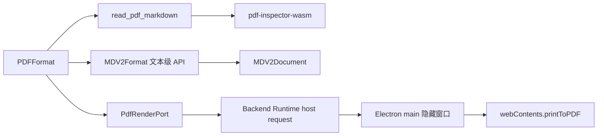

# PDF 经 Markdown V2 翻译与重排输出实施方案

## 1. 目标与完成定义

本任务为 LinguaGacha 增加 `.pdf` 源文件支持。PDF 在 Backend 文件域内通过 `@firecrawl/pdf-inspector-wasm` 提取 Markdown，并依据逐页 OCR 路由保留可提取页面，再单向复用 Markdown V2 的块解析、Item metadata、资源投影与写回语义；翻译完成后由 Electron main 使用 Chromium 将译后 Markdown 重新排版为 PDF。

完成后的稳定链路为：

```text
PDF bytes
  -> pdf-inspector-wasm
  -> Markdown text + pagesNeedingOcr
  -> MDV2Format 文本级 reader
  -> file_type: PDF / text_type: MD 的块 Items
  -> 现有通用翻译流程
  -> MDV2Format 文本级 writer
  -> translated Markdown
  -> Electron Chromium printToPDF
  -> translated .pdf
```

完成必须同时满足：

- 新建工程、工作台导入、替换、预览、reset-all、reset preview 和 CLI 都识别 `.pdf`。
- PDF Item 固定使用 `file_type: "PDF"`、`text_type: "MD"`，Markdown 块 metadata 与当前 `MD_V2` 完全同形。
- PDF 格式层只消费 Markdown V2 能力；Markdown 模块不导入 PDF、pdf-inspector、Electron 或 PDF renderer。
- 输入转换使用精确锁定版本的 `@firecrawl/pdf-inspector-wasm`，转换在 Backend Runtime worker 或 CLI 主进程中本地执行。
- 原始 PDF bytes 继续按现有 asset 事务写入 `.lg`，不额外持久化中间 Markdown。
- 导出只生成译文 PDF，不生成 PDF 双语对照文件。
- GUI Backend Runtime 通过结构化 host request 请求 Electron main 渲染；CLI 在当前 Electron 进程直接调用同一宿主实现。
- PDF 输出是固定排版规则生成的新文档；页面数量、分页、字体、图片和原始几何布局不构成保留契约。
- 混合 PDF 保留可提取页面并跳过 OCR 页面；没有任何可提取文本或 PDF 受密码保护时统一返回 `file.parse_failed`，诊断上下文保留稳定原因。
- Agent 工作区把 PDF asset 投影为转换后的 Markdown 文本文件，不把 PDF 二进制按普通文本解码。
- 当前代码、测试、构建产物、README 和长期工程文档形成同一终态。

## 2. 产品范围与质量边界

### 2.1 当前支持范围

本任务支持可由 pdf-inspector 本地提取部分或完整文本的 PDF。输入转换和输出渲染均在本机完成。

PDF 输出采用统一样式重新排版，固定使用：

- A4 纸张；
- `18mm 16mm` 上下、左右页边距；
- 项目内置 `LGBaseFont` 正文与标题字体；
- 项目内置等宽字体处理 code；
- GFM 标题、段落、列表、引用、表格、删除线、代码块和链接的稳定打印样式；
- `printBackground: true` 与 `preferCSSPageSize: true`。

### 2.2 明确不属于当前能力的内容

- OCR、远程上传和 API key 配置；
- 原始页面尺寸、坐标、页数、分页、页眉页脚和字体还原；
- 原始图片、表单、注释、签名和附件保留；
- PDF 双语对照输出；
- PDF 专属翻译流程、任务状态或校对类型；
- 用户可配置的 PDF 纸张、主题或 CSS；
- 历史 PDF 工程迁移。

仓库此前没有可创建的 PDF 工程，因此本任务不引入旧 PDF 项目识别、双格式分发、读取回退或运行时兼容分支。

## 3. 当前代码事实与实施前置条件

实施以当前工作区正在落地的 Markdown V2 终态为前置条件：

1. `src/backend/file/formats/markdown/md-v2-document.ts` 已拥有 Markdown AST、原子块、布局骨架、排除状态、资源短引用投影和恢复。
2. `src/backend/file/formats/markdown/md-v2-format.ts` 当前直接在 `read_from_stream()` 中完成文本解析与 Item 构造，并在 `write_to_path()` 中完成资源读取、metadata 收窄、排序、文本重建和 `.md` 写盘。
3. 当前运行时 Markdown 文件身份为 `MD_V2`，文本语义仍为 `MD`；历史 `MD` 只属于 Markdown V2 project-open migration。
4. `FileFormatService` 统一负责扩展名发现、解析分发、文件类型判定和全部格式写回。
5. 新建工程和导入流程会把原始 source bytes 写入 `.lg` asset；reset 流程会从 asset 重新调用 `FileFormatService.parse_asset()`。
6. `TranslationFileExportService` 是 GUI 与 CLI 共同的文件导出编排者；它从数据库读取 Item 和 asset，再调用 `FileFormatService.write_items()`。
7. GUI 的完整 Backend 运行在 worker thread；Electron main 只通过 `BackendRuntimeHostOperation` 执行宿主能力。
8. CLI 入口已等待 `app.whenReady()`，因此可以使用 `BrowserWindow.webContents.printToPDF()`。
9. `PROJECT_SOURCE_FORMATS` 同时驱动 Backend 源文件发现、摘要统计和工程主页格式展示。
10. Agent 工作区当前只特殊展开 EPUB/XLSX，其余 asset 都按文本解码；PDF 必须增加显式 Markdown 投影。
11. electron-vite 的 renderer 当前只有 `index.html` 入口，electron-builder 已包含 `build/dist/**/*` 与 `build/dist-electron/**/*`。

实施者必须先确认 Markdown V2 计划已形成可运行终态，不得覆盖或回退当前工作区内属于该任务的未提交改动。PDF 方案不承担 Markdown V1 清理或迁移的重复实现。

## 4. 最终架构与依赖方向



### 4.1 责任分配

|责任|唯一拥有者|
|---|---|
|PDF bytes → Markdown、逐页 OCR 路由与错误映射|`pdf-markdown-reader.ts`|
|Markdown AST、块、布局和资源 token|`MDV2Document`|
|Markdown 文本 ↔ Item、metadata 与文本重建|`MDV2Format` 文本级 API|
|PDF Item 身份、原始 asset 转换和 PDF 文件写出|`PDFFormat`|
|格式发现、解析与导出分发|`FileFormatService`|
|译文 Markdown → 安全静态 HTML|`pdf-markdown-html.ts`|
|隐藏窗口加载、布局稳定和 `printToPDF`|`desktop-pdf-render-host.ts`|
|GUI worker/main 宿主协议|`shared/backend-runtime.ts` 及两端实现|
|GUI 与 CLI 的宿主能力注入|各自产品入口与 `BackendBootstrap`|
|PDF 在 Agent 工作区中的 Markdown 投影|`agent-workspace-sources.ts`|

### 4.2 依赖约束

- `MDV2Document` 不认识 Item、文件路径、PDF 或 Electron。
- `MDV2Format` 不认识 PDF、pdf-inspector、Electron 或 PDF 渲染选项。
- `PDFFormat` 组合 `MDV2Format`，并把其生成的 `MD_V2` Item 复制为 `PDF` Item。
- `src/backend` 不导入 Electron；PDF 渲染只通过必需的 `PdfRenderPort` 进入组合根。
- `src/gui` 不导入 Backend 实现；宿主请求和返回只消费 `src/shared/backend-runtime.ts` 的协议。
- `src/frontend/pdf-renderer.html` 只是本地打印壳，不接入产品导航、preload、Backend API 或共享前端状态。

## 5. 领域值域与公开格式目录

### 5.1 Item 类型

在 `src/domain/item.ts` 的当前 `ITEM_FILE_TYPES` 中加入：

```ts
"PDF"
```

PDF reader 创建的每个 Item 固定满足：

```ts
{
  file_type: "PDF",
  text_type: "MD",
  file_path: original_pdf_relative_path,
  row: markdown_block_start_line,
  extra_field: {
    markdown: {
      before: string,
      after: string,
    },
  },
}
```

`PDF` 只表示源文件与写回格式；通用翻译、过滤、保护和校对继续按 `text_type: "MD"` 工作，`src/backend/engine/` 不增加 PDF 分支。

### 5.2 用户可见格式

在 `PROJECT_SOURCE_FORMATS` 加入唯一条目：

```ts
{
  id: "pdf",
  extension: ".pdf",
  title_key: "project_page.formats.pdf",
  description_keys: ["project_page.formats.ebook"],
}
```

在中、英、德三套 `project-page.ts` 中补齐 `pdf`，统一采用各语言的“PDF 电子书”文案，并复用通用 `ebook` 描述。

工程源文件选择器当前不设置格式 filter，因此无需修改 Electron dialog filter；目录发现、格式计数和格式标签会自动消费统一目录。

## 6. Markdown V2 文本级 API

### 6.1 `read_text()`

在 `MDV2Format` 中增加同步公开方法：

```ts
public read_text(text: string, rel_path: string): Item[];
```

它承接当前 `read_from_stream()` 在解码后的全部行为：

1. 调用 `parse_markdown_v2_document(text)`；
2. 按 unit 构造 `file_type: "MD_V2"`、`text_type: "MD"` 的 Item；
3. 保存 `before/after` metadata；
4. 按 `unit.excluded` 设置 `EXCLUDED/NONE`。

`read_from_stream()` 只保留解码职责：

```ts
public async read_from_stream(content: Uint8Array, rel_path: string): Promise<Item[]> {
  return this.read_text(await decode_text_content(content), rel_path);
}
```

### 6.2 `write_text()`

在 `MDV2Format` 中增加同步公开方法：

```ts
public write_text(items: Item[], source_text: string | null): string;
```

它承接当前 `write_to_path()` 在文件分组之外的全部行为：

1. `source_text` 非空时调用 `parse_markdown_v2_document()` 读取资源 map；解析失败时使用空 map。
2. `source_text` 为空时直接使用空 map。
3. 按 `row`、再按 `id` 稳定排序传入 Items。
4. 收窄 `extra_field.markdown`；非法 metadata 继续使用计划已定义的空布局回落。
5. 对 `effective_dst()` 调用 `restore_markdown_v2_resources()`。
6. 拼接 `before + restored_text + after`，最后直接 `join("")`。

该方法不按 `file_type` 过滤；调用者必须先传入同一物理文件的 Item group。这样 Markdown 逻辑保持纯粹，不需要了解 PDF 身份。

### 6.3 当前 `.md` 文件适配

`MDV2Format.write_to_path()` 继续：

1. `group_items(items, "MD_V2")`；
2. 读取并解码原始 `.md` asset，缺失或解码失败时得到 `null`；
3. 调用 `write_text(file_items, source_text)`；
4. 写入 translated 目录。

`MDV2Document` 契约无需因 PDF 变化。

## 7. pdf-inspector WASM PDF reader

### 7.1 依赖与资源装配

在 `devDependencies` 精确加入：

```json
"@firecrawl/pdf-inspector-wasm": "1.17.0"
```

新增 `src/backend/file/formats/pdf/pdf-markdown-reader.ts`，使用包的 Node 初始化方式：

```ts
import { fileURLToPath } from "node:url";
import { initSync, processPdf } from "@firecrawl/pdf-inspector-wasm";
import wasm_asset_url from "@firecrawl/pdf-inspector-wasm/pdf_inspector_wasm_bg.wasm?url";

let initialized = false;

function ensure_pdf_inspector_wasm_initialized(): void {
  if (initialized) return;
  const wasm_path = fileURLToPath(new URL(wasm_asset_url, import.meta.url));
  initSync({ module: default_native_fs.read_file(wasm_path) });
  initialized = true;
}
```

`?url` 必须由 electron-vite 将 `.wasm` 发射到 `build/dist-electron`；electron-builder 现有 glob 会把该资产收入发布包。WASM 由 `NativeFs` 读为 bytes 后初始化，不需要从 ASAR 外部加载。PDF 只保留这一条 pdf-inspector 转换路径。

### 7.2 公开函数

模块只导出：

```ts
export function read_pdf_markdown(content: Uint8Array): string;
export type PdfMarkdownResult = Readonly<{
  markdown: string;
  skipped_pages: readonly number[];
}>;
export function read_pdf_markdown_result(content: Uint8Array): PdfMarkdownResult;
```

行为固定为：

1. 初始化 WASM；
2. 调用 `processPdf(content, { includePageMarkers: true, profile: "fidelity" })`；
3. 返回 Markdown 与 `pagesNeedingOcr`；转换器已输出的页标记只作为边界，随后移除；
4. `markdown` 非空时保留当前可提取内容，即使存在 `pagesNeedingOcr`；
5. 只有 Markdown 为空且存在 OCR 页面或 PDF 类型不是 `TextBased` 时才映射 `file.parse_failed`，并保留 `no_extractable_text` 原因。

### 7.3 错误映射

PDF 不新增专用错误码；不可提取或受密码保护的 PDF 统一使用已有 `file.parse_failed`，并在 diagnostic context 保留稳定原因：

```ts
{ format: "PDF", reason: "no_extractable_text" | "encrypted" }
```

三套 `app.ts` 不增加 PDF 专用文案，沿用 `file.parse_failed`。

映射规则：

|处理结果或错误|AppError|
|---|---|
|Markdown 非空且 `pagesNeedingOcr` 非空|成功导入可提取页面，返回 `skipped_pages` 供诊断；不阻塞项目|
|Markdown 为空且 `pagesNeedingOcr` 非空，或 PDF 类型为 `Scanned` / `ImageBased` / `Mixed`|`file.parse_failed`，diagnostic context 为 `format: PDF`、`reason: no_extractable_text` 并保存合法的 `pages/pageCount`|
|输入带 PDF trailer `/Encrypt`|`file.parse_failed`，diagnostic context 为 `format: PDF`、`reason: encrypted`|
|解析异常、结构损坏或其它处理失败|`file.parse_failed`，diagnostic context 保存可用的 inspector code|
|WASM 初始化/资产读取异常|`file.io_failed`，保留 cause|

已有 `source-file-parse-failure-reporter` 会直接保留 AppError code；部分成功不生成失败记录，跳过页只进入 reader 结果诊断，不增加 PDF 专属翻译流程或 Item 字段。

## 8. PDFFormat

新增：

```text
src/backend/file/formats/pdf/pdf-format.ts
src/backend/file/formats/pdf/pdf-format.test.ts
```

### 8.1 Reader

`PDFFormat` 持有一个 `MDV2Format` 实例。`read_from_stream(content, rel_path)`：

1. 调用 `read_pdf_markdown(content)`；
2. 调用 `md.read_text(markdown, rel_path)`；
3. 对每个 Item 使用 `Item.from_json({...item.to_json(), file_type: "PDF"})` 创建 PDF Item；
4. 保留 `row`、`text_type`、状态、资源 token 与 `extra_field.markdown`；
5. 返回 PDF Item 列表。

不直接修改 `MDV2Format` 返回的可变对象，避免同一 Item 引用跨格式传播。

### 8.2 Writer

在 `file-format-shared.ts` 定义：

```ts
export type PdfRenderPort = (markdown: string) => Promise<Uint8Array>;

export interface FileFormatWriteContext {
  paths: ExportPaths;
  asset_reader: (rel_path: string) => Buffer | null;
  render_pdf: PdfRenderPort;
}
```

`PDFFormat.write_to_path(items, context)`：

1. `group_items(items, "PDF")`；
2. 对每组读取原始 PDF asset；
3. asset 存在时调用 `read_pdf_markdown()` 得到 source Markdown；转换失败时使用 `null`，让资源恢复按 Markdown V2 宽松语义继续；
4. 调用 `md.write_text(file_items, source_markdown)` 重建译后 Markdown；
5. 调用 `context.render_pdf(translated_markdown)`；
6. 使用 `write_binary_file()` 写到 `translated_path/原始相对路径`；
7. 不写 `bilingual_path`。

导出阶段对原始 asset 的再次转换只服务 Markdown 资源 destination 恢复，不重新生成 Item 或改变项目事实。

## 9. FileFormatService 与导出组合根

### 9.1 格式门面

`FileFormatService`：

- 装配唯一 `PDFFormat` 实例；
- `.pdf` 固定分发到 `pdf.read_from_stream()`；
- `write_items()` 改为接收 `FileFormatWriteContext`；
- 现有格式从 context 读取原先需要的 `paths` 或 `asset_reader`；
- 最后调用 `pdf.write_to_path(items, context)`。

`write_items()` 的签名统一改成：

```ts
public async write_items(
  items: Item[],
  context: FileFormatWriteContext,
): Promise<void>;
```

这次重构同时删除现有三个位置参数，所有调用者一次性切换，不保留旧重载。

### 9.2 TranslationFileExportService

构造函数新增必需的 `PdfRenderPort`：

```ts
public constructor(
  database: ProjectDatabase,
  app_setting_service: AppSettingService,
  session_state: ProjectSessionState,
  output_folder_opener: OutputFolderOpener,
  pdf_renderer: PdfRenderPort,
  log_manager?: FileExportLogManager,
  native_fs: NativeFs = default_native_fs,
)
```

`write_export_to_paths()` 调用：

```ts
await format_service.write_items(items, {
  paths,
  asset_reader: (rel_path) => this.database.read_asset_content(project_path, rel_path),
  render_pdf: this.pdf_renderer,
});
```

所有生产构造点和测试构造点必须显式提供 renderer；不提供默认 renderer 或 capability fallback。

### 9.3 Backend 组合根

以下类型新增必需字段：

```ts
renderPdf: PdfRenderPort;
```

涉及：

- `BackendBootstrapOptions`；
- `BackendServicesOptions`；
- `BackendBootstrap` 向 `BackendServices` 的装配；
- `BackendServices` 向 `TranslationFileExportService` 的装配。

## 10. Electron PDF 渲染宿主

### 10.1 静态 Markdown → HTML

新增 `src/gui/shell/pdf-markdown-html.ts`，只导出纯函数：

```ts
export function render_pdf_markdown_html(markdown: string): string;
```

实现复用当前依赖：

- `React.createElement()`；
- `react-dom/server.renderToStaticMarkup()`；
- `react-markdown`；
- `remark-gfm`。

渲染规则：

- `skipHtml: true`，原始 HTML 标签不成为活动 DOM；其普通文本内容保留；
- `img` component 只输出 alt 文本，不生成 `` 或远程资源预加载；
- link 保留为普通 `<a href>`；隐藏窗口不注册导航或外部打开行为；
- 不启用 `rehype-raw`、Mermaid、syntax highlighter 或 Agent Markdown 组件。

### 10.2 打印壳

新增 `src/frontend/pdf-renderer.html`，只包含：

- UTF-8 metadata；
- 禁止网络和脚本资源的 CSP；
- `LGBaseFont`、粗体和等宽字体的本地 `@font-face`；
- 固定 `@page`、正文、标题、列表、引用、表格、pre/code 和分页 CSS；
- `<main id="pdf-content"></main>`。

把该文件加入 electron-vite renderer `rolldownOptions.input`，输出名固定为 `pdf-renderer.html`。它不加载产品 `index.css` 或前端入口脚本。

### 10.3 renderer 入口加载复用

将 `desktop-window-host.ts` 当前私有 `load_renderer_entry()` 改为可复用的导出函数，并增加显式 `entry_file_name`：

```ts
export function load_renderer_entry(
  target_window: BrowserWindow,
  desktop_bundle_dir: string,
  entry_file_name: "index.html" | "pdf-renderer.html",
  query?: Record<string, string>,
): Promise<void>;
```

行为：

- 开发态从 `ELECTRON_RENDERER_URL` 解析对应入口 URL；
- 发布态从 `resolve_renderer_dist(desktop_bundle_dir)` 加载对应文件；
- 主窗口和日志窗口显式传 `index.html`；
- PDF 宿主传 `pdf-renderer.html`。

所有调用点等待或显式 `void` 处理返回 Promise；不保留旧签名。

### 10.4 隐藏窗口宿主

新增 `src/gui/shell/desktop-pdf-render-host.ts`：

```ts
export async function render_desktop_pdf(args: {
  markdown: string;
  desktopBundleDir: string;
  signal: AbortSignal;
}): Promise<Uint8Array>;
```

每次调用创建一个局部隐藏 `BrowserWindow`：

```ts
{
  show: false,
  webPreferences: {
    sandbox: true,
    nodeIntegration: false,
    contextIsolation: true,
    webSecurity: true,
    backgroundThrottling: false,
  },
}
```

执行顺序：

1. `signal.throwIfAborted()`；
2. 创建窗口并绑定 abort listener，取消时销毁窗口；
3. 加载 `pdf-renderer.html`；
4. 调用 `render_pdf_markdown_html(markdown)`；
5. 通过 `executeJavaScript()` 把 JSON 安全序列化的 HTML 字符串写入 `#pdf-content`；
6. 页面侧等待 `document.fonts.ready` 和连续两次 `requestAnimationFrame`，不使用固定 sleep；
7. 调用 `webContents.printToPDF({ printBackground: true, preferCSSPageSize: true })`；
8. 把 Buffer 收窄为 `Uint8Array` 返回；
9. `finally` 移除 abort listener 并销毁窗口。

局部窗口天然隔离并发导出，也不新增应用级 runner 生命周期或队列。

## 11. GUI Backend Runtime 宿主协议

### 11.1 共享协议

在 `shared/backend-runtime.ts` 增加：

```ts
export type BackendRuntimePdfRenderRequest = Readonly<{
  markdown: string;
}>;
```

`BackendRuntimeHostOperation` 增加：

```ts
| { kind: "render_pdf"; request: BackendRuntimePdfRenderRequest }
```

返回值通过现有 `BackendRuntimeResult<unknown>` structured clone 传递 `Uint8Array`。协议不携带输出路径，最终文件仍由 Backend `NativeFs` 写入。

### 11.2 Backend runtime worker

`run_backend_runtime()` 向 `BackendBootstrap` 注入：

```ts
renderPdf: async (markdown) =>
  normalize_native_file_bytes(
    await call_host({ kind: "render_pdf", request: { markdown } }),
  ),
```

runtime stop 继续通过既有 `host_cancel` 取消未完成渲染；`render_pdf` 使用普通宿主请求结算语义。

### 11.3 BackendRuntimeClient

构造 options 增加必需回调：

```ts
renderPdf: (markdown: string, signal: AbortSignal) => Promise<Uint8Array>;
```

`handle_host_request()` 增加 `render_pdf` 分支，调用该回调并把结果放入 `host_response`。现有 `active_host_operations` controller 负责 runtime stop 和 worker exit 时的取消。

### 11.4 GUI 入口

`run_gui_entry()` 创建 `BackendRuntimeClient` 时注入：

```ts
renderPdf: (markdown, signal) =>
  render_desktop_pdf({
    markdown,
    signal,
    desktopBundleDir: desktop_bundle_dir,
  }),
```

PDF 渲染函数按请求创建和销毁窗口，因此 GUI 退出流程不新增持久资源字段或 dispose 步骤。

## 12. CLI 装配

`src/index.ts` 已解析 `desktop_bundle_dir`。把它作为显式参数依次传入：

```text
run_cli_entry
  -> run_cli_command
  -> render_desktop_pdf
```

更新签名：

```ts
run_cli_entry(
  argv: string[],
  app_root: string,
  desktop_bundle_dir: string,
  worker_execution: BackendWorkerExecution,
)

run_cli_command(
  app_root: string,
  desktop_bundle_dir: string,
  command: CLICommandOptions,
  worker_execution: BackendWorkerExecution,
)
```

CLI 等待 `app.whenReady()` 后向 `BackendBootstrap` 注入：

```ts
renderPdf: (markdown) =>
  render_desktop_pdf({
    markdown,
    desktopBundleDir: desktop_bundle_dir,
    signal: new AbortController().signal,
  }),
```

CLI job 仍通过 `finally`/现有异常聚合路径停止 Backend；单次 PDF render 自行清理窗口。

## 13. Agent 工作区 PDF source 投影

`agent-workspace-sources.ts` 在 archive 分支之前增加 `file.file_type === "PDF"` 分支：

1. 读取原始 PDF asset；
2. 调用同一 `read_pdf_markdown(content)`；
3. 写入 `sources/<original-relative-path>.md`；
4. 返回：

```ts
{
  file_path: original_path,
  file_type: "PDF",
  source_text_path: `sources/${original_path}.md`,
}
```

例如 `docs/report.pdf` 投影为 `sources/docs/report.pdf.md`。文件名同时保留原始身份和真实文本格式。

同步更新 `AgentWorkspaceSourceFile` 注释和 `agent-workspace-contract.ts` 中 `source_text_path` 的 purpose，使其覆盖普通文本与 PDF Markdown 投影。Agent items 数据集继续使用已经解析的 PDF Item，不增加 PDF 专属字段。

## 14. 文件清单

### 14.1 新增

```text
src/backend/file/formats/pdf/pdf-markdown-reader.ts
src/backend/file/formats/pdf/pdf-markdown-reader.test.ts
src/backend/file/formats/pdf/pdf-markdown-reader.integration.test.ts
src/backend/file/formats/pdf/pdf-format.ts
src/backend/file/formats/pdf/pdf-format.test.ts
src/gui/shell/pdf-markdown-html.ts
src/gui/shell/pdf-markdown-html.test.ts
src/gui/shell/desktop-pdf-render-host.ts
src/gui/shell/desktop-pdf-render-host.test.ts
src/frontend/pdf-renderer.html
src/test/pdf-fixture.ts
```

`src/test/pdf-fixture.ts` 提供一个纯内存最小文本 PDF builder：固定 PDF 对象内容，但根据实际 byte offsets 计算 xref；不得保存不透明 base64 大字符串或依赖外部下载。

### 14.2 修改

```text
package.json
package-lock.json
src/domain/item.ts
src/domain/item.test.ts
src/shared/project-source-formats.ts
src/shared/project-source-formats.test.ts
src/shared/error/app-error.ts
src/shared/error/app-error.test.ts
src/shared/backend-runtime.ts
src/shared/i18n/resources/zh-CN/app.ts
src/shared/i18n/resources/en-US/app.ts
src/shared/i18n/resources/de-DE/app.ts
src/shared/i18n/resources/zh-CN/project-page.ts
src/shared/i18n/resources/en-US/project-page.ts
src/shared/i18n/resources/de-DE/project-page.ts
src/backend/file/formats/file-format-shared.ts
src/backend/file/formats/markdown/md-v2-format.ts
src/backend/file/formats/markdown/md-v2-format.test.ts
src/backend/file/file-format-service.ts
src/backend/file/file-format-service.test.ts
src/backend/file/source-file-parse-failure-reporter.test.ts
src/backend/file/translation-file-export-service.ts
src/backend/file/translation-file-export-service.test.ts
src/backend/agent/agent-workspace-sources.ts
src/backend/agent/agent-workspace-sources.test.ts
src/backend/agent/agent-workspace-contract.ts
src/backend/agent/agent-workspace-contract.test.ts
src/backend/bootstrap/backend-bootstrap-types.ts
src/backend/bootstrap/backend-bootstrap.ts
src/backend/bootstrap/backend-bootstrap.test.ts
src/backend/bootstrap/backend-services.ts
src/backend/bootstrap/backend-services.test.ts
src/backend/bootstrap/backend-runtime.ts
src/backend/bootstrap/backend-runtime.test.ts
src/gui/runtime/backend-runtime-client.ts
src/gui/runtime/backend-runtime-client.test.ts
src/gui/shell/desktop-window-host.ts
src/gui/shell/desktop-window-host.test.ts
src/gui/gui-entry.ts
src/gui/gui-entry.test.ts
src/cli/cli-entry.ts
src/cli/cli-entry.test.ts
src/cli/cli-runner.ts
src/cli/cli-runner.test.ts
src/index.ts
src/index.test.ts
buildtools/vite/electron.vite.config.ts
README.md
README_EN.md
README_JA.md
docs/ARCHITECTURE.md
docs/BACKEND.md
docs/CLI.md
docs/FRONTEND.md
docs/AGENT_RUNTIME.md
```

根据真实编译或测试影响补充相邻测试，但不得批量改写无关 fixtures、文案或格式实现。

## 15. 实施阶段

### 阶段 A：完成 Markdown V2 可复用边界

1. 确认 Markdown V2 计划的当前实现与迁移已通过其目标测试。
2. 在 `MDV2Format` 提取 `read_text()` 和 `write_text()`。
3. 让 `.md` stream/path 方法只负责解码、分组和文件 IO。
4. 用现有 Markdown V2 tests 证明提取前后 Item 与输出文本契约不变。

### 阶段 B：输入转换与 PDF Item

1. 加入精确 pdf-inspector-wasm 依赖和 WASM asset import，移除旧 PDF WASM 依赖。
2. 实现一次初始化、逐页 OCR 路由、可用 Markdown 保留和错误映射。
3. 加入 `PDF` ItemFileType、公开格式目录与 i18n。
4. 实现 PDF reader 和 FileFormatService `.pdf` 分发。
5. 验证新建/导入预览、asset 保存和 reset 复用现有解析流水线。

### 阶段 C：PDF 输出宿主

1. 实现安全 Markdown 静态 HTML renderer。
2. 新增独立打印 HTML 入口和固定 CSS。
3. 泛化现有 renderer entry loader。
4. 实现局部隐藏窗口与 `printToPDF()`。
5. 扩展 Backend Runtime host protocol、client 和 worker。
6. 把 `renderPdf` 作为必需能力贯穿 Bootstrap、BackendServices 和导出服务。
7. GUI 与 CLI 分别注入同一宿主实现。

### 阶段 D：文件域写回与 Agent 投影

1. 将 `FileFormatService.write_items()` 收口为 `FileFormatWriteContext`。
2. 实现 PDF writer 和译文目录写出。
3. 更新 Agent workspace source 投影与 contract。
4. 完成 GUI、CLI、混合格式和 Agent workspace 集成测试。

### 阶段 E：发布事实与文档

1. 验证 `.wasm` 进入 electron-vite 与 electron-builder 产物。
2. 更新三份 README 的支持格式和重排语义。
3. 使用 `project-doc` 工作流重组并同步长期工程文档。
4. 全仓检索 PDF、宿主操作数量、支持格式列表和旧函数签名，删除失效描述。

阶段 A 必须先形成稳定文本级 API；阶段 B 至 D 必须在同一交付中形成 GUI/CLI 可读可写的完整 PDF 终态，不提交只可导入而不可导出的产品状态。

## 16. 测试矩阵

### 16.1 Markdown V2 回归

`md-v2-format.test.ts`：

- `read_text()` 与 `read_from_stream()` 产生相同块 Item；
- `write_text()` 与当前 `.md` writer 产生相同文本；
- `write_text()` 不依赖 Item file_type；
- source text 缺失或解析失败时按空资源 map 宽松输出；
- `.md` 文件仍只写 translated 目录。

这些测试证明 PDF 复用边界没有改变 Markdown V2 的公开行为。

### 16.2 pdf-inspector reader

`pdf-markdown-reader.test.ts` 使用窄模块 mock 固定 pdf-inspector 返回或抛出的结果，验证：

- 同一进程多次读取只初始化一次 WASM；
- 混合结果保留非空 Markdown、去除页标记并返回跳过页码；
- 全部页面需要 OCR 时映射 parse-failed 并保留 `no_extractable_text` 原因；
- encrypted trailer 与其它处理错误都映射 parse-failed，前者保留 `encrypted` 原因；
- unknown/init failure 映射 file.io_failed；
- 部分成功结果返回 `skipped_pages`；全无文本时才把页码写入 diagnostic context，错误分类不依赖第三方 message。

`pdf-markdown-reader.integration.test.ts` 不 mock pdf-inspector，使用 `src/test/pdf-fixture.ts` 生成的真实文本与混合 PDF，断言实际 WASM 初始化成功、可用正文保留且需 OCR 页面返回 `skipped_pages`。真实绑定和结果映射分文件运行，避免 hoisted module mock 污染集成测试。

### 16.3 PDFFormat

`pdf-format.test.ts` 对 `pdf-markdown-reader` 使用窄模块 mock，对 Markdown V2 使用真实实现：

- Reader 生成 `PDF/MD` 块 Item，并完整保留 Markdown metadata、row 和排除状态；
- 多段、表格、代码与资源 token 沿用 Markdown V2 块语义；
- Writer 按 row/id 稳定重建译后 Markdown；
- Writer 重新转换原始 PDF 后恢复可识别资源 destination；
- asset 缺失或二次转换失败仍调用 renderer 输出当前译文；
- renderer 返回的 bytes 写入 translated `.pdf`；
- bilingual 目录不生成 PDF。

### 16.4 文件域与项目流水线

- `file-format-service.test.ts`：支持 `.pdf`、解析得到 PDF、摘要计数、写回 context 传递。
- `source-file-parse-pipeline.test.ts`：真实 PDF fixture 进入 draft，file_type 为 PDF；PDF coded error 进入 failed_files。
- `translation-file-export-service.test.ts`：注入 fake PdfRenderPort，证明数据库 PDF Item/asset 经统一导出服务写出 PDF。
- 现有 project lifecycle/content/reset tests 只在其 fixture 或类型断言确实受影响时更新；不重复覆盖解析流水线已经证明的通用行为。

### 16.5 HTML 与 Electron 宿主

`pdf-markdown-html.test.ts`：

- GFM 标题、列表、表格、删除线和代码生成预期结构；
- raw HTML 不成为活动标签，但文本仍保留；
- Markdown image 只输出 alt，不产生 ``、preload 或远端 URL 请求节点；
- 用户文本正确转义。

`desktop-pdf-render-host.test.ts` 使用 Electron fake：

- 创建隐藏 sandbox window；
- 加载专用 renderer entry；
- 等待注入、字体与布局完成后调用 printToPDF；
- 返回 bytes；
- 成功、加载失败、打印失败和 abort 均销毁窗口；
- 不使用 timeout 或持久窗口状态。

### 16.6 跨进程契约

- `backend-runtime.test.ts`：Backend producer 发送 `render_pdf` 请求并把 host response 收窄为 bytes；runtime stop 取消 pending 请求。
- `backend-runtime-client.test.ts`：main consumer 调用 renderPdf、回传 bytes、传播结构化失败并响应 host_cancel。
- `backend-bootstrap.test.ts` 与 `backend-services.test.ts`：必需 port 沿组合根到达 TranslationFileExportService。
- `gui-entry.test.ts`：GUI 注入 desktop bundle 与 abort signal。
- `cli-entry.test.ts`、`cli-runner.test.ts`、`index.test.ts`：desktop bundle 显式传递，CLI 等待 Electron ready 后注入 renderer。

生产者与消费者分别做结构化契约测试；二进制返回通过真实 structured-clone 行为存在风险，因此发布验证还需覆盖一次真实 Electron smoke。

### 16.7 Agent 工作区

- PDF source 生成 `<path>.pdf.md`，内容为 pdf-inspector 保留的可提取 Markdown；
- project meta 保留原始 `file_path/file_type` 并指向 Markdown 投影；
- PDF bytes 不进入文本文件；
- 缺失或不可转换 asset 沿用 sources 生成失败语义；
- contract 的 `source_text_path` purpose 与实际输出一致。

### 16.8 用户可见目录与文档

- `project-source-formats.test.ts` 断言 `pdf/.pdf` 唯一、描述键存在且计数形状完整；
- i18n schema 编译证明三语言键一致；
- README 与长期文档引用当前实际能力，不把重排输出描述为版式还原。

## 17. 验证命令

先完成 Markdown V2 前置验证，再运行 PDF 目标测试：

```powershell
npx vitest run src/backend/file/formats/markdown/md-v2-format.test.ts
npx vitest run src/backend/file/formats/pdf/pdf-markdown-reader.test.ts
npx vitest run src/backend/file/formats/pdf/pdf-markdown-reader.integration.test.ts
npx vitest run src/backend/file/formats/pdf/pdf-format.test.ts
npx vitest run src/gui/shell/pdf-markdown-html.test.ts
npx vitest run src/gui/shell/desktop-pdf-render-host.test.ts
```

运行直接受影响测试：

```powershell
npx vitest run src/backend/file/file-format-service.test.ts
npx vitest run src/backend/file/source-file-parse-pipeline.test.ts
npx vitest run src/backend/file/translation-file-export-service.test.ts
npx vitest run src/backend/agent/agent-workspace-sources.test.ts
npx vitest run src/backend/agent/agent-workspace-contract.test.ts
npx vitest run src/backend/bootstrap/backend-bootstrap.test.ts
npx vitest run src/backend/bootstrap/backend-services.test.ts
npx vitest run src/backend/bootstrap/backend-runtime.test.ts
npx vitest run src/gui/runtime/backend-runtime-client.test.ts
npx vitest run src/gui/gui-entry.test.ts
npx vitest run src/cli/cli-entry.test.ts
npx vitest run src/cli/cli-runner.test.ts
npx vitest run src/index.test.ts
npx vitest run src/shared/project-source-formats.test.ts
```

依赖、共享协议、Backend、GUI main、CLI 和构建入口均发生变化，执行完整基线：

```powershell
npm run build
npm run lint
npm run check
npm run format -- --check
npm test
```

构建后确认 WASM 和打印入口进入产物：

```powershell
Get-ChildItem build/dist-electron -Recurse -Filter '*.wasm'
Get-ChildItem build/dist -Recurse -Filter 'pdf-renderer.html'
```

输出必须各自唯一命中预期资产；缺失时构建视为失败。

在获得用户对真实 Electron 调试的确认后，使用一个包含中文、标题、列表、表格和链接的文本 PDF 执行一次发布态 smoke，验证：

1. PDF 可创建 `.lg`；
2. Item 显示为正常 Markdown 块文本；
3. 使用 fake/mock LLM 或已有测试模型完成翻译；
4. GUI 与 CLI 均输出可打开且以 `%PDF-` 开头的 PDF；
5. 中文字体、分页和表格可读；
6. 应用退出后没有残留隐藏窗口或未结算 worker 请求。

未获确认时必须明确报告真实 Electron smoke 未执行以及剩余的宿主/字体/发布包风险，不以重复单测替代。

## 18. 长期文档与 README 同步

实现阶段使用 `project-doc` 技能维护权威归宿，并重组现有相关段落而非尾部追加：

- `docs/ARCHITECTURE.md`：Backend Runtime host operation 增加 PDF 渲染，进程关系仍为 Backend 生成 Markdown、Electron main 拥有 Chromium。
- `docs/BACKEND.md`：PDF asset、`PDF/MD` Item、Markdown V2 单向复用、reset 与导出事实。
- `docs/CLI.md`：`.pdf` 输入和重排 PDF 输出。
- `docs/FRONTEND.md`：隐藏打印入口、sandbox window、静态 HTML 与宿主调用。
- `docs/AGENT_RUNTIME.md`：PDF source 在工作区投影为 `<path>.pdf.md`。

三份 README 的支持格式列表加入 PDF，并用各自语言明确“文本型输入、重新排版输出”。不修改外部 Wiki。

`docs/WORKFLOW.md` 的现有跨进程、构建和 Electron 验证矩阵已经覆盖本任务，无需新增 PDF 专题规则。

## 19. 交付检查清单

- [x] Markdown V2 前置终态已完成，PDF 未引用历史 `MD`。
- [x] `MDV2Format.read_text/write_text` 成为 Markdown Item 转换唯一入口。
- [x] `PDFFormat` 单向消费 `MDV2Format`，Markdown 模块不含 PDF 知识。
- [x] `ITEM_FILE_TYPES` 包含 `PDF`，PDF Item 固定使用 `text_type: MD`。
- [x] pdf-inspector-wasm 精确锁定并只初始化一次，旧 PDF WASM 依赖已删除。
- [x] 混合 PDF 保留可提取页面、reader 返回跳过页；全扫描件和加密 PDF 统一使用 `file.parse_failed` 并保留稳定诊断原因。
- [x] `.pdf` 进入统一发现、摘要、预览、创建、导入、替换与 reset 流程。
- [x] 原始 PDF bytes 保存为 `.lg` asset，中间 Markdown 不持久化。
- [x] PDF writer 只写 translated 目录。
- [x] Markdown HTML renderer 不激活 raw HTML 或远端图片。
- [x] Electron host 每次请求都在终态销毁隐藏窗口。
- [x] GUI host request 与 CLI 直接调用使用同一 renderer。
- [x] Agent 工作区把 PDF 投影为 `.pdf.md`。
- [x] WASM 与 `pdf-renderer.html` 均进入发布产物。
- [x] README 和五份长期工程文档已同步。
- [x] 目标测试、受影响测试、完整基线和全量测试通过。
- [x] 真实 Electron smoke 未获确认，未执行；交付中明确说明宿主/字体/发布包剩余风险。
- [x] diff 中没有旧 `write_items` 签名、缺失的必需 renderer、PDF 运行时回退或重复 Markdown 解析实现。

## 20. 最终验收断言

执行者应能用以下断言判定任务完成：

```text
任意可本地提取文本的 PDF
  -> PDF/MD Markdown V2 块 Items
  -> 通用翻译流程
  -> 可打开的重排 PDF

任意混合 PDF
  -> 保留可提取页面
  -> 跳过 OCR 页面并记录页码
  -> 继续创建 PDF/MD 项目事实

任意全扫描页或图片型 PDF
  -> file.parse_failed(reason: no_extractable_text)
  -> 不创建不完整项目事实

任意加密 PDF
  -> file.parse_failed(reason: encrypted)
  -> 不创建不完整项目事实

任意 PDF reset
  -> 从原始 .lg asset 经同一 pdf-inspector + MDV2Format reader 重建相同身份规则

任意 PDF 导出
  -> MDV2Format writer 重建 Markdown
  -> Electron main printToPDF
  -> Backend NativeFs 写入 translated 原相对路径

任意 PDF Agent 工作区快照
  -> 原始文件身份保持 PDF
  -> source_text_path 指向本地 Markdown 投影

任意 Markdown V2 文件
  -> 行为与 PDF 接入前保持一致
  -> 不依赖 PDF 或 Electron
```

以上实现、测试、构建产物、文档和删除检查必须同时满足，才算完成。
